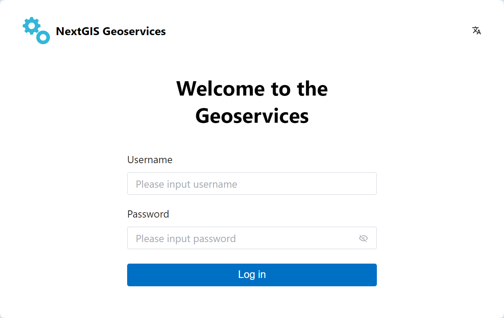
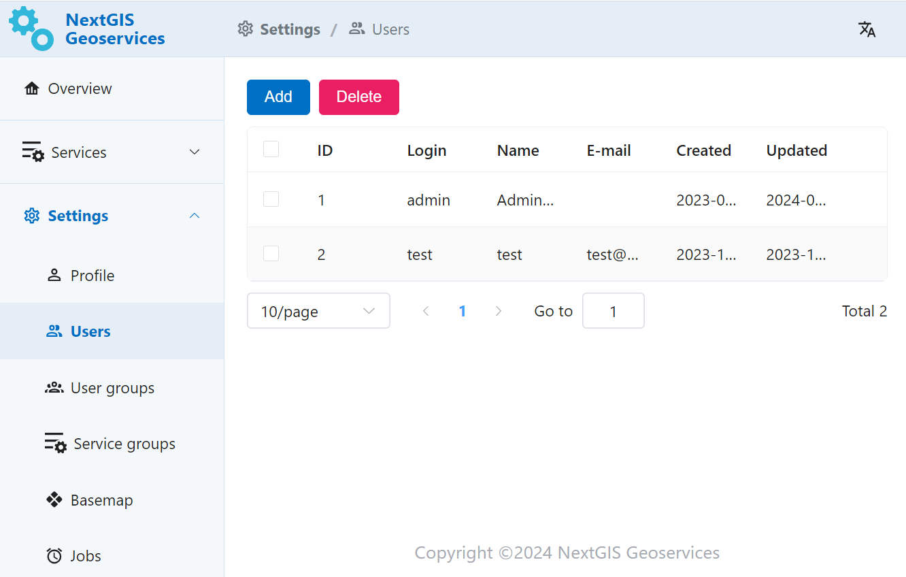

.. sectionauthor:: Роман Гайнуллов <roman.gainullov@nextgis.ru>

.. _docs_geoserv_prem_auth:

Authorization
============

To start working with the app user needs to log in.
Enter username and password in the corresponding fields.
Admin credentials for initial log-in are generated when the app is deployed.

   Authorization in NextGIS GeoServices on-premise

GeoServices on-premise (GeoServices for short) are integrated with `NextGIS ID on-premise <https://docs.nextgis.com/docs_ngid/source/toc.html>`_ authentication service deployed by default with the software.
Users added to the `Team <https://docs.nextgis.com/docs_ngid/source/ngidop.html#ngidop-teams>`_ also get access to GeoServices.

Additionally, Administrator can create local users within GeoServices (in Settings).

   "Users" section in GeoServices Settings
