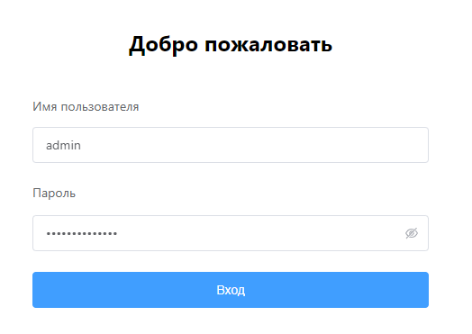
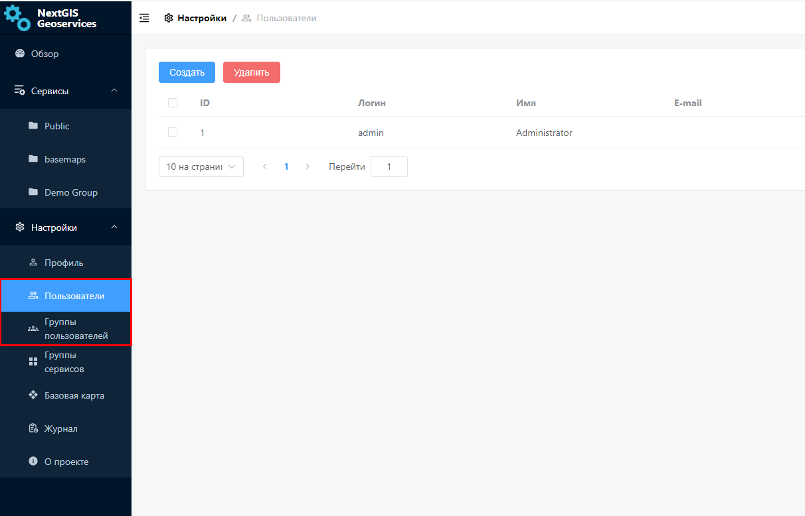

.. sectionauthor:: Роман Гайнуллов <roman.gainullov@nextgis.ru>

.. _docs_geoserv_prem_auth:

Авторизация
============

Для начала работы пользователю требуется авторизоваться.
В соответствующих полях нужно указать имя пользователя и его пароль.
Учетные данные для первого входа администратора предоставляются при развертывании приложения.

   Авторизация в NextGIS GeoServices on-premise

GeoServices on-premise (далее - Геосервисы) интегрированы с сервисом авторизации `NextGIS ID on-premise <https://docs.nextgis.ru/docs_ngid/source/toc.html>`_, который по умолчанию разворачивается вместе с ПО.
Таким образом добавленные в `Команду <https://docs.nextgis.ru/docs_ngid/source/ngidop.html#ngidop-teams>`_ пользователи также получают доступ в Геосервисы.

Вместе с этим Администратор имеет возможность добавлять локальных пользователей внутри самих Геосервисов в разделе Настройки.

   Раздел "Пользователи" в настройках геосервисов
