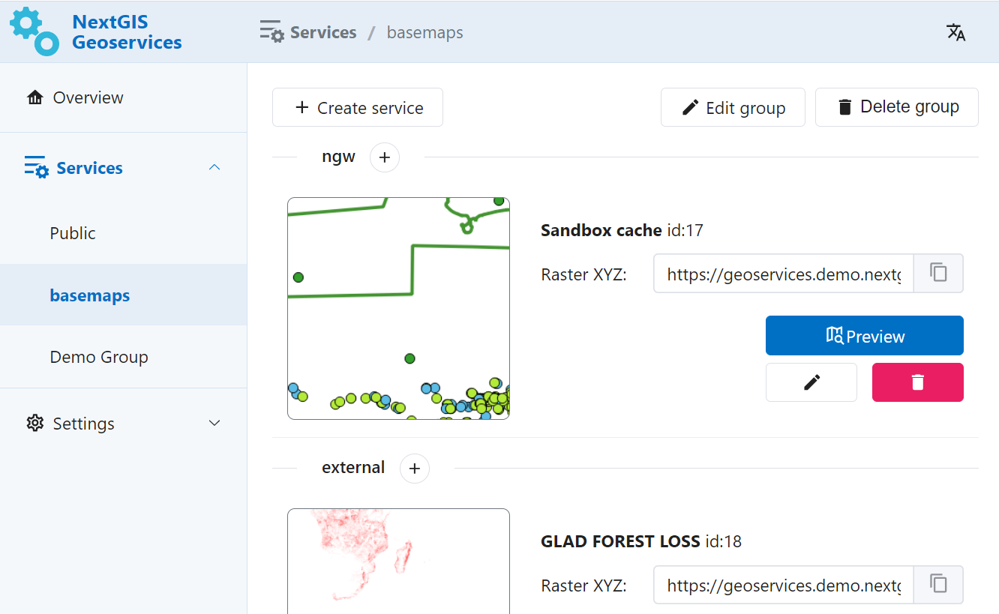
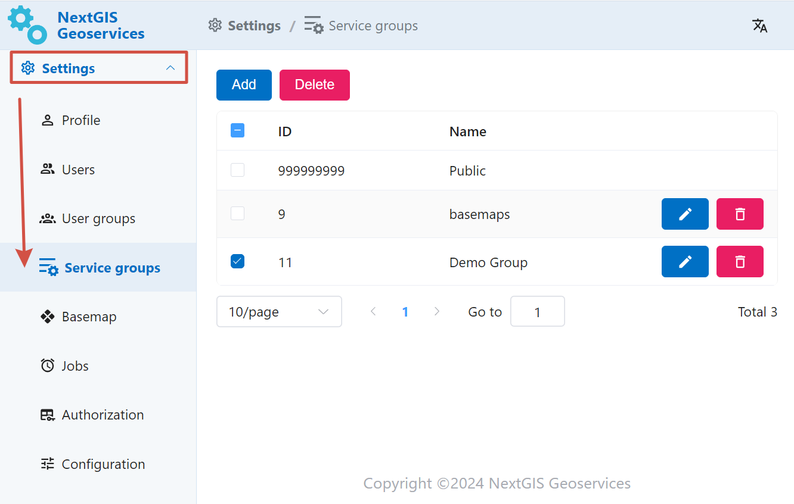
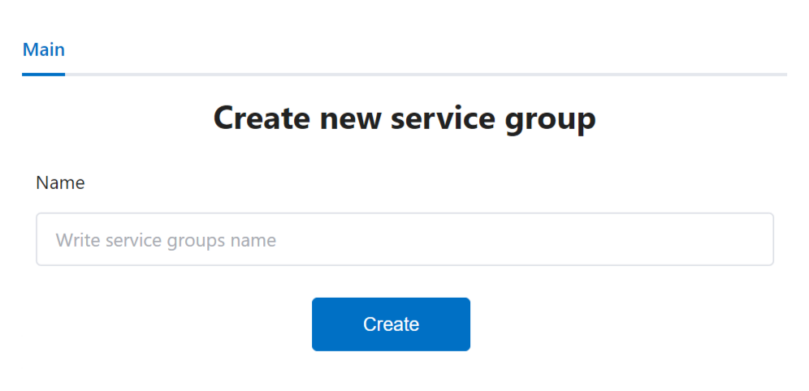
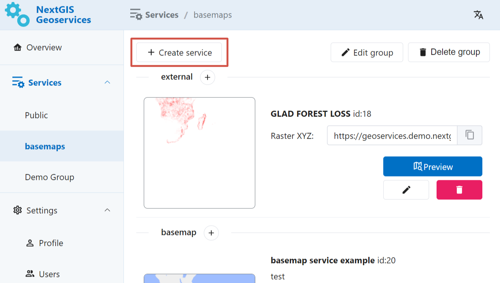
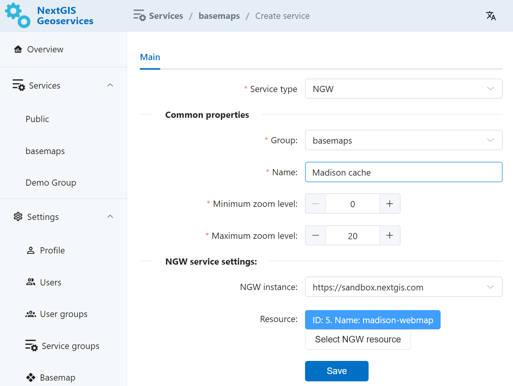
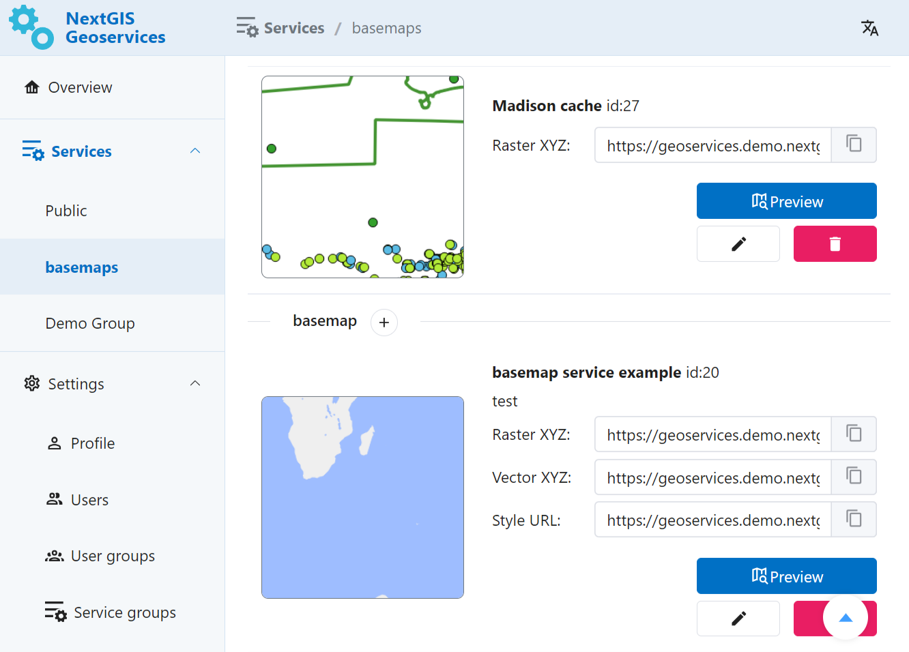
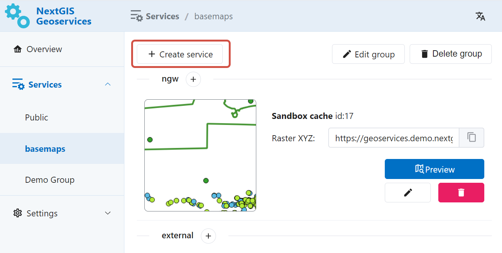
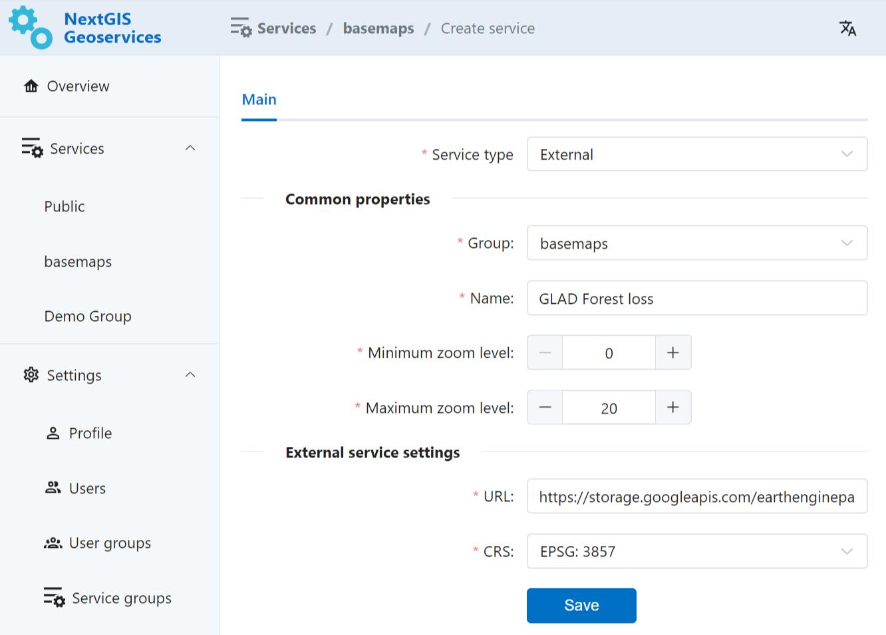
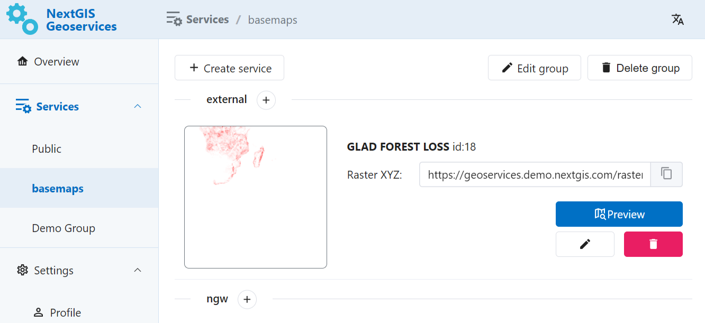

.. sectionauthor:: Роман Гайнуллов <roman.gainullov@nextgis.ru>

.. _docs_geoserv_prem_services:

Services
=======

Groups of services
---------------

Services can be added only to specific groups of services. Groups are created in Settings in **Service groups** tab.

   One of the service groups 

You can delete or edit a group using buttons.

   Service groups settings

To create a new group, press **Add** and enter a name for it.

   Adding new service group

NGW Web Maps
------------

`NextGIS Web <https://nextgis.com/nextgis-web/>`_ is a server-based geoinformation system for gathering, storing, visualising and analyzing geospacial data.

NGW Web Maps service allows to created cached tile services based on Web Maps created in NextGIS Web.

Administrator enters URL of a Web Map in NextGIS Web, service name and scale limits for caching.
After that the service will appear in the list. Service can be modified or deleted.

Working with the service does not engage NextGIS Web itself, so the service can handle high peak loads and reduce the load on NextGIS Web.

   Button for creating new service

   Parameters for the new service

   Newly created sevice in the group

External TMS
------------

GeoServices allows to add, cache and use external TMS.

   Button for creating new service

Enter name for the service, URL of the TMS service, select coordinate system and scale limits.
The newly created service will appear in the selected group. Service can be modified or deleted.

   Parameters for the new TMS service

   Newly created TMS sevice in the group
