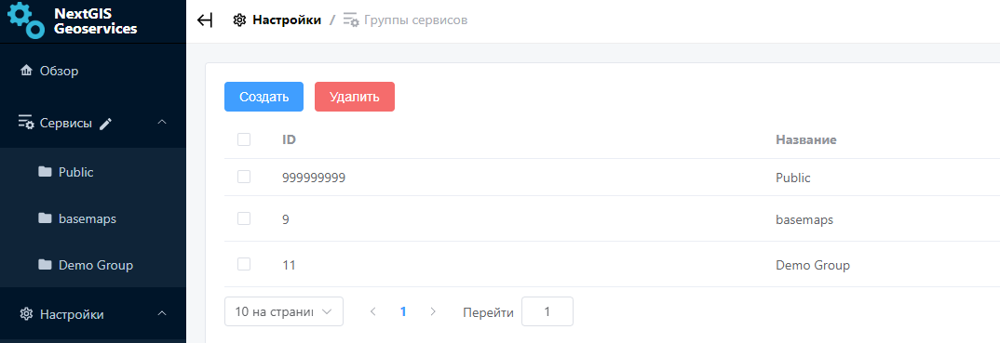
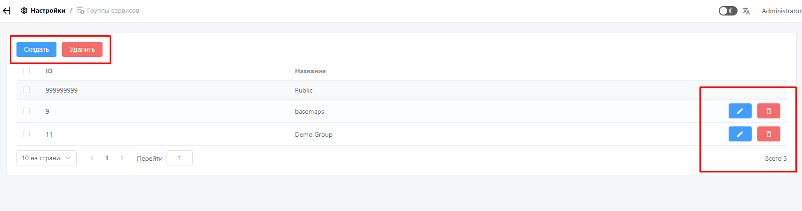
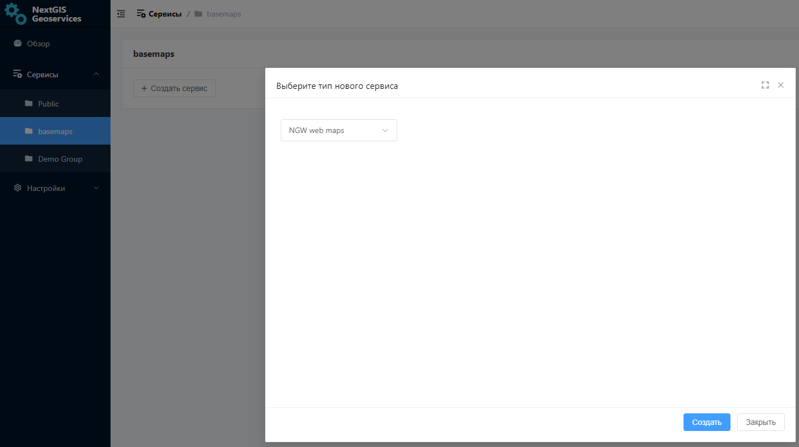
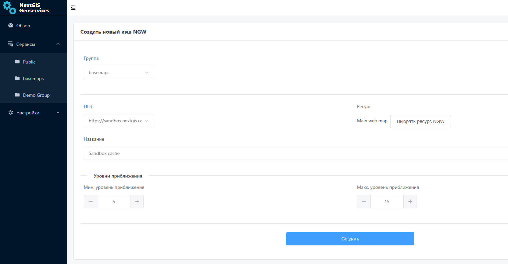
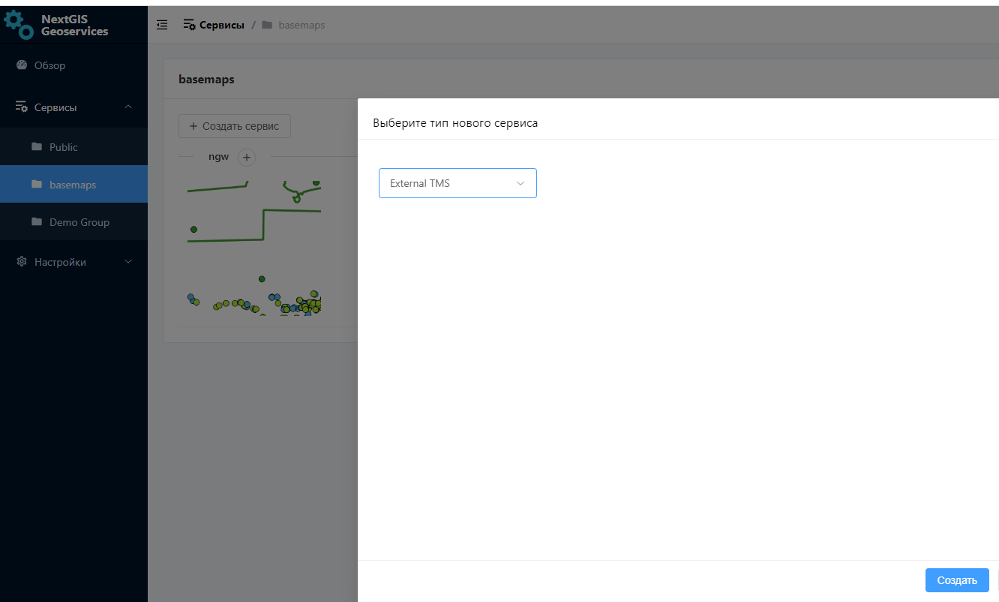
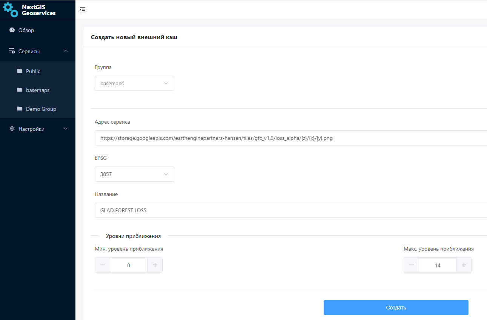
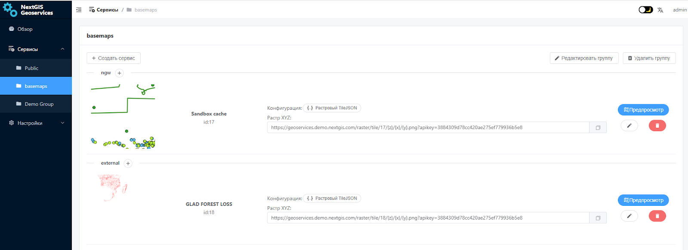

.. sectionauthor:: Роман Гайнуллов <roman.gainullov@nextgis.ru>

.. _docs_geoserv_prem_services:

Сервисы
=======

Группы сервисов
---------------

Сервисы в приложение могут быть добавлены только в определенные группы сервисов. Группы задаются в настройках на вкладке **Группы сервисов**.

Удалить или изменить группу сервисов можно с помощью соответствующей кнопки в интерфейсе, выбрав нужные сервисы.

Для создания новой группы следует указать её название.

.. figure:: _static/geosop_gr_serv3.png
   :name: geosop_gr_serv3
   :align: center
   :width: 20cm

NGW Web Maps
------------

`NextGIS Web <https://nextgis.ru/nextgis-web/>`_ - это серверная геоинформационная система, предназначенная для сбора, хранения, визуализации и обработки пространственных данных.

Сервис NGW Web Maps позволяет создавать кэшированные тайловые сервисы на основе веб-карт, созданных в NextGIS Web.

Администратор указывает URL развернутого NextGIS Web, ресурс веб-карты, название сервиса и диапазон масштабных уровней для кэширования.
После этого сервис появится в списке созданных. При необходимости сервис можно отредактировать или удалить.

Обращение к созданному сервису не затрагивает NextGIS Web, таким образом можно создать сервис для высоких пиковых нагрузок и снизить нагрузку на сам NextGIS Web.

.. figure:: _static/geosop_ngw3.png
   :name: geosop_ngw3
   :align: center
   :width: 20cm

External TMS
------------

Геосервисы позволяют добавлять внешние TMS для их дальнейшего кэширования и использования.

В форме заполняются URL добавляемого TMS сервиса, система координат, название и диапазон уровней отображения.
После чего сервис появится в списке соответствующей группы. При необходимости сервис можно отредактировать или удалить.

