.. sectionauthor:: Роман Гайнуллов <roman.gainullov@nextgis.ru>

.. _docs_geoserv_prem_settings:

Settings
============

Profile
--------

**Profile** section contains user information. It is devided into two tabs: *My profile* and *My API keys*.

**My profile** tab has the following settings:
* Login
* Password (can be modified after you log in for the first time)
* Username
* E-mail

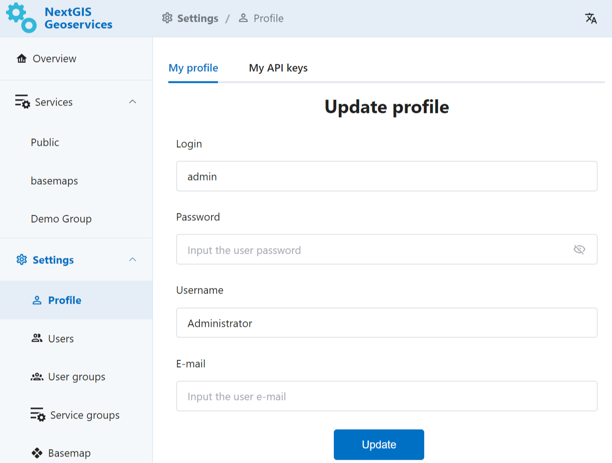

   My profile section in NextGIS GeoServices on-premise

**My API keys** are used for integration with other NextGIS services and external applications.
For instance, you'll need an API key to work
In this section Administrator can create and delete API keys.

While creating an API key, Administrator can set an expiration date for it.
Other API key settings include extent boundary, scale limits and origins.

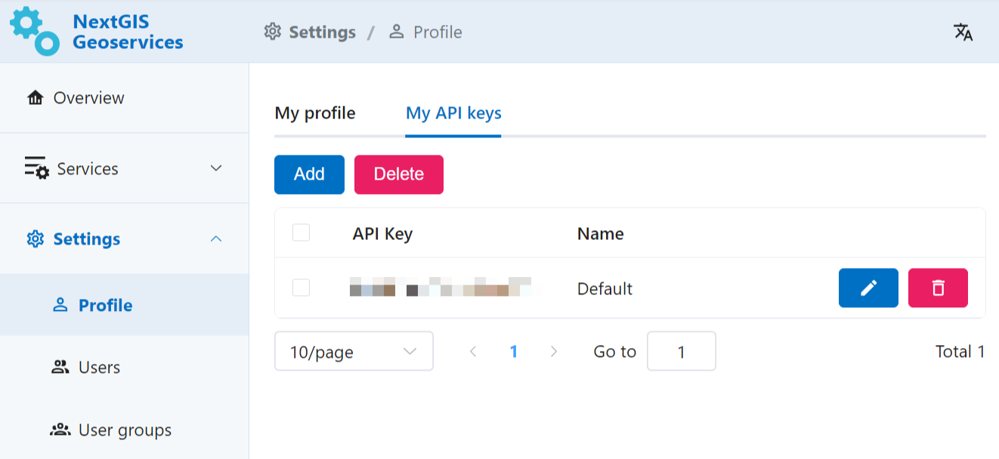

   My API keys section in NextGIS GeoServices on-premise

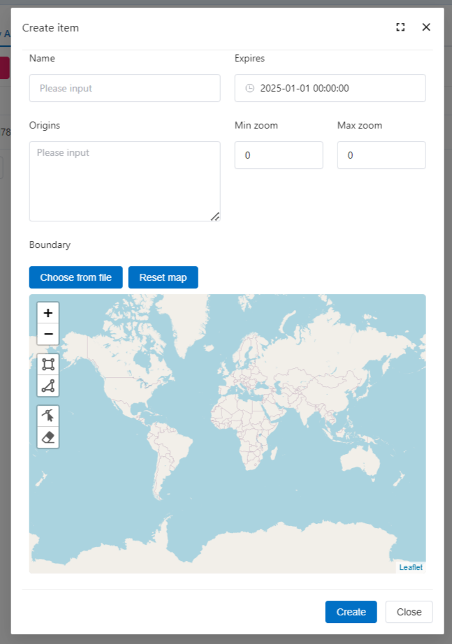

   Creating a new API key

Users and user groups
------------------------------------

В зависимости от прав доступа пользователь имеет различный набор возможностей по настройке разделов Геосервисов.

Administrator has full access and can create users, user groups, add users to the groups, delete and modify usersa and groups
.

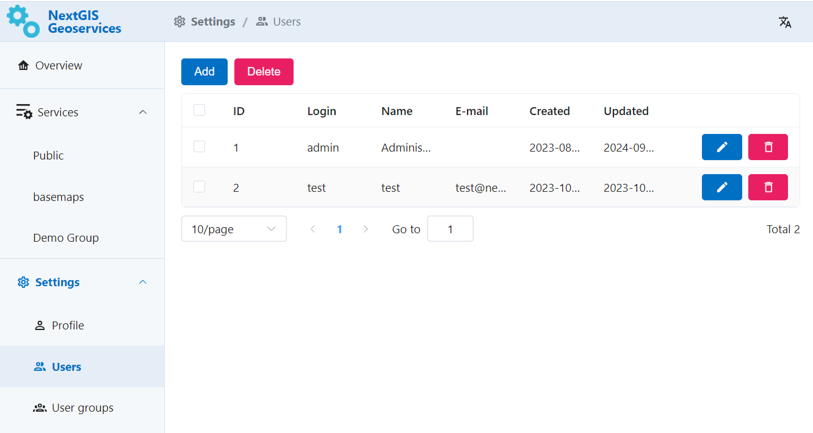

   Creating and deleting user in NextGIS GeoServices on-premise

To create a new user press **Add* and fill the following fields:

* Login
* Password
* Username
* E-mail
* Group to which the new user will be added (optional)

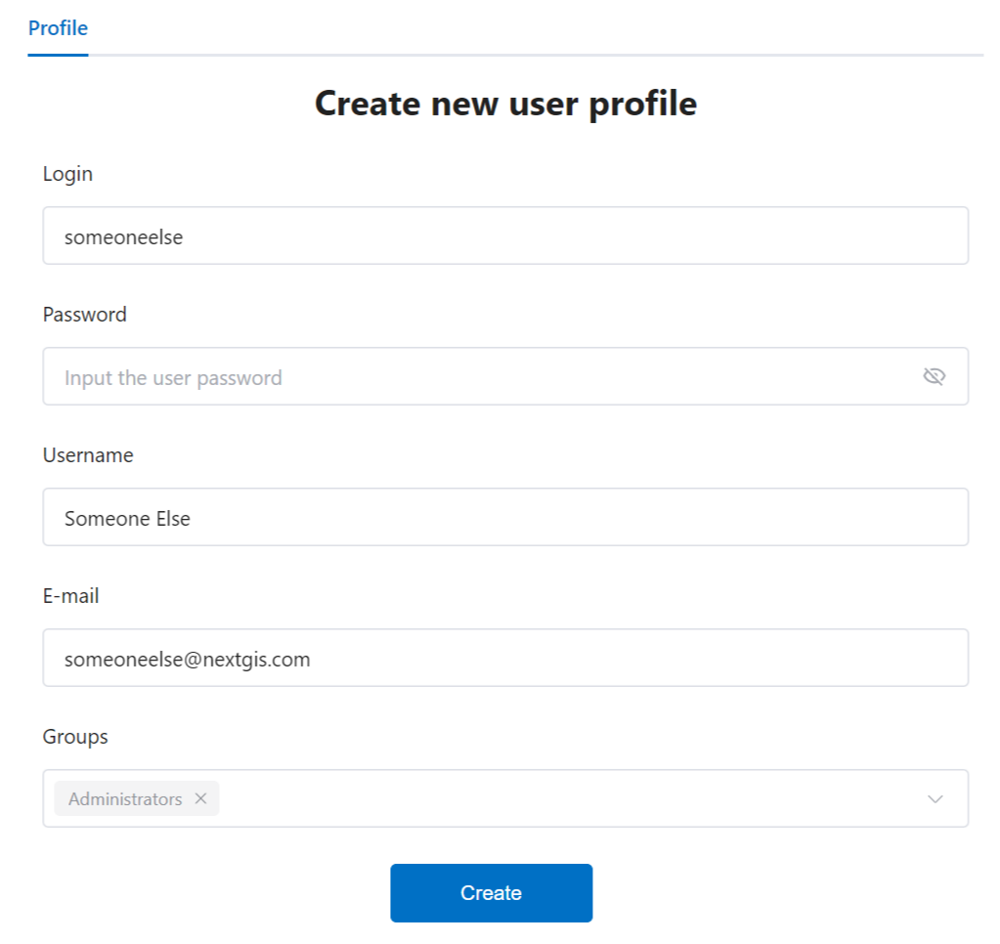

   Creating new user in NextGIS GeoServices on-premise

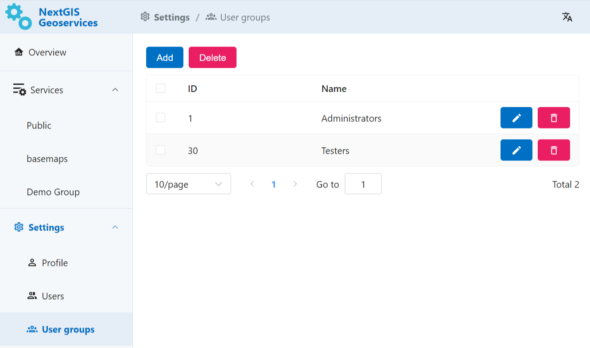

   List of user groups in NextGIS GeoServices on-premise

To create a User group, in the list of groups press **Add**. Enter the name for the group. You can select users to be included in the group from a dropdown menu.

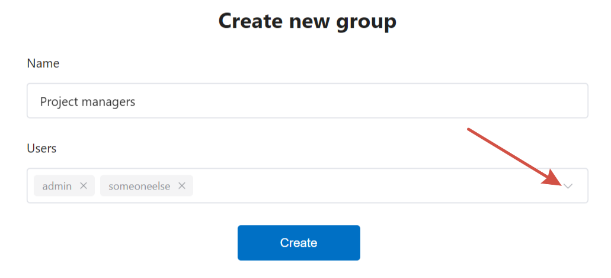

   Creating user group in NextGIS GeoServices on-premise

.. _geoserv_prem_set_basemap:

Basemap
--------------

In this section you can upload data and set boundaries for the future basemap tile service.

Input:

* Basemap file
* Boundaries

For **Basemap file** you can upload a PBF file or choose an area from the dropdown list.

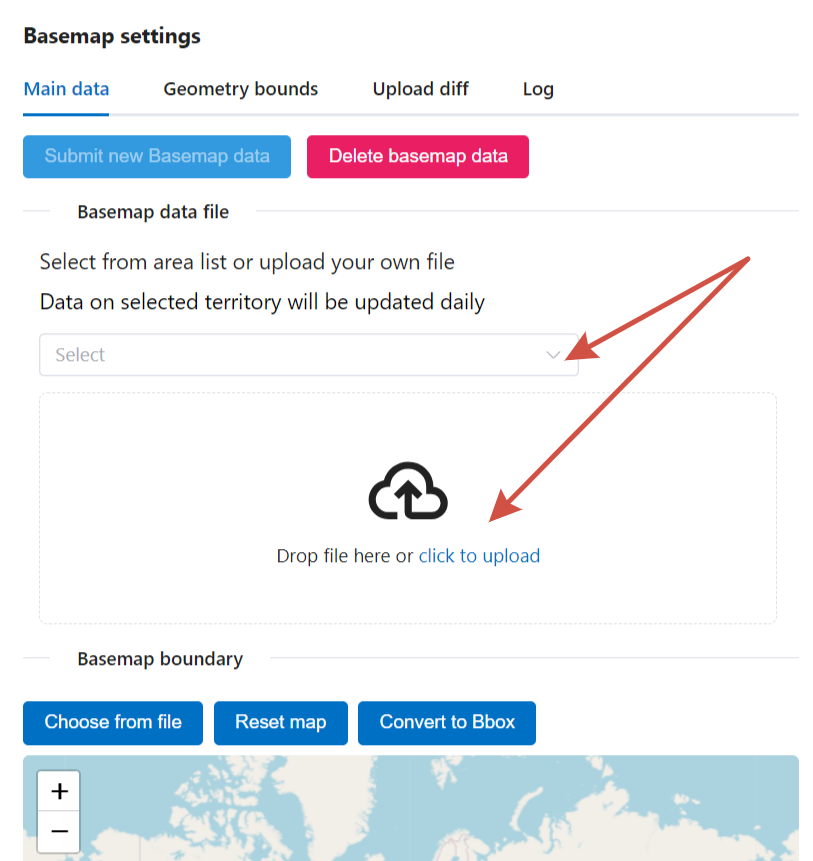

   Two ways of selecting basemap: from list and from file

You can set the **Boundary** for the service area in several ways:

* draw it on the map in the interface;
* upload a (multi)polygon vector file in GeoJSON format.

If you select an area from the list, its boundaries will be set automatically.

.. important::
   If the boundary is not set, the next data base update will include data of the entire globe, not just the previously uploaded PBF. This would take much more storage space on your device.

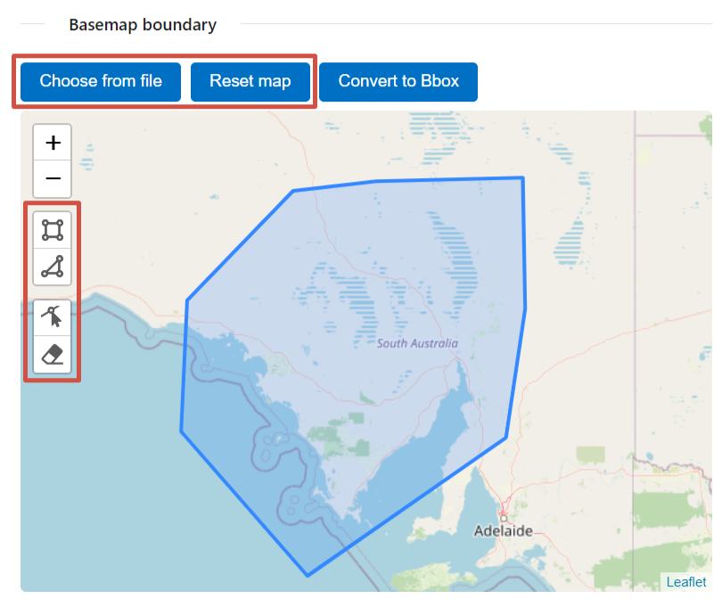

   Ways to set up boundary for basemap

When all files are uploaded and the boundaries are set, press **Submit new basemap data** on the top of the page. The process of creating tile service will begin.

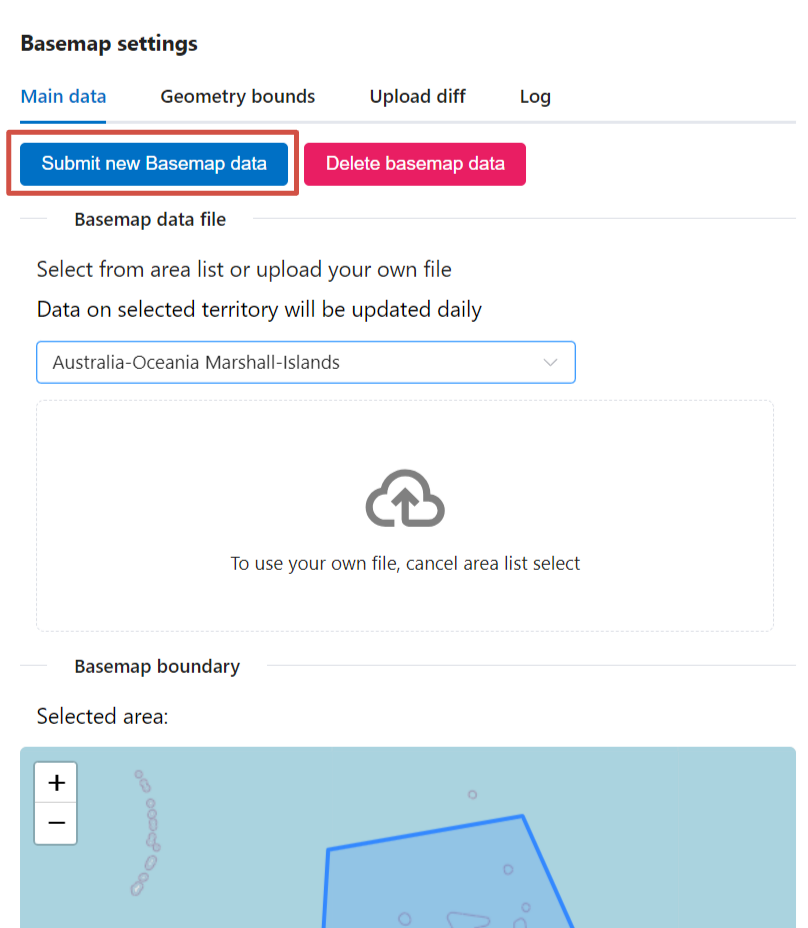

   Submit new Basemap data

Upload progress is displayed on the same tab and in the Log tab. After the process is completed successfully, the progress bar becomes green and a tick appears at the end.

.. figure:: _static/geosop_base3_en.png
   :name: geosop_base3
   :align: center
   :width: 20cm

   Upload complete

In the Log the process will be marked by a green dot.

.. figure:: _static/geosop_base5_en.png
   :name: geosop_base5
   :align: center
   :width: 20cm

   Upload progress status in the Log tab

The tile service XYZ that you created can be found in the Services section. Use the link to add it to external software such as NextGIS Web or QGIS. 

.. figure:: _static/geosop_base6_en.png
   :name: geosop_base6
   :align: center
   :width: 20cm

   Link to be used in external apps

.. figure:: _static/geosop_base7_en.png
   :name: geosop_base7
   :align: center
   :width: 20cm

   Newly create tile service

Log
-------

The log registers data processing history and other actions performed by the app. 
Log entries include status, process source, beginning and end times, task ID and messages.

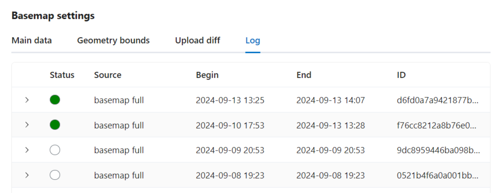

.. figure:: _static/geosop_journal2_en.png
   :name: geosop_journal2
   :align: center
   :width: 20cm

   Log tab in NextGIS GeoServices on-premise

About
-----------

This section has information on the current versions of the components.

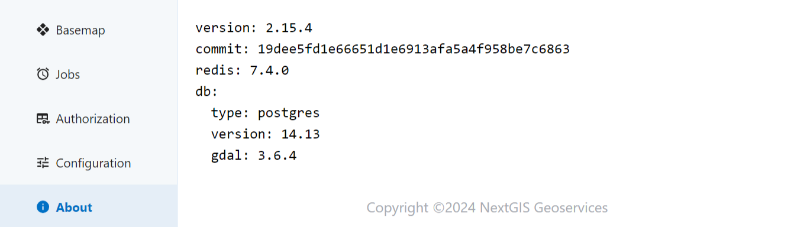

   Component version info in NextGIS GeoServices on-premise
 
