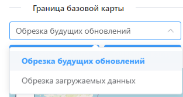
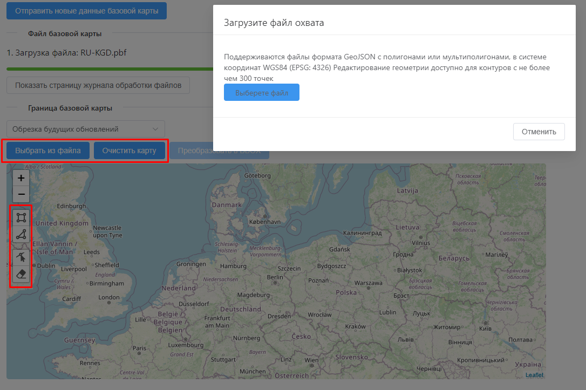
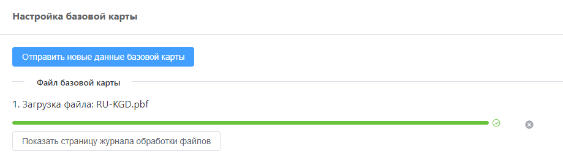

.. sectionauthor:: Роман Гайнуллов <roman.gainullov@nextgis.ru>

.. _docs_geoserv_prem_settings:

Настройки
============

Профиль
--------

Основная информация о пользователе содержится в разделе **Профиль**, которая делится на две вкладки: *Мой профиль* и *Мои API-ключи*.

В **Моем профиле** находятся:
* Логин
* Пароль (можно сразу изменить)
* Имя пользователя
* Электронная почта

.. figure:: _static/geosop_gr_profile1.png
   :name: geosop_gr_profile1
   :align: center
   :width: 20cm

   Раздел "Мой профиль" в NextGIS GeoServices on-premise

**Мои API-ключи** служат для интеграции NextGIS GeoServices с другими сервисами NextGIS и внешними приложениями.
API ключ понадобится например для работы с публичной кадастровой картой в NextGIS Web, в настольном модуле NGQ Rosreestr Tools.
В данном разделе Администратор может создавать и удалять API-ключи.

Каждый API ключ может иметь свой срок действия, который определяется при его создании Администратором.
Здесь же задается охват, масштабные уровни и домены, на которые распространяется действие ключа.

.. figure:: _static/geosop_gr_profile2.png
   :name: geosop_gr_profile2
   :align: center
   :width: 20cm

   Раздел "Мой API-ключи" в NextGIS GeoServices on-premise

.. figure:: _static/geosop_gr_profile3.png
   :name: geosop_gr_profile3
   :align: center
   :width: 20cm

   Создание нового API-ключа

Пользователи и группы пользователей
------------------------------------

В зависимости от прав доступа пользователь имеет различный набор возможностей по настройке разделов Геосервисов.

Администратору доступен вся функциональность. Он может создавать пользователей, группы пользователей, добавлять пользователей в эти группы.
Также как удалять и изменять их.

.. figure:: _static/geosop_gr_users1.png
   :name: geosop_gr_users1
   :align: center
   :width: 20cm

   Создание и удаление пользователя в NextGIS GeoServices on-premise

При создании нового пользователя указывается:

* Логин
* Пароль
* Имя пользователя
* Электронная почта
* Группа, к которой он относится (опционально)

.. figure:: _static/geosop_gr_users2.png
   :name: geosop_gr_users2
   :align: center
   :width: 20cm

   Создание нового пользователя в NextGIS GeoServices on-premise

.. figure:: _static/geosop_gr_users3.png
   :name: geosop_gr_users3
   :align: center
   :width: 20cm

   Список пользователей в NextGIS GeoServices on-premise

При создании *группы пользователей* указывается её Название и при необходимости выбирается пользователь из списка, которого нужно включить в эту группу.

.. figure:: _static/geosop_gr_users4.png
   :name: geosop_gr_users4
   :align: center
   :width: 20cm

   Создание группы пользователей в NextGIS GeoServices on-premise

Базовая карта
--------------

В этом разделе загружаются данные и задаются границы будущего тайлового сервиса базовой карты.

Входные данные:
* Файл базовой карты в формате pbf.
* Границы базовой карты

Задать границу базовой карты можно для:
* Будущих обновлений
* Загруженных в данный момент данных

Границу, по которой будет производиться обрезка, можно как нарисовать инструментами на карте в интерфейсе, так и загрузить (мульти)полигон в виде файла в GeoJSON формате.

.. important::
   Если границу не задать, то при последующем обновлении в БД попадут данные на весь мир, за пределами загруженного ранее региона pbf. Таким образом повышается расход места на диске.

.. figure:: _static/geosop_base3.png
   :name: geosop_base3
   :align: center
   :width: 20cm

   Способы задать обрезку для Базовой карты

Когда все файлы загружены и границы заданы, нужно нажать **Отправить новые данные базовой карты**. Это запустит процесса формирования тайлового сервиса на их основе.

   Отправить новые данные для базовой карты

Отслеживать статус загрузки можно на странице журнала обработки файлов.
Когда процесс завершится, индикатор перейдет в зеленый статус.

.. figure:: _static/geosop_base5.png
   :name: geosop_base5
   :align: center
   :width: 20cm

   Статус загрузки в журнале обработки файлов

Созданный тайловый сервис XYZ появится в разделе Сервисы. По ссылке его можно подключать во внешнее ПО, такое как NextGIS Web или QGIS.

.. figure:: _static/geosop_base6.png
   :name: geosop_base6
   :align: center
   :width: 20cm

.. figure:: _static/geosop_base7.png
   :name: geosop_base7
   :align: center
   :width: 20cm

   Созданный тайловый сервис

Журнал
-------

В журнале фиксируется история обработки данных и других действий на стороне приложения. 
Фиксируется статус, название процесса, его начало и конец, id задачи и выводятся информационные сообщения.

.. figure:: _static/geosop_journal1.png
   :name: geosop_journal1
   :align: center
   :width: 20cm

.. figure:: _static/geosop_journal2.png
   :name: geosop_journal2
   :align: center
   :width: 20cm

   Журнал регистрируемых действий в NextGIS GeoServices on-premise

О проекте
-----------

Раздел, в котором прописаны текущие версии компонентов.

.. figure:: _static/geosop_about.png
   :name: geosop_about
   :align: center
   :width: 20cm

   Информация о версии комнонентов NextGIS GeoServices on-premise
