.. sectionauthor:: Роман Гайнуллов <roman.gainullov@nextgis.ru>

.. _docs_geoserv_prem_settings:

Настройки
============

.. _geoserv_prem_set_profile:

Профиль
--------

Основная информация о пользователе содержится в разделе **Профиль**, которая делится на две вкладки: *Мой профиль* и *Мои API-ключи*.

В **Моем профиле** находятся:
* Логин
* Пароль (можно сразу изменить)
* Имя пользователя
* Электронная почта

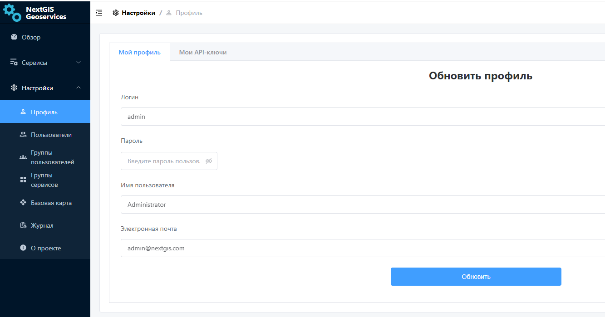

   Раздел "Мой профиль" в NextGIS GeoServices on-premise

**Мои API-ключи** служат для интеграции NextGIS GeoServices с другими сервисами NextGIS и внешними приложениями.
API ключ понадобится например для работы с публичной кадастровой картой в NextGIS Web, в настольном модуле NGQ Rosreestr Tools.
В данном разделе Администратор может создавать и удалять API-ключи.

Каждый API ключ может иметь свой срок действия, который определяется при его создании Администратором.
Здесь же задается охват, масштабные уровни и домены, на которые распространяется действие ключа.

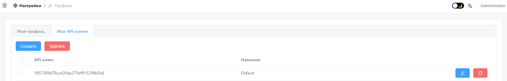

   Раздел "Мой API-ключи" в NextGIS GeoServices on-premise

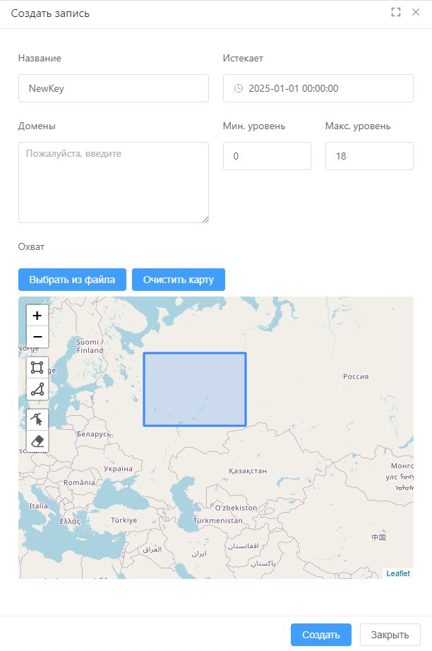

   Создание нового API-ключа

.. _geoserv_prem_set_users:

Пользователи и группы пользователей
------------------------------------

В зависимости от прав доступа пользователь имеет различный набор возможностей по настройке разделов Геосервисов.

Администратору доступен вся функциональность. Он может создавать пользователей, группы пользователей, добавлять пользователей в эти группы.
Также как удалять и изменять их.

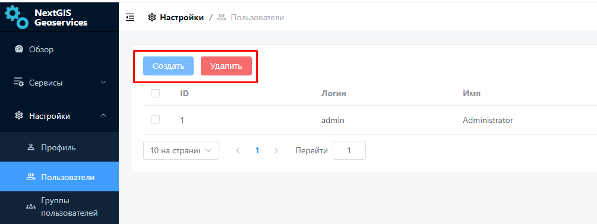

   Создание и удаление пользователя в NextGIS GeoServices on-premise

При создании нового пользователя указывается:

* Логин
* Пароль
* Имя пользователя
* Электронная почта
* Группа, к которой он относится (опционально)

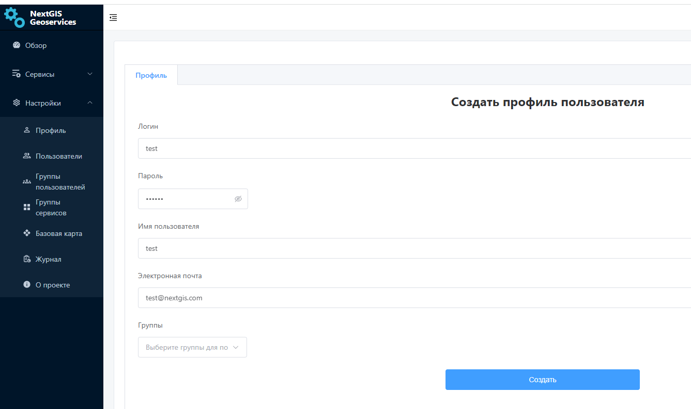

   Создание нового пользователя в NextGIS GeoServices on-premise

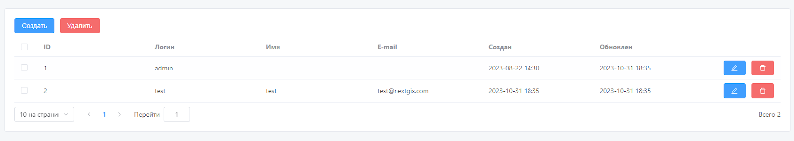

   Список пользователей в NextGIS GeoServices on-premise

При создании *группы пользователей* указывается её Название и при необходимости выбирается пользователь из списка, которого нужно включить в эту группу.

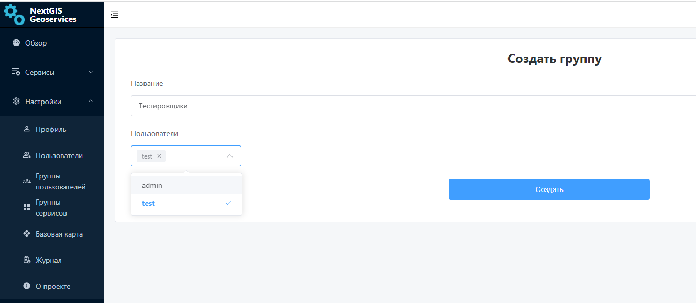

   Создание группы пользователей в NextGIS GeoServices on-premise

.. _geoserv_prem_set_basemap:

Базовая карта
--------------

В этом разделе загружаются данные и задаются границы будущего тайлового сервиса базовой карты.

Входные данные:

* Файл базовой карты
* Границы базовой карты

**Файл базовой карты** можно загрузить в формате PBF или выбрать территорию из списка.

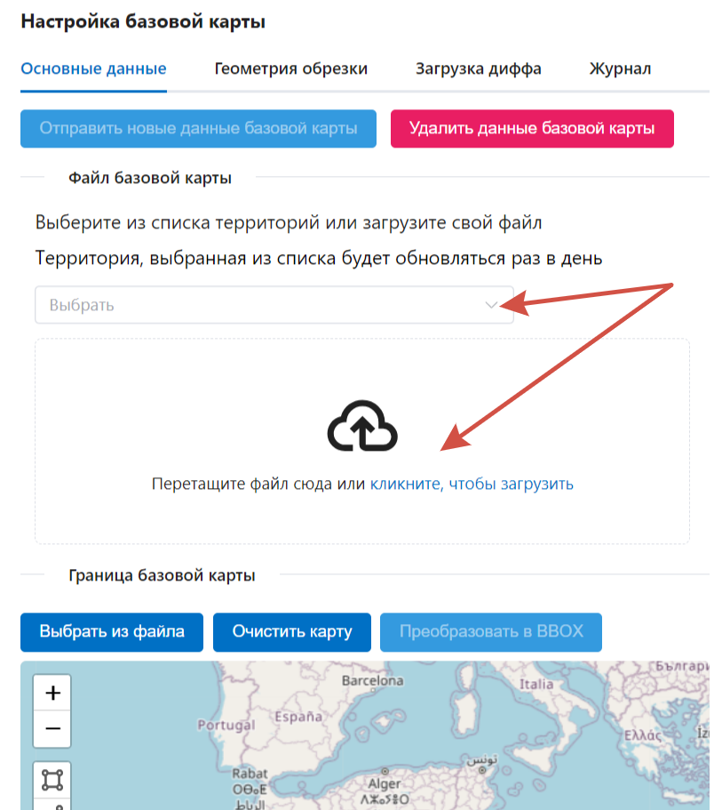

   Два варианта выбора базовой карты: из списка и из файла

**Границу**, по которой будет производиться обрезка, можно задать несколькими способами:

* нарисовать инструментами на карте в интерфейсе;
* загрузить (мульти)полигон в виде файла в GeoJSON формате.

При выборе базовой карты из списка её границы будут заданы автоматически.

.. important::
   Если границу не задать, то при последующем обновлении в БД попадут данные на весь мир, за пределами загруженного ранее региона pbf. Таким образом повышается расход места на диске.

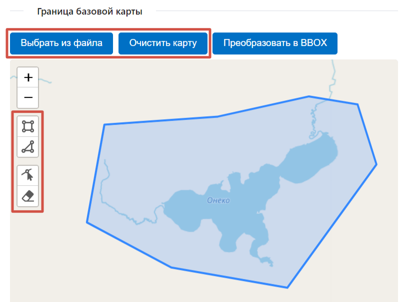

   Способы задать обрезку для Базовой карты

Когда все файлы загружены и границы заданы, нужно нажать **Отправить новые данные базовой карты**. Это запустит процесс формирования тайлового сервиса на их основе.

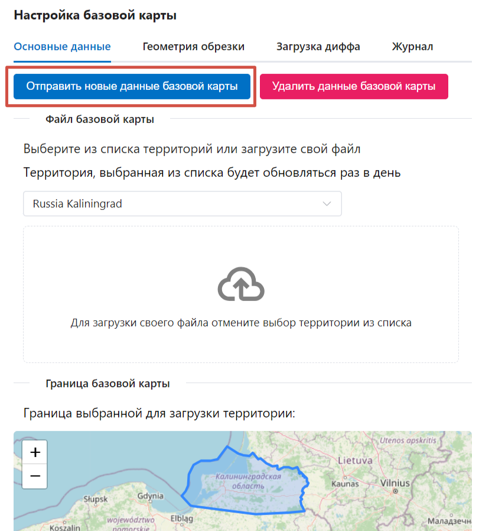

   Отправить новые данные для базовой карты

Процесс загрузки можно отслеживать на той же вкладке или на вкладке "Журнал". После успешного завершения полоса загрузки станет зеленой и в конце появится галочка.

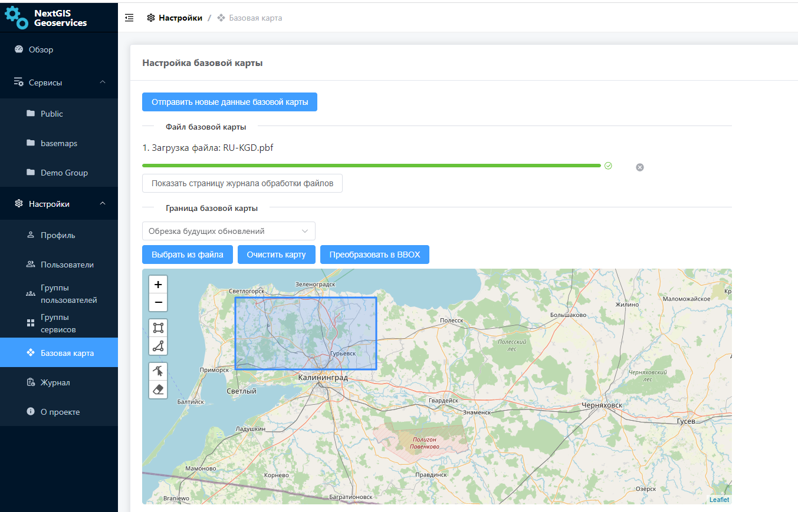

   Процесс загрузки успешно завершен

В Журнале индикатор перейдет в зеленый статус.

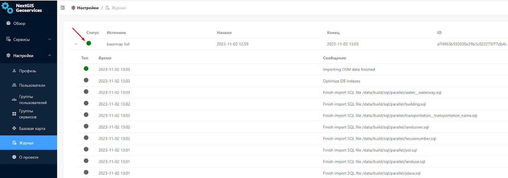

   Статус загрузки в журнале обработки файлов

Созданный тайловый сервис XYZ появится в разделе Сервисы. По ссылке его можно подключать во внешнее ПО, такое как NextGIS Web или QGIS. 

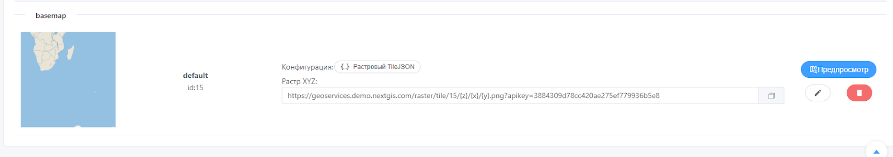

   Ссылка, которую можно использовать во внешних приложениях

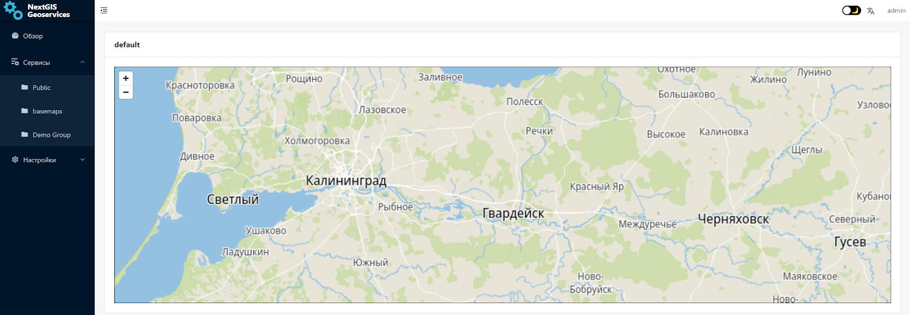

   Созданный тайловый сервис

.. _geoserv_prem_set_log:

Журнал
-------

В журнале фиксируется история обработки данных и других действий на стороне приложения. 
Фиксируется статус, название процесса, его начало и конец, id задачи и выводятся информационные сообщения.

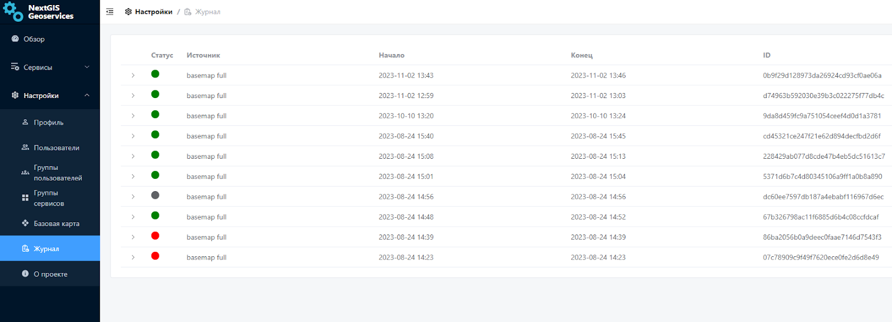

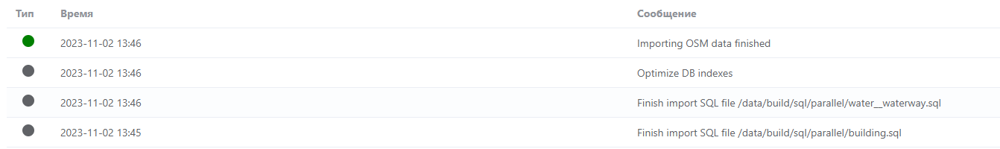

   Журнал регистрируемых действий в NextGIS GeoServices on-premise

.. _geoserv_prem_set_about:

О проекте
-----------

Раздел, в котором прописаны текущие версии компонентов.

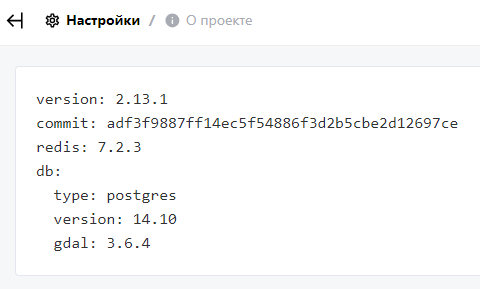

   Информация о версии компонентов NextGIS GeoServices on-premise
