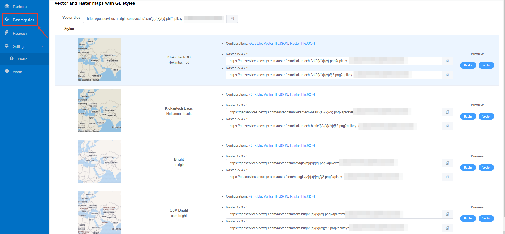

.. sectionauthor:: Роман Гайнуллов <roman.gainullov@nextgis.com>

.. _nggeos_basemap_tiles:

Basemap services
========================

.. important::
   To use the described functionality you need to be on `Premium plan <https://nextgis.com/nextgis-com/plans>`_.

`NextGIS GeoServices <https://geoservices.nextgis.com/>`_ allows adding vector and raster maps with GL styles:

1. Klokantech 3D
2. Klokantech Basic
3. Bright (nextgis)
4. OSM Bright (osm-bright)
 
 

 
   Basemap services in NextGIS GeoServices
 
.. note:: 
	To use the data you'll need a personal `API key <https://docs.nextgis.com/docs_geoservices/source/reissue_api_key.html>`_ (by default the API key can be found in your profile). 
   
