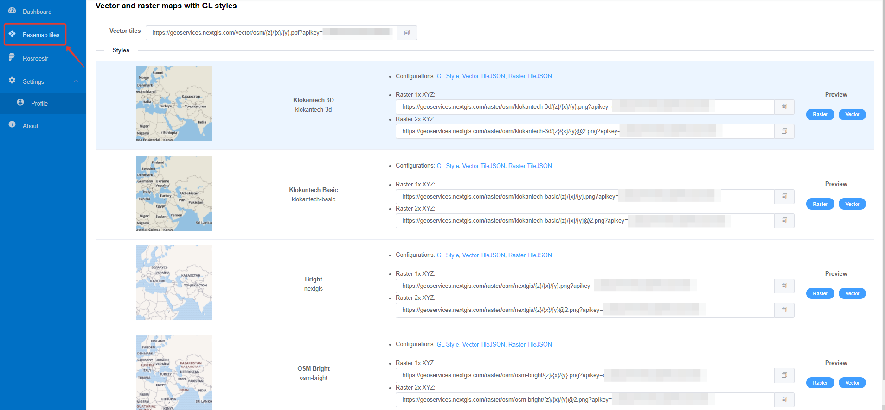

.. sectionauthor:: Роман Гайнуллов <roman.gainullov@nextgis.com>

.. _nggeos_basemap_tiles:

Сервисы базовых подложек
========================

С помощью `NextGIS Geoservices <https://my.nextgis.com>`_ есть возможность подключить векторные и растровые карты с GL стилями (:numref:`nggeos_basemap_tiles`):

1. Klokantech 3D
2. Klokantech Basic
3. Bright (nextgis)
4. OSM Bright (osm-bright)
 
 

 
   Сервисы базовых подложек NextGIS Geoservices
 
.. note:: 
	Для подключения данных необходимо получить персональный `API ключ <https://docs.nextgis.ru/docs_geoservices/source/reissue_api_key.html>`_ (apikey в строке запроса, размыто на изображении). 
   
`Пример <https://demo.nextgis.com/resource/5217>`_ подключения сервиса как `базовой подложки <https://docs.nextgis.ru/docs_ngcom/source/data_connect.html#ngcom-basemap-layer>`_ в NextGIS Web.
