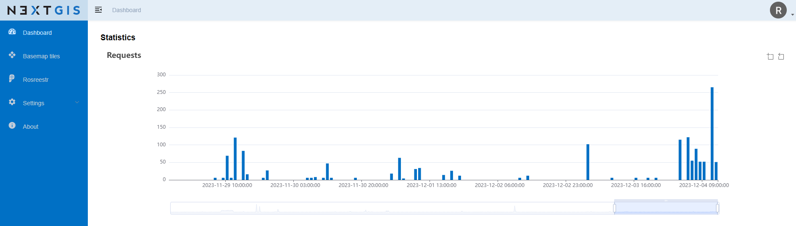

Сервисы Публичной кадастровой карты Росреестра, дополнение для разработчиков
==========================================================================

Общая информация
------------------

Сервисы NextGIS Geoservices PKK могут быть использованы программно посредством API и соответствующих запросов.

Типы данных
----------------

Возможно получение данных по следующим типам (type) объектов:

* 1 - parcels - Земельные участки. Пример кадастрового номера: 40:7:122101:5
* 2 - units - Кадастровые кварталы. Пример кадастрового номера: 40:7:120803
* 4 - area - Кадастровые округа. Пример кадастрового номера: 40
* 5 - buildings - объекты капитального строительства. Пример кадастрового номера: 40:7:120702:175
* 10 - restricted zones - Зоны с особыми условиями использования территорий (ЗОУИТ). Пример кадастрового номера: 50:32-6.208

Что является запросом и лимиты
--------------------------------

Установленный по умолчанию лимит количества запросов - 1050 / час (25 000 / сутки)
В него входят:

- Запросы к тайлам. Учитываются только те случаи, когда мы отдали тайл, а не ошибку.
- Запросы за получением атрибутов (поиск по номеру и по местоположению).

Посмотреть текущую статистику запросов можно в дашборде по ссылке https://geoservices.nextgis.com/dashboard

   Дашборд со статистикой по запросам

CORS Origins
-------------

Для веб-запросов - необходимо установить разрешенные адреса. 

* Войдите под своей учетной записью на geoservices.nextgis.com
* Зайдите в свой профиль. Найдите раздел Origins
* Нажмите New и введите адрес, который необходимо разрешить.
* Нажмите ОК
* Нажмите Update

Пример скрипта
------------------

.. code-block:: bash
    
    import requests
    
    url = 'https://geoservices.nextgis.com/pkk/features/by_pos?apikey=YOUR-API-KEY&lat=55.676511886387196&lon=37.587604244740675&types=1'
    
    resp = requests.get(url)
    data = resp.json()
    print(data['features'][0]['geometry'])

