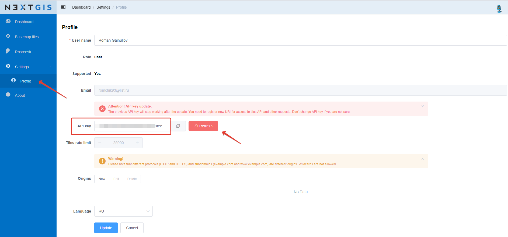

.. sectionauthor:: Роман Гайнуллов <roman.gainullov@nextgis.com>

.. _nggeos_reissue_api_key:

Перевыпуск API ключа
=====================

Если срок действия вашего API ключа истек, его необходимо перевыпустить заново. Для этого:

1. Перейдите в раздел **Profile** настроек *Settings* на левой панели;
2. Нажмите кнопку **Refresh** напротив поля текущего API ключа (см. :numref:`nggeos_refresh_api_key`).

 
   Перевыпуск API ключа

