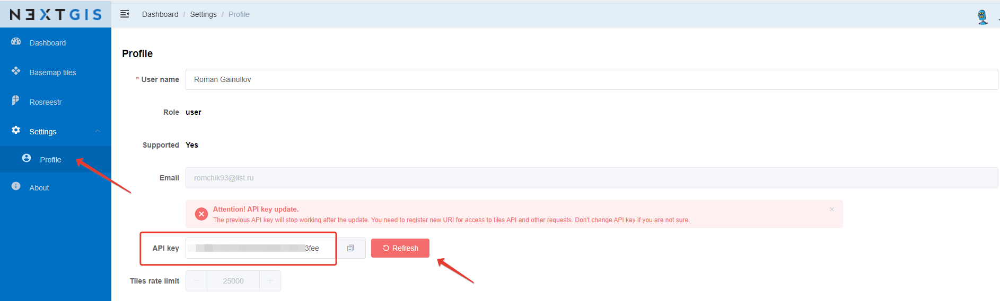

.. sectionauthor:: Роман Гайнуллов <roman.gainullov@nextgis.com>

.. _nggeos_reissue_api_key:

Reissue of API key
==================
  
If you need to update your API key, it must be reissued again. For this:

1. Go to the **Profile** section of the *Settings* on the left panel;

2. Click the **Refresh** button opposite the current API key field.

   Reissue of API key
