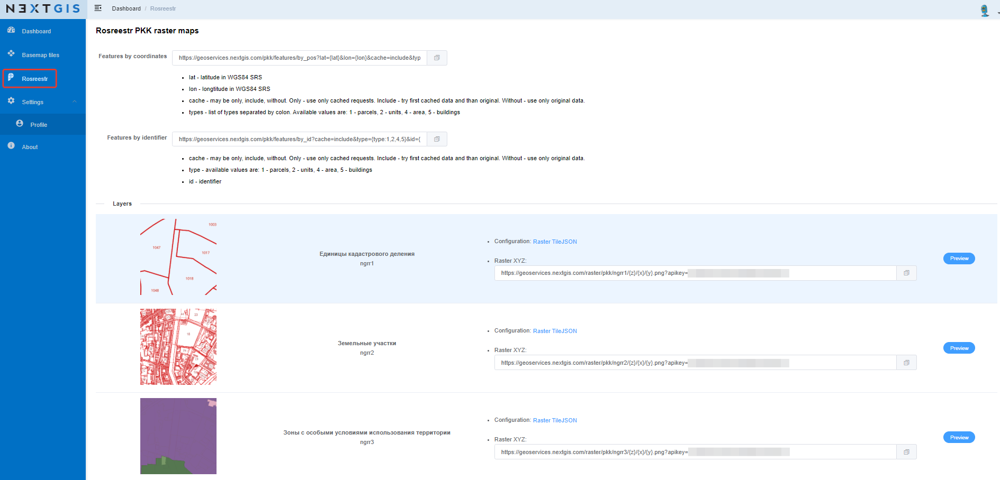

.. sectionauthor:: Роман Гайнуллов <roman.gainullov@nextgis.com>

.. _nggeos_pkk:

Сервисы Публичной кадастровой карты Росреестра
=============================================

`NextGIS Geoservices <https://geoservices.nextgis.com/>`_ позволяет получить растровые данные сервиса ПКК и подключить их как внешние источники (:numref:`nggeos_basemap_rosreestr_pkk`). 
Программно также можно получать границы и атрибутивную информацию по отдельным кадастровым единицам: кварталам, участкам, ОКС, ЗОУИТ.

Доступные следующие слои кадастрового деления:

1. Единицы кадастрового деления (ngrr1)
2. Земельные участки (ngrr2)
3. Зоны с особыми условиями использования территории (ngrr3)

 
   Сервисы Публичной кадастровой карты

.. note:: 
	Для подключения данных необходим персональный `API ключ <https://docs.nextgis.ru/docs_geoservices/source/reissue_api_key.html>`_ (по умолчанию apikey находится в строке запроса, размыто на изображении).
   
`Пример <https://demo.nextgis.com/resource/3928>`_ подключения кадастровых данных
как `слои TMS <https://docs.nextgis.ru/docs_ngweb/source/layers.html#tms>`_ в NextGIS Web.

Также данные можно отфильтровать по координатам и идентификатору, выполнив соответствующие запросы.
