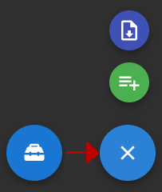

.. sectionauthor:: Ekaterina Petrunenko <ekaterina.petrunenko@nextgis.com>

Модуль " Фильтр выделов"
=========================
С главной страницы доступно два режима: просмотр созданных ранее выборок и создание новой выборки выделов.

Создание новой выборки
-------------------------------------

 .. figure:: _static/user_filter_vd_1.png
   :name: user_filter_vd_1
   :align: center
   :width: 16cm

   Кнопка создания выборки выделов
   
При нажатии на кнопку “Создать” открывается страница настройки макета выборки.
В боковой панели слева возможно:

* настроить масштаб экспортируемой выборки

* задать название выборки для дальнейшей ее идентификации

* используя математические операторы, задать любое количество фильтров для выборки на основе атрибутов выделов

Доступно включение/отключение слоев, отображаемых на карте. Порядок отрисовки слоев, их стиль и прозрачность задается через интерфейс администратора.

 .. figure:: _static/user_filter_vd_2.png
   :name: user_filter_vd_2
   :align: center
   :width: 16cm

   Настройка макета для выборки выделов
   
При наведении курсора на кнопку в правом нижнем углу экрана становится доступно сохранение выборки в базу данных NextGIS Лес (зеленая иконка) или ее экспорт на компьютер пользователя в виде jpeg-файла (синяя иконка).

   
   Внешний вид кнопок для экспорта выборки на компьютер или сохранения ее в базу данных
   
   
Просмотр созданных ранее выборок
-----------------------------------------------------

 .. figure:: _static/user_filter_vd_3.png
   :name: user_filter_vd_3
   :align: center
   :width: 16cm

   Кнопка для просмотра перечня созданных ранее выборок
   
При нажатии на кнопку “Список” открывается страница с таблицей, в которой перечислены все сохраненные в базе данных выборки на основе выделов. 

 .. figure:: _static/user_filter_vd_4.png
   :name: user_filter_vd_4
   :align: center
   :width: 10cm

   Таблица сохраненных в приложении выборок
   
Помимо просмотра информации, на этой странице возможно также удалить или отредактировать отдельную выборку. За эти действия отвечают, соответственно, иконки корзины и карандаша, расположенные в самой левой колонке напротив каждой записи. При выборе редактирования какой-либо выборки открывается страница редактирования, аналогичная странице настройки макета выборки.   

   
