.. _connect_data_edit:

Редактирование 
=========================

.. |button_to_qgis| image:: _static/button_to_qgis.png
   :width: 6mm

.. |button_to_wg| image:: _static/button_to_wg.png
   :width: 6mm

  
Модуль NextGIS Connect позволяет быстро редактировать геометрии и атрибуты объектов в Векторных слоях Веб ГИС сразу после добавления их в QGIS. Такой способ редактирования позволяет изменять слой даже при отсутствии подключения к интернету, сохранять изменения на устройстве и затем, при восстановлении соединения, передать их в Веб ГИС.

Функция применима только для форматов векторных данных, используемых в QGIS.

.. warning:: 
	По умолчанию редактировать слой *напрямую* может один пользователь. 

#. Импортируйте слой из Веб ГИС в QGIS, выделив его в окне NextGIS Connect и нажав |button_to_qgis|"Добавить в QGIS".
#. Перейдите в режим редактирования в контекстном меню слоя или через панель инструментов.
#. Внесите необходимые изменения.
#. Выйдите из режима редактирования. В появившемся диалоговом окне сохраните изменения.
#. Синхронизация произойдет автоматически.

Чтобы проверить, когда последний раз был синхронизирован слой, наведите курсор на значок синхронизации.

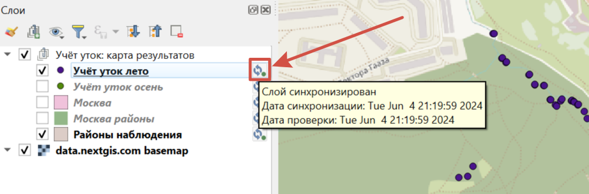

   Всплывающая подсказка с информацией о синхронизации

При нажатии на значок откроется окно статуса слоя.

.. figure:: _static/nextgis_connect/ngc_layer_status_ru.png
   :align: center
   :width: 14cm

   Диалоговое окно статуса слоя

В нем отображается дата последней синхронизации, статус: синхронизирован - не синхронизирован.

Можно запустить её принудительно, нажав на кнопку **Синхронизация**.

.. note::
    Пока слой находится в режиме редактирования, синхронизация недоступна.

.. important:: Если со времени последней синхронизации в облаке были сделаны изменения, дальнейшая синхронизация станет невозможна. 

Чтобы снова получить возможность синхронизировать данные, нажмите на значок синхронизации рядом со слоем, в открывшемся окне "Статус слоя" в выпадающем меню выберите **Сброс слоя**. Обратите внимание: если  сброс произойдет при наличии локальных изменений, они будут утеряны. 

.. figure:: _static/ngc_check_sync_ru.png
   :align: center
   :alt: Всплывающая подсказка с информацией о синхронизации
   :width: 16cm

   Значок синхронизации слоя

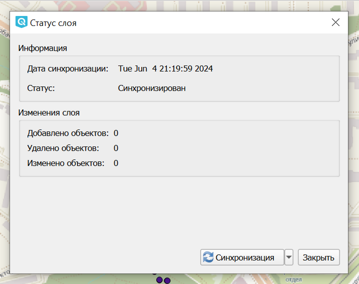

   Диалоговое окно статуса слоя. Для сброса слоя нужно нажать на стрелочку вниз рядом с кнопкой "Синхронизация" и выбрать "Сброс слоя"

В случае, если изменения, внесенные в облаке, были ошибочными, и их нужно заменить на локальные, воспользуйтесь функцией `обновления данных <https://docs.nextgis.ru/docs_ngconnect/source/edit.html#connect-data-overwrite>`_.

Синхронизируются и версионируются только сами данные. Изменение структуры данных сделает синхронизацию невозможной и слой нужно будет скачать заново.

.. _connect_multiuser:

Совместное редактирование
--------------------------------

Если нужно одновременное редактирование данных с разных устройств/платформ, то доступны следующие варианты:

1. Использовать сервисы OGC API — Features или `WFS <https://docs.nextgis.ru/docs_ngconnect/source/edit.html#connect-data-edit-wfs>`_. Их можно создать в Веб ГИС (`WFS <https://docs.nextgis.ru/docs_ngweb/source/layers.html#c-wfs>`_, `OGC API — Features <https://docs.nextgis.ru/docs_ngweb/source/layers.html#c-ogc-api-features>`_) или прямо `через коннект <https://docs.nextgis.ru/docs_ngcom/source/ngqgis_connect.html#wfs-wms-ogc-api-features>`_, и редактировать данные через них.

2. Напрямую в QGIS с включенной функцией `версионирования <https://docs.nextgis.ru/docs_ngweb/source/layers.html#create-vector-layer-vers-pic>`_ векторных слоёв. Включается в Веб ГИС в настройках каждого векторного слоя. При включенном версионировании вся история изменений слоя будет накапливаться в системе. Это позволит Connect увидеть изменения, сделанные на других устройствах, и обработать их без сброса слоя.

.. _connect_data_edit_wfs:

Редактирование через WFS
--------------------------

Также редактирование векторного слоя возможно при использовании стандартного протокола :term:`WFS` (с поддержкой редактирования):

* Опубликуйте по протоколу WFS Векторный слой, объекты которого вы хотите отредактировать;
* Выберите в дереве ресурсов Веб ГИС в окне модуля NextGIS Connect соответствующий WFS сервис;
* Нажмите кнопку |button_to_qgis| Добавить в QGIS на панели инструментов модуля или выберите пункт **Добавить в QGIS** в контекстном меню сервиса;

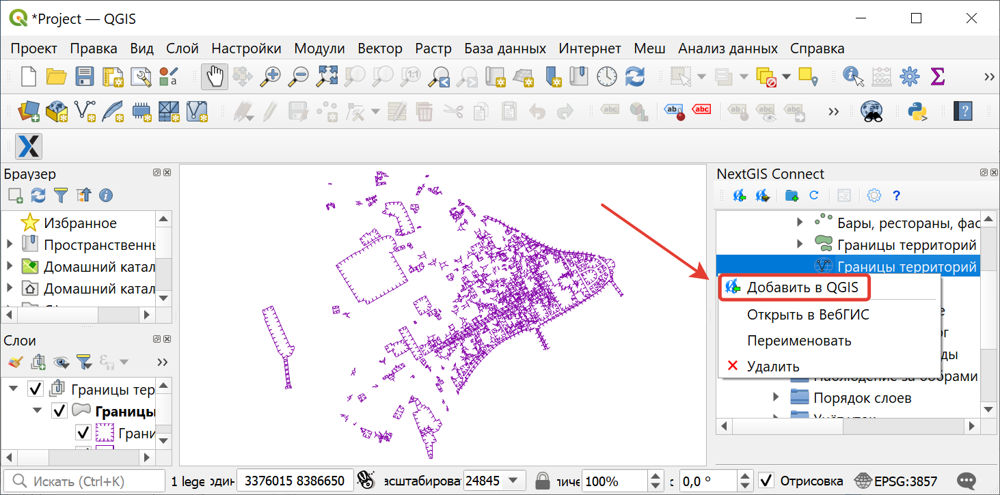
   
   Добавление слоя в QGIS через панель NextGIS Connect
   
* Если операция прошла успешно, то на панели слоев QGIS появится новая группа слоев WFS, опубликованных с помощью добавленного WFS сервиса;
* Включите режим редактирования (иконка карандаша) и отредактируйте геометрии и атрибуты объектов в добавленном слое WFS с помощью :ref:`стандартных инструментов QGIS <ngqgis_editing>`;

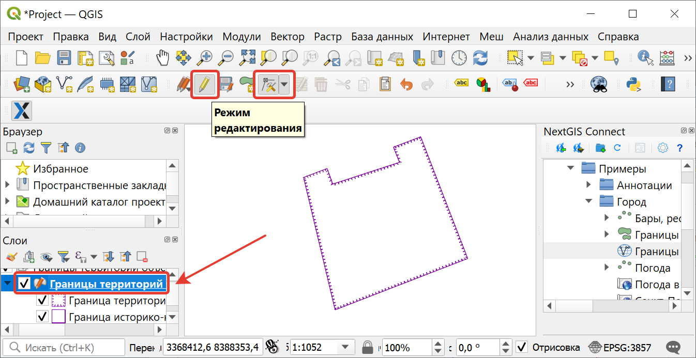
   
   Редактирование объектов

* Нажмите ещё раз кнопку "Режим редактирования" и подтвердите сохранение изменений.

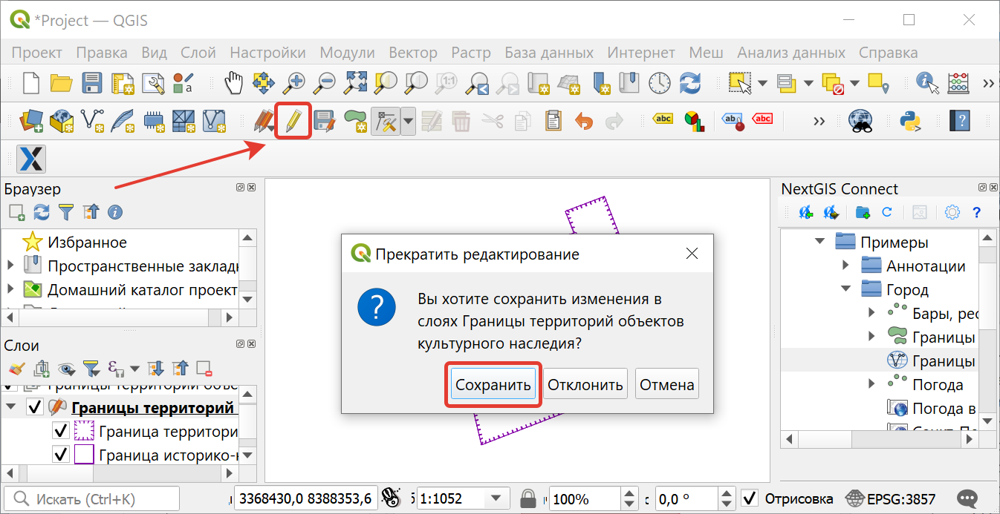
   
   Сохранение изменений векторного слоя
   
* Если редактирование объектов прошло успешно, то соответствующие изменения сразу же будут отображены в Веб ГИС в :ref:`Таблице объектов <ngw_feature_table>` и :ref:`веб-клиенте <ngw_webmaps_client>` Веб-карты.

.. _connect_data_overwrite:

Обновление данных
-----------------

С помощью NextGIS Connect можно обновить целиком содержимое уже существующего векторного слоя Веб ГИС, заменив входящие в него объекты, но сохранив его стили, псевдонимы атрибутов и другие настройки.

.. warning:: 
   При обновлении **слоя** все данные целевого слоя, включая вложения (фото, документы), будут очищены. Если вам нужно их сохранить - используйте `WFS <https://docs.nextgis.ru/docs_ngconnect/source/resources.html#wfs>`_. Если обновляется `стиль <https://docs.nextgis.ru/docs_ngconnect/source/edit.html#connect-style-overwrite>`_, то вложения затронуты не будут.

Для обновления (замены) данных слоя:

* Выберите на панели слоёв QGIS векторный слой, объекты которого вы хотите отправить в векторный слой Веб ГИС;
* Выберите в дереве ресурсов Веб ГИС в окне модуля NextGIS Connect векторный слой, объекты которого вы хотите заменить;
* Щелкните правой кнопкой мыши по выбранному векторному слою в окне NextGIS Connect и выберите **Перезаписать выбранный слой**.

Идентификатор ресурса слоя при этом останется неизменным. Операция подразумевает, что слой-источник и целевой слой имеют одинаковую структуру атрибутов.

   
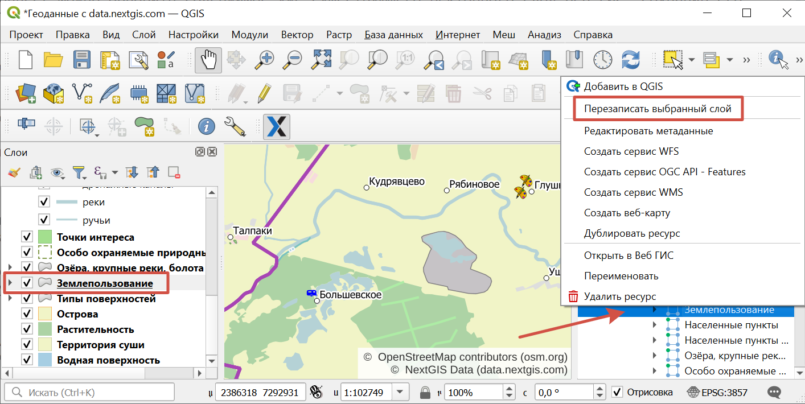
   
   Перезапись выбранного слоя через контекстное меню

Объекты слоя также можно `редактировать <https://docs.nextgis.ru/docs_ngcom/source/ngqgis_connect.html#ngcom-ngqgis-connect-data-edit>`_ напрямую или через WFS.

.. _connect_style_overwrite:

Обновление стиля
-----------------

Стиль можно заменить или добавить к существующему. При обновлении стиля модуль NextGIS Connect удалит старый стиль вашего слоя из веб ГИС и загрузит новый, оставив при этом нетронутыми данные и вложения.

* Добавьте слой в QGIS через Connect.
* Измените стиль вашего слоя (цвет, толщина линий и так далее).
* Выделите слой в панели слоев QGIS и в панели Connect.
* В панели инструментов Connect нажмите кнопку |button_to_wg| "Добавить в Веб ГИС" и выберите в меню "Добавить новый стиль к слою" или "Обновить стиль слоя".

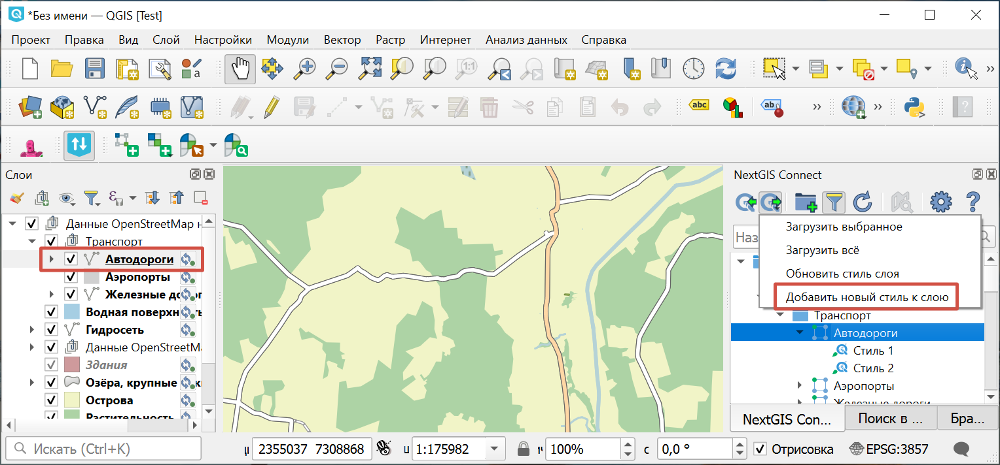

   Добавление стиля

Чтобы обновить стиль, не нужно выбирать конкретный.

1. если стиль у слоя один, то он и обновляется;
2. если стилей у слоя несколько, то показывается выбор;
3. если стиля у слоя нет, то он просто добавляется.

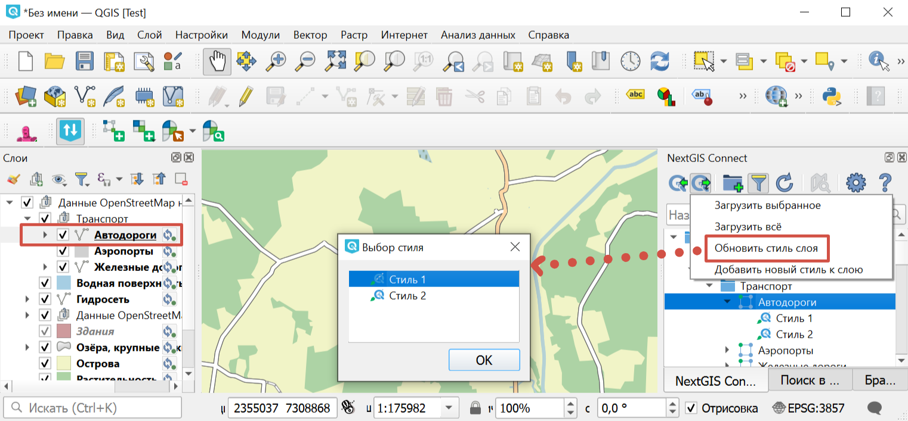

   Выбор одного из стилей для обновления

Также эта операция доступна в контекстном меню слоя в панели слоёв QGIS: :menuselection:`NextGIS Connect --> Добавить новый стиль к слою / Обновить стиль слоя`.

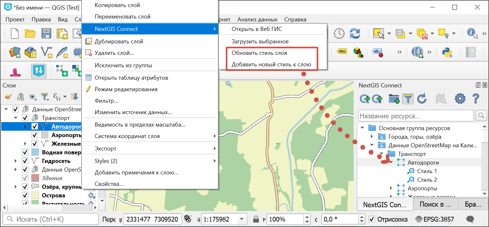

   Обновление/добавление стиля через контекстное меню слоя

.. _connect_style_copy:

Копирование стиля из Веб ГИС
-----------------------------

Модуль имеет возможность копирования QML-стиля слоя в Веб ГИС для применения его к локальному слою в QGIS. 

.. raw:: html

   <iframe width="560" height="315" src="https://rutube.ru/play/embed/7460a5277d280d8d74942770b88a2b28/" frameBorder="0" allow="clipboard-write; autoplay" webkitAllowFullScreen mozallowfullscreen allowFullScreen></iframe>

Посмотреть видео процесса на `youtube <https://youtu.be/UH2OKvBz1Mk>`_, `rutube <https://rutube.ru/video/7460a5277d280d8d74942770b88a2b28/>`_.

Разверните нужный вам слой в дереве Connect и кликните правой кнопкой мыши по QML-стилю слоя. Выберите «Копировать стиль» и стандартным способом через контекстное меню слоя на панели слоёв QGIS вставьте его.

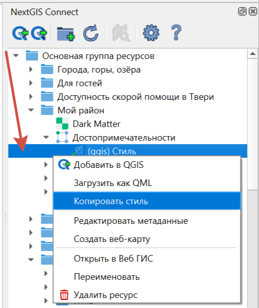

   Копирование стиля

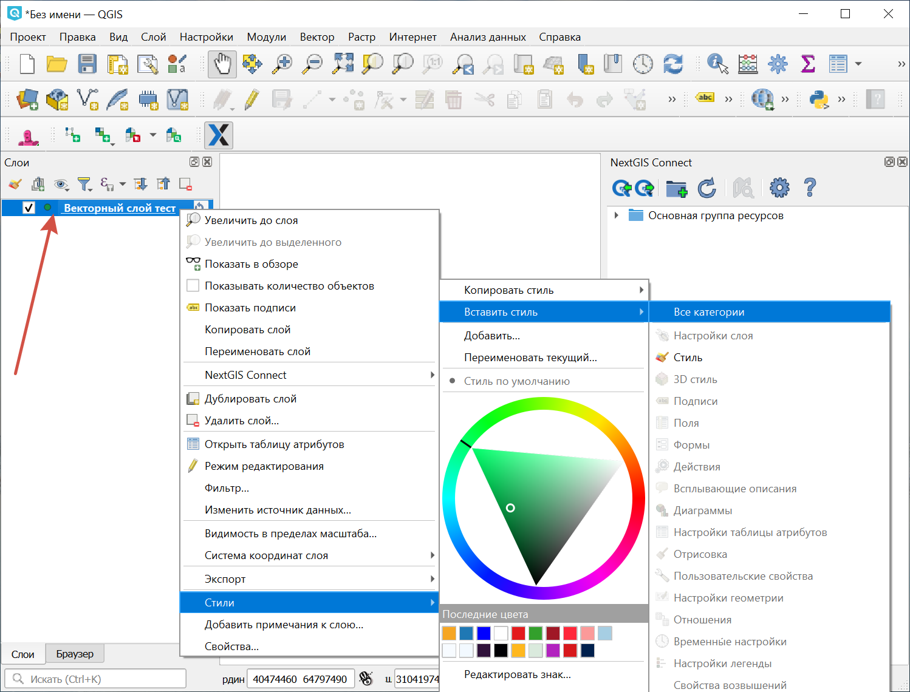

   Вставить стиль

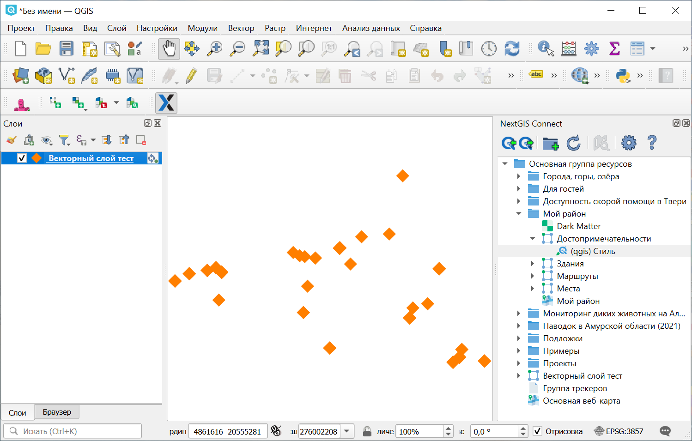

   Скопированный стиль в проекте QGIS
