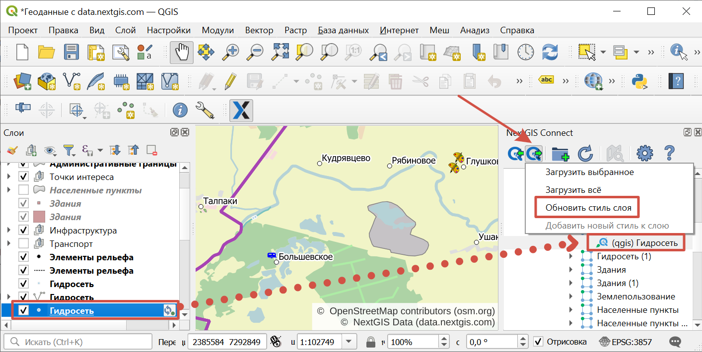
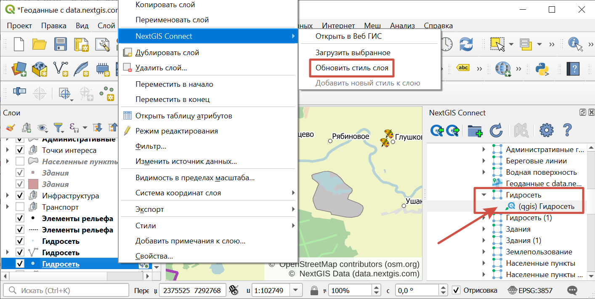
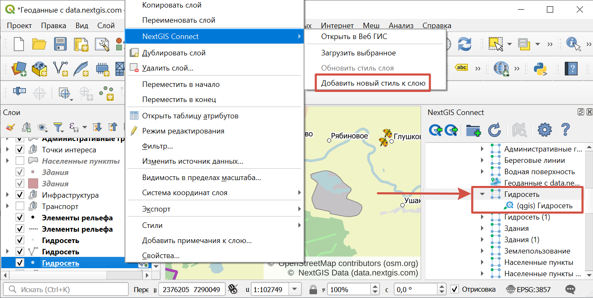

.. _connect_data_edit:

Редактирование 
=========================
  
Модуль NextGIS Connect позволяет быстро редактировать геометрии и атрибуты объектов в Векторных слоях Веб ГИС. Функция применима только для форматов векторных данных, используемых в QGIS.

.. warning:: 
	По умолчанию редактировать слой *напрямую* может один пользователь. 

#. Импортируйте слой из Веб ГИС в QGIS, выделив его в окне NextGIS Connect и нажав "Добавить в QGIS".
#. Перейдите в режим редактирования в контекстном меню слоя или через панель инструментов.
#. Внесите необходимые изменения.
#. Выйдите из режима редактирования. В появившемся диалоговом окне сохраните изменения.
#. Синхронизация произойдет автоматически.

Если со времени последней синхронизации в облаке были сделаны изменения, дальнейшая синхронизация станет невозможна. Нажмите на значок синхронизации рядом со слоем, в открывшемся окне "Статус слоя" в выпадающем меню выберите **Сброс слоя**. Обратите внимание: если  сброс произойдет при наличии локальных изменений, они будут утеряны. 

.. figure:: _static/ngc_check_sync_ru.png
   :align: center
   :alt: Всплывающая подсказка с информацией о синхронизации
   :width: 16cm

   Значок синхронизации слоя

.. figure:: _static/ngc_layer_status_ru.png
   :align: center
   :width: 14cm

   Диалоговое окно статуса слоя. Для сброса слоя нужно нажать на стрелочку вниз рядом с кнопкой "Синхронизация" и выбрать "Сброс слоя"

Если нужно одновременное редактирование данных с разных устройств/платформ, то доступны следующие варианты:

1. Использовать сервисы OGC API — Features или `WFS <https://docs.nextgis.ru/docs_ngcom/source/ngqgis_connect.html#ngcom-connect-data-edit-wfs>`_. Их можно создать в Веб ГИС (`WFS <https://docs.nextgis.ru/docs_ngweb/source/layers.html#c-wfs>`_, `OGC API — Features <https://docs.nextgis.ru/docs_ngweb/source/layers.html#c-ogc-api-features>`_) или прямо `через коннект <https://docs.nextgis.ru/docs_ngcom/source/ngqgis_connect.html#wfs-wms-ogc-api-features>`_, и редактировать данные через них.

2. Напрямую в QGIS с включенной функцией `версионирования <https://docs.nextgis.ru/docs_ngweb/source/layers.html#create-vector-layer-vers-pic>`_ векторных слоёв. Включается в Веб ГИС в настройках каждого векторного слоя. При включенном версионировании вся история изменений слоя будет накапливаться в системе. Это позволит Connect увидеть изменения, сделанные на других устройствах, и обработать их без сброса слоя.

Синхронизируются и версионируются только сами данные. Изменение структуры данных сделает синхронизацию невозможной и слой нужно будет скачать заново.

.. _connect_data_edit_wfs:

Редактирование через WFS
--------------------------

Также редактирование векторного слоя возможно при использовании стандартного протокола :term:`WFS` (с поддержкой редактирования):

* :ref:`Опубликуйте по протоколу WFS <ngcom_ngqgis_connect_wfs_service>` Векторный слой, объекты которого вы хотите отредактировать (как это сделать, см выше);
* Выберите в дереве ресурсов Веб ГИС в окне модуля NextGIS Connect соответствующий WFS сервис;
* Нажмите кнопку **Добавить в QGIS** на панели инструментов модуля или выберите пункт **Добавить в QGIS** в контекстном меню сервиса;

.. figure:: _static/NGConnect_edit_add_ru.png
   :name: NGConnect_edit_add_pic
   :align: center
   :width: 20cm
   
   Добавление слоя в QGIS через панель NextGIS Connect
   
* Если операция прошла успешно, то на панели слоев QGIS появится новая группа слоев WFS, опубликованных с помощью добавленного WFS сервиса;
* Включите режим редактирования (иконка карандаша) и отредактируйте геометрии и атрибуты объектов в добавленном слое WFS с помощью :ref:`стандартных инструментов QGIS <ngqgis_editing>`;

.. figure:: _static/NGConnect_edit_process_ru.png
   :name: NGConnect_edit_process_pic
   :align: center
   :width: 20cm
   
   Редактирование объектов

* Нажмите ещё раз кнопку "Режим редактирования" и подтвердите сохранение изменений.

.. figure:: _static/NGConnect_edit_save_ru.png
   :name: NGConnect_edit_save_pic
   :align: center
   :width: 20cm
   
   Сохранение изменений векторного слоя
   
* Если редактирование объектов прошло успешно, то соответствующие изменения сразу же будут отображены в Веб ГИС в :ref:`Таблице объектов <ngw_feature_table>` и :ref:`веб-клиенте <ngw_webmaps_client>` Веб-карты.

.. _connect_data_overwrite:

Обновление данных
-----------------

С помощью NextGIS Connect можно обновить целиком содержимое уже существующего векторного слоя Веб ГИС, заменив входящие в него объекты, но сохранив его стили, псевдонимы атрибутов и другие настройки.

.. warning:: 
   Все данные целевого слоя, включая вложения (фото, документы), будут очищены. Если вам нужно их сохранить - используйте WFS

Для обновления (замены) данных слоя:

* Выберите на панели слоёв QGIS векторный слой, объекты которого вы хотите отправить в векторный слой Веб ГИС;
* Выберите в дереве ресурсов Веб ГИС в окне модуля NextGIS Connect векторный слой, объекты которого вы хотите заменить;
* Щелкните правой кнопкой мыши по выбранному векторному слою в окне NextGIS Connect и выберите **Перезаписать выбранный слой**.

Идентификатор ресурса слоя при этом останется неизменным. Операция подразумевает, что слой-источник и целевой слой имеют одинаковую структуру атрибутов.

   
.. figure:: _static/NGconnect_vector_overwrite_ru_2.png
   :name: connect_vector_overwrite
   :align: center
   :width: 20cm
   
   Перезапись выбранного слоя через контекстное меню

Объекты слоя также можно `редактировать <https://docs.nextgis.ru/docs_ngcom/source/ngqgis_connect.html#ngcom-ngqgis-connect-data-edit>`_ напрямую или через WFS.

.. _connect_style_overwrite:

Обновление стиля
-----------------

Стиль можно заменить или добавить к существующему.

Для того, чтобы внести изменения и заменить старый стиль на новый:

* Добавьте слой в QGIS через Connect.
* Измените стиль вашего слоя (цвет, толщина линий и так далее).
* Выделите слой в панели слоев QGIS, а в окне Connect выделите **стиль** нужного ресурса.
* В панели инструментов Connect нажмите кнопку "Добавить в Веб ГИС" и выберите в меню "Обновить стиль слоя". (Или в панели слоев QGIS на редактируемом слое - Правый клик > NextGIS Connect > Обновить стиль слоя)

   Обновление стиля

   Обновление стиля через контекстное меню слоя

После данных операций модуль NextGIS Connect удалит старый стиль вашего слоя из веб ГИС и загрузит новый, оставив при этом нетронутыми данные и вложения.

Также можно добавить изменённый стиль, сохранив старый. Для этого после внесения изменений сделайте следующее:

* Выделите в окне Connect **слой**.
* В панели слоев QGIS в контекстном меню выберите NextGIS Connect > Добавить новый стиль к слою.

   Добавление стиля

.. _connect_style_copy:

Копирование стиля из Веб ГИС
-----------------------------

Модуль имеет возможность копирования QML-стиля слоя в Веб ГИС для применения его к локальному слою в QGIS.

Разверните нужный вам слой в дереве Connect и кликните правой кнопкой мыши по QML-стилю слоя. Выберите «Копировать стиль» и стандартным способом через контекстное меню слоя на панели слоёв QGIS вставьте его.

.. figure:: _static/connect_copy_style_ru.png
   :name: connect_copy_style_pic
   :align: center
   :width: 8cm

   Копирование стиля

.. figure:: _static/connect_paste_style_ru.png
   :name: connect_paste_style_pic
   :align: center
   :width: 20cm

   Вставить стиль

.. figure:: _static/connect_result_style_ru.png
   :name: connect_result_style_pic
   :align: center
   :width: 20cm

   Скопированный стиль в проекте QGIS
