.. _connect_data_edit:

Edit data 
=========================

.. |button_to_qgis| image:: _static/button_to_qgis.png
   :width: 6mm

.. |button_to_wg| image:: _static/button_to_wg.png
   :width: 6mm
  
NextGIS Connect plugin allows to quickly edit geometries and attribute values of features in Web GIS Vector layers right after adding them to QGIS. This allows the layer to be edited even with no Internet connection. The changes will be saved to the device and transfered to Web GIS when the connection is restored.

This functionality is only available for vector data formats used in QGIS.

.. warning:: 
	By default only one user at a time can edit the layer **directly**. 

#. Import the layer from Web GIS to QGIS by selecting it in NextGIS Connect and pressing |button_to_qgis| Add to QGIS.
#. Enter the edit mode from the layer’s context menu or from the toolbar.
#. Make the changes.
#. Exit edit mode. Confirm changes in the pop-up window.
#. The layer will be automatically synchronized.

To check when the layer was last synchronized, hover over the sync symbol.

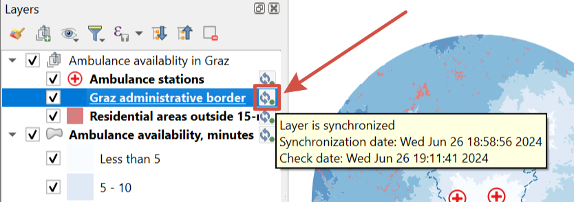

   Synchronization information

Press the symbol to open the layer status window.

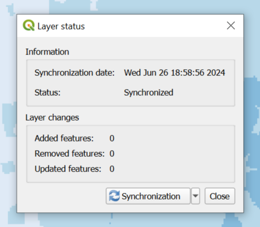

   Layer status dialog

It has the date and time of the latest synchronization and the status: synchronized or not synchronized.

You can start the process manually by pressing the **Synchronization** button.

.. important::
    While the layer is in edit mode, synchronization is not available.

If changes have been made to the layer in Web GIS since the last synchronization, further synchronization will not be possible. Press the sync symbol by the layer, "Layer status" window will open. In the dropdown menu select **Reset layer**. Keep in mind that if you reset the layer, all local changes that had not been synchronized will be lost. 

   Layer synchronization symbol

   Layer status dialog. To reset the layer, press the downward arrow by the "Synchronization" button and select "Reset layer"

If the edits made in the cloud were incorrect and you need to replace them with local ones, you can use the `Data overwrite <https://docs.nextgis.com/docs_ngconnect/source/edit.html#connect-data-overwrite>`_ function.

Only the data itself is synchronized. If the data structure changes, it makes synchronization impossible. The layer needs to be downloaded again.

.. _connect_multiuser:

Multi user editing
--------------------------------

Layers can be edited by several people at once or from several different devices/platforms. The options for collaborative editing are:

1. Use OGC API — Features or `WFS <https://docs.nextgis.com/docs_ngconnect/source/edit.html#connect-data-edit-wfs>`_ services. You can create them in Web GIS (`WFS <https://docs.nextgis.com/docs_ngweb/source/layers.html#c-wfs>`_, `OGC API — Features <https://docs.nextgis.com/docs_ngweb/source/layers.html#c-ogc-api-features>`_) or directly in the `Connect plugin <https://docs.nextgis.ru/docs_ngcom/source/ngqgis_connect.html#wfs-wms-ogc-api-features>`_ and then use them to edit data.

2. Edit directly in QGIS with enabled `versioning <https://docs.nextgis.com/docs_ngweb/source/layers.html#create-vector-layer-vers-pic>`_ of vector layers.  Turn on versioning in the layer's settings in Web GIS. When versioning is on, all changes made to the layer are logged in the system. That allows Connect to access edits made on other devices and process them without resetting the layer.

.. _connect_data_edit_wfs:

Edit layer with WFS
--------------------------

You can also edit a vector layer using the standard :term:`WFS` protocol (with feature edit support):

* Publish via WFS protocol the Vector layer you're going to edit;
* Select in NextGIS Connect Resources panel the relevant WFS service;
* Press |button_to_qgis| Add to QGIS button on NextGIS Connect control panel or select **Add to QGIS** in the service context menu;

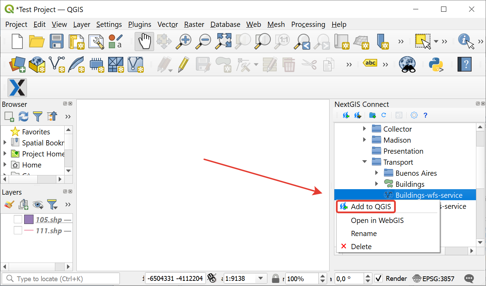
   
   Adding layer to QGIS using WFS service
   
* If the operation is successful you'll see in QGIS Layers panel a new group of WFS layers published via the selected WFS service;
* Enter Edit mode and modify geometries and attributes in the added WFS layer using standard QGIS tools;

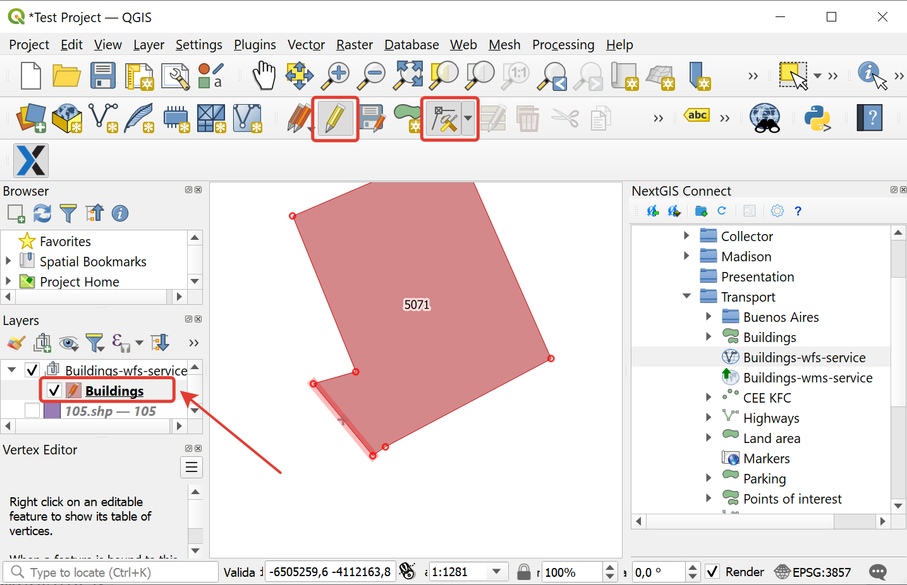
   
   Features editing

* Press the "Edit" button to finish editing and press "Save" in the opened window.

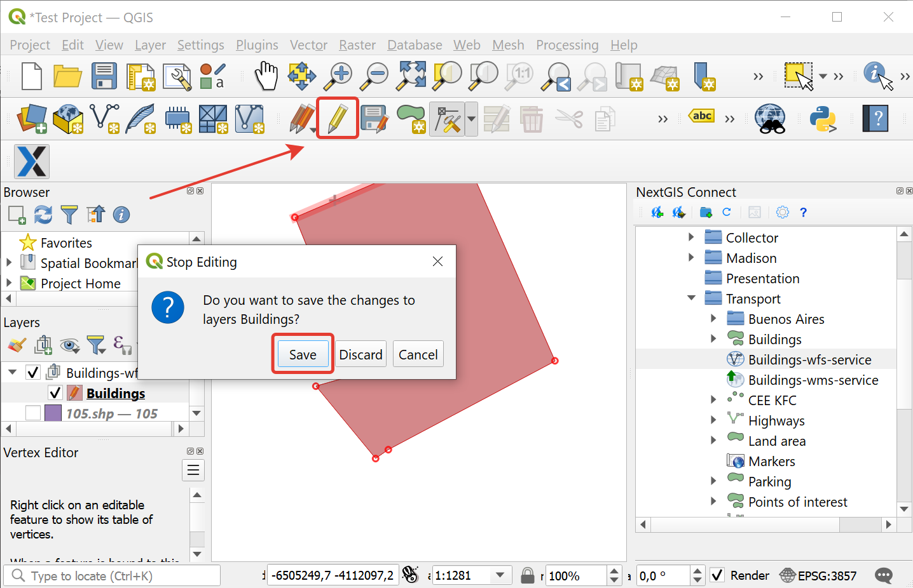
   
   Saving changes
   
* If the editing was successful, you'll be able to see the changes in the Web GIS at once, both in the :ref:`Feature table <ngw_feature_table>` and on the Web Map :ref:`web client <ngw_webmaps_client>`.

.. _connect_data_overwrite:

Update data
-----------------

NextGIS Connect allows you to update the content of an existing Web GIS vector layer keeping its styles, attribute aliases and other settings.

.. warning:: 
   When a **layer** is updated, all data of the target layer including attachments (photos, documents) is cleared. If you need to keep the attachments intact, use `WFS <https://docs.nextgis.ru/docs_ngconnect/source/resources.html#wfs>`_. When you update a `style <https://docs.nextgis.com/docs_ngconnect/source/edit.html#connect-style-overwrite>`_, it does not affect attachments.

To update (overwrite) layer's data:

* In the QGIS Layers panel, select the vector layer that has features you want to send to an existing Web GIS vector layer;
* In the NextGIS Connect panel select the vector layer , select the vector layer the contents of which you need to replace;
* Right click on the target layer and choose **Overwrite selected layer**.

Layer resource ID stays the same. The attribute structure of the source and target layers must be the same, otherwise you cannot overwrite data.

   
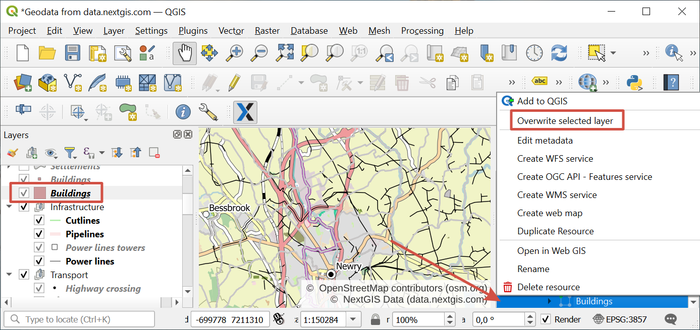
   
   Overwriting layer with the new version via context menu 

You can also edit features `directly <https://docs.nextgis.com/docs_ngconnect/source/edit.html#connect-data-edit>`_ or via `WFS <https://docs.nextgis.com/docs_ngconnect/source/edit.html#connect-data-edit-wfs>`_.

.. _connect_style_overwrite:

Update style
-----------------

You can add another style to a layer or replace its existing style with a new one. When a style is updated, the NextGIS Connect module removes the old style of the layer from the Web GIS and loads the new one leaving all data and attachments intact.

* Add layer to QGIS via Connect;
* Change the style of the layer (color, line width, etc.);
* Select the layer in QGIS Layers panel as well as in the Connect panel.
* In Connect toolbar press |button_to_wg| Add to Web GIS and in the dropdown menu select "Add new style to layer" or "Update style".

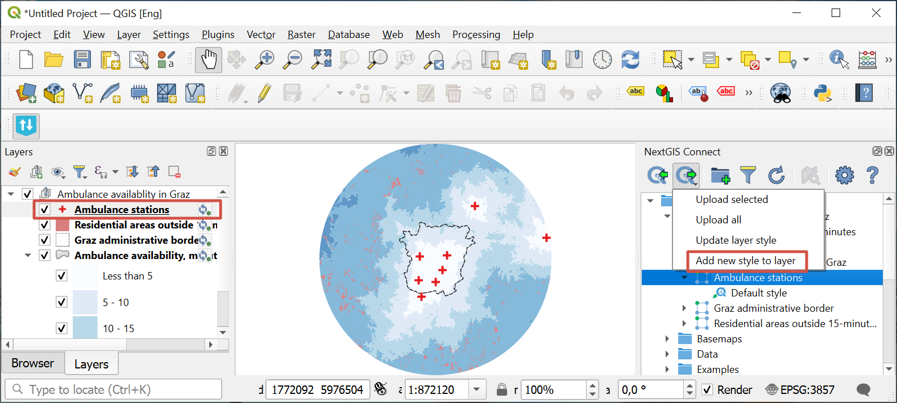

   Adding style to a layer

To update layer's style you don't need to select a specific one.

1. If the layer has only one style, this style is updated;
2. If the layer has multiple styles, selection dialog appears;
3. If the layer has no style, the style is added to it.

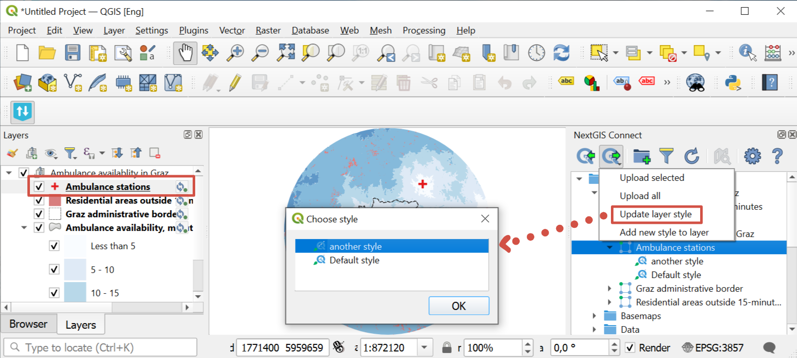

   Selecting one of the styles to update

This operation is also available in the layer's context menu in QGIS Layers panel: :menuselection:`NextGIS Connect --> Add new style to layer / Update layer style`.

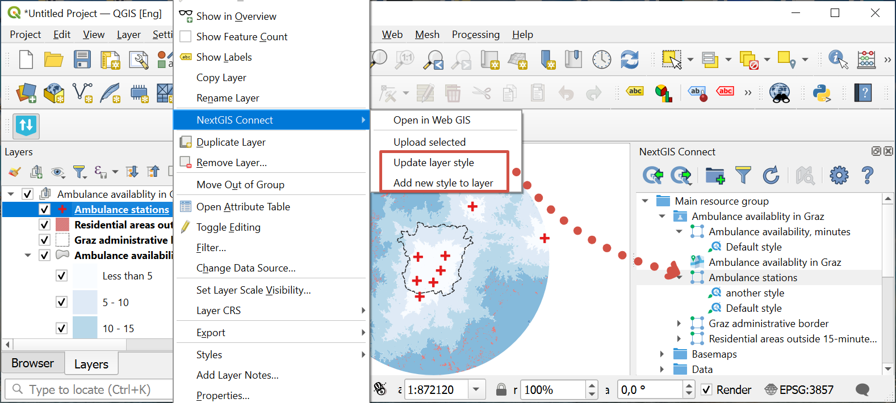

   Updating/adding a style from context menu

.. _connect_style_copy:

Copy style from Web GIS
-----------------------------

With Connect you can copy QML style from Web GIS and apply it to a local style in QGIS. 

.. raw:: html

   <iframe width="560" height="315" src="https://www.youtube.com/embed/bmba3qqgTmM?si=rT99QhzB5_InKbnU" title="YouTube video player" frameborder="0" allow="accelerometer; autoplay; clipboard-write; encrypted-media; gyroscope; picture-in-picture; web-share" referrerpolicy="strict-origin-when-cross-origin" allowfullscreen></iframe>

Watch on `youtube <https://youtu.be/bmba3qqgTmM?si=dZMBmZyPSXojFgiY>`_.

Click on the layer in the Connect panel to view the styles and right-click on the QML-style. Select "Copy style" in the context menu. Then in the QGIS Layers panel paste style via context menu as usual.

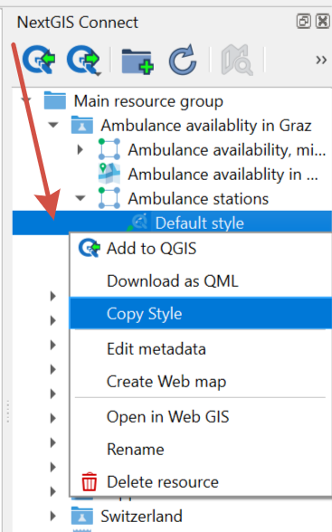

   Copying a style

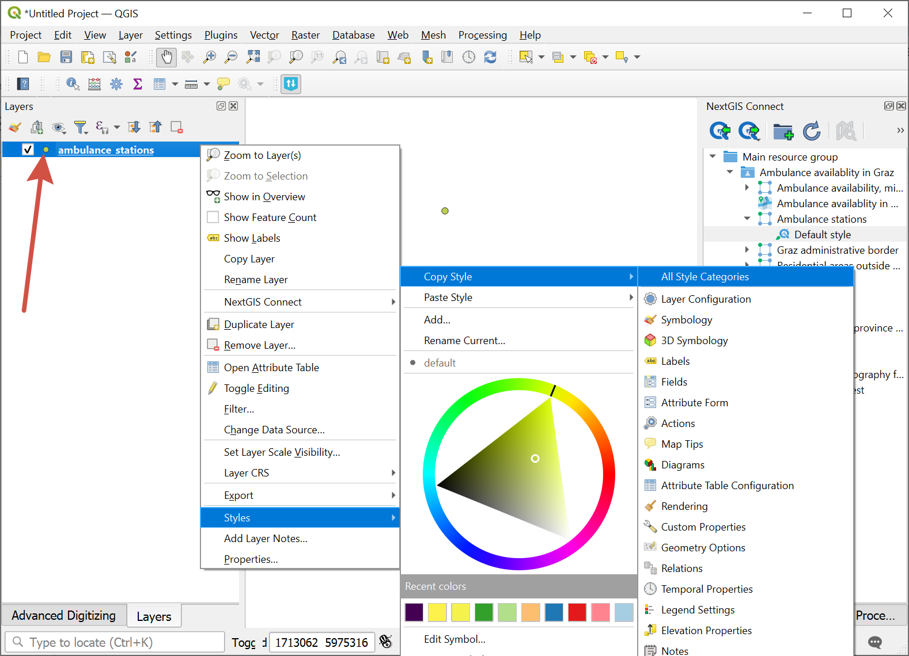

   Pasting a style

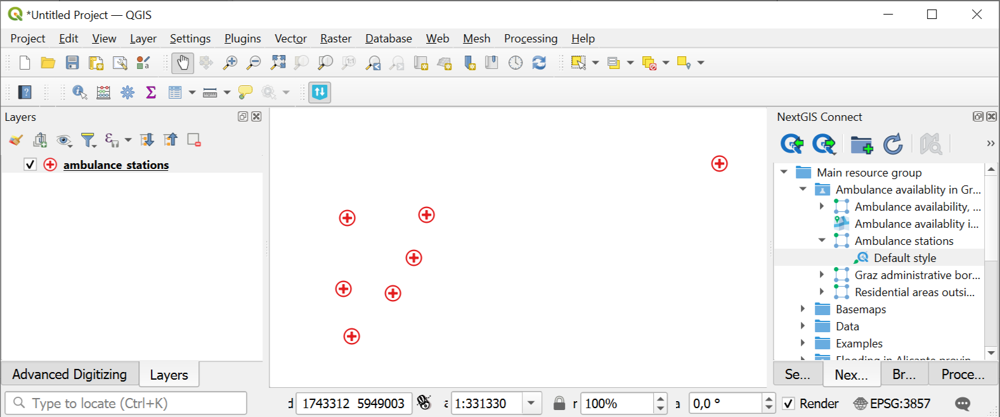

   Copied style in the QGIS project
