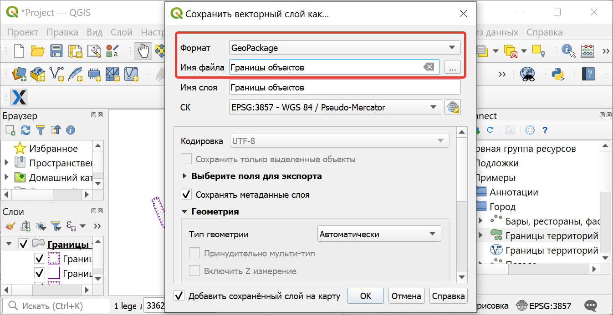
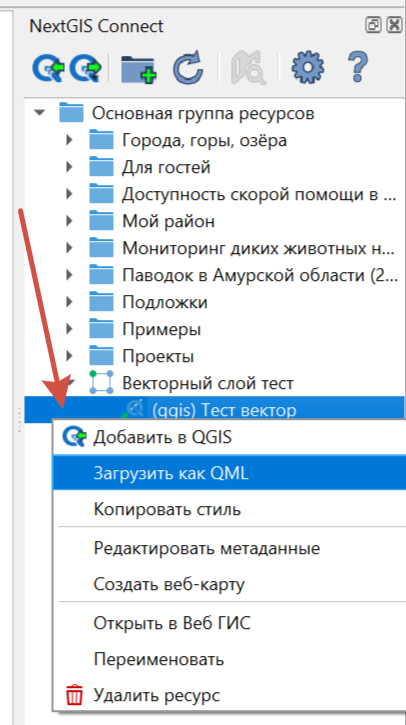

.. _connect_save_to_device:

Экспорт в файл 
================

.. _connect_save_layer:

Сохранить слой в файл
-------------------------

Чтобы сохранить **слой** на устройстве, выберите в главном меню :menuselection:`Слой --> Сохранить как` или в панели слоев вызовите контекстное меню и нажмите :menuselection:`Экспорт --> Сохранить объекты как`.

   
   Сохранение векторного слоя в файл

.. _connect_save_style:

Сохранить стиль векторного слоя
---------------------------------

Чтобы сохранить на устройстве **стиль** QGIS векторного слоя, в панели Connect вызовите к нему контекстное меню и выберите **Загрузить как QML**.

   Загрузка стиля слоя как файла QML
