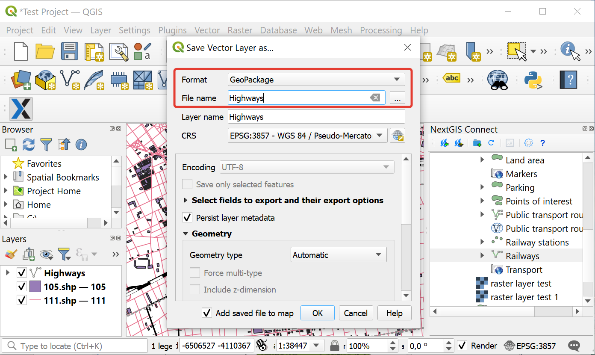
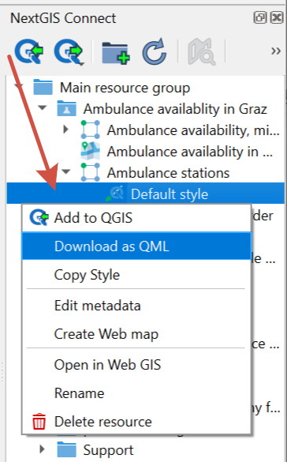

.. _connect_save_to_device:

Export to file 
================

.. _connect_save_layer:

Save layer as file
-------------------------

To save a **layer** to your device select in the main menu :menuselection:`Layer  -->  Save as` or in the Layers panel in the layer's context menu select :menuselection:`Export --> Save features as`.

   
   Saving vector layer to a file

.. _connect_save_style:

Save vector layer style
---------------------------------

To save a QGIS **style** of a vector layer, in the Connect panel open its context menu and select **Download as QML**.

   Saving style to a QML file
