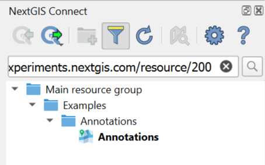
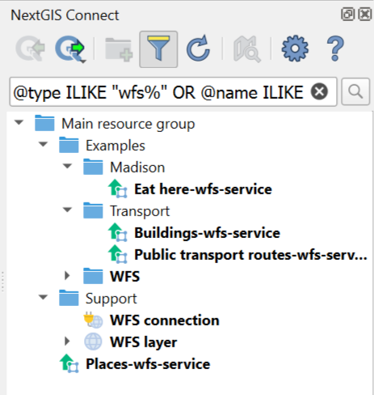
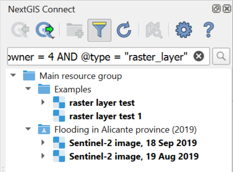
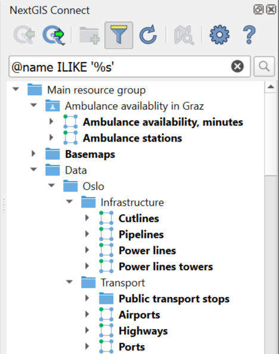
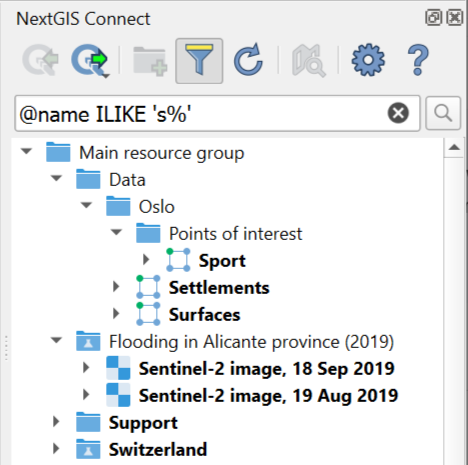
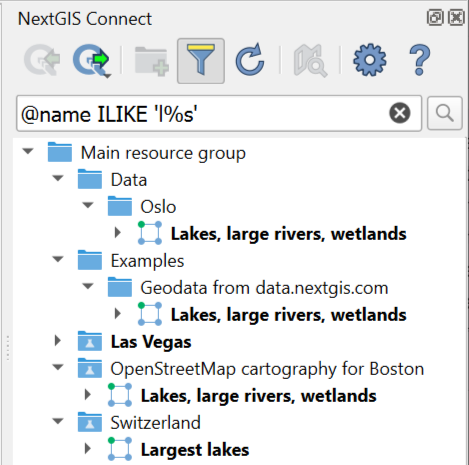
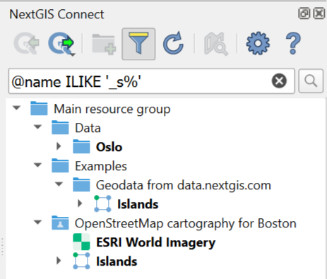
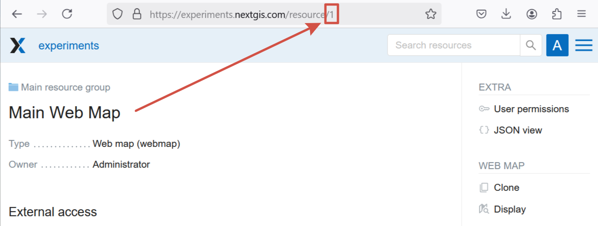
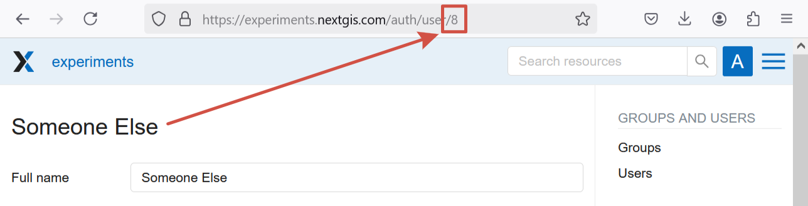
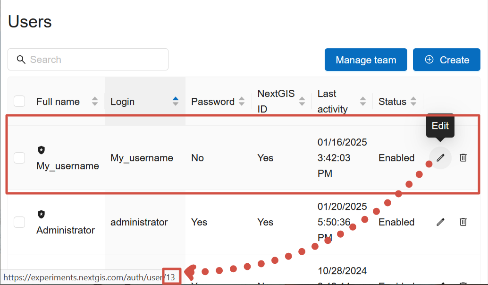

.. sectionauthor:: Yulia Grigorenko <yulia.grigorenko@nextgis.com>

Search and filter
======================

In NextGIS Connect you can `search resources by name <https://docs.nextgis.com/docs_ngconnect/source/filter.html#ngc-search-name>`_ and `url <https://docs.nextgis.com/docs_ngconnect/source/filter.html#ngc-search-url>`_ or `filter <https://docs.nextgis.com/docs_ngconnect/source/filter.html#ngc-filter-expression>`_ the resource tree using expressions.

To open the search/filter bar, press |button_filter| button in the plugin toolbar.

.. |button_filter| image:: _static/button_filter.png
   :width: 6mm
   :alt: funnel

.. _ngc_search_name:

Search by name
----------------------------

To search by name, enter word(s) or symbol(s) that are part of the resource name (use part of the word if you're not sure what form it is in). The resource tree will be filtered to only display the resources that have the entered symbol combination in their names and paths to those resources in the tree. The search results are marked in bold.

Keep in mind that letters with diacritical signs, such as é or ü are considered separate symbols. To find all the variations of the spelling used in the Web GIS, enter a part of the name or use an `expression with wildcards <https://docs.nextgis.com/docs_ngconnect/source/filter.html#ngc-filter-expression>`_.

To find the exact match, enclose the search words in quotation marks.

.. _ngc_search_url:

Search by URL
--------------

If you have a link to a Web GIS resource you can find it in the NextGIS Connect resource tree by pasting the URL into the search bar. The layer tree will display the path to the resource.

   Search by link

If you know the resource ID, you can find it in the layer tree by using an `expression <https://docs.nextgis.com/docs_ngconnect/source/filter.html#ngc-filter-expression>`_ or by adding it to the Web GIS URL, following the template ``https://mywebgis.nextgis.com/resource/id``, e.g. https://experiments.nextgis.com/resource/200.

.. _ngc_filter_expression:

Filter by expression
--------------------------------

To filter the resource tree by parameters other than the resource name (see the full list below) use expressions with conditions ``=, IN, ILIKE``. As for logical operators ``AND`` и ``OR``, you can use either of them several times in an expression, but not combined with the other. 

Examples of expressions: 

``@type ILIKE "wfs%" OR @name ILIKE "%wfs%"``. The Connect panel will show all the WFS connections, layers and services as well as resource that have "wfs" in their name (e.g. a Web Map called "WFS demo").

   All resources related to WFS

``@owner = 4 AND @type = "raster_layer"``. The Connect panel will show all raster layers owned by the user with ID=4.

   All raster layers of a particular user

You can filter resources by:

* ``@id`` – identification number of the resource. You can also use it to `search by URL <https://docs.nextgis.com/docs_ngconnect/source/filter.html#ngc-search-url>`_.
* ``@parent`` – identification number of the parent resource, all its subresources will be displayed (e.g. all resources in a group or all styles and forms of a layer)
* ``@owner`` – all resources owned by the user with the entered ID

Values for the above expressions are entered as numbers, no quotation marks. `Where to find these numbers. <https://docs.nextgis.com/docs_ngconnect/source/filter.html#ngc-find-id>`_

Administrators also can enter usernames for search by owner.

* ``@type`` – resource type (resource group, vector layer, lookup table etc), see the full list of possible values below
* ``@name`` – resource name, similar to `search by name <https://docs.nextgis.com/docs_ngconnect/source/filter.html#ngc-search-name>`_, but can be combined with other parameters. ``@name = "text"`` searches for exact matches, while the simple name search uses the expression ``@name ILIKE "%text%"``
* ``@keyname`` – resource key
* ``@description`` – resource description

Values of these parameters are strings, they should be enclosed in quotation marks or apostrophes. Also you can add one of the wildcards: ``_`` – any symbol or ``%`` – any number of any symbols. 

As an example, see how it works for the expression @name ILIKE …

* ``'%s'`` – any string that ends with the letter S, for example "Track\ **s**"
* ``'s%'`` – any string that starts with the letter S, for example "**S**\ entinel"
* ``'l%s'`` – any string that starts with a the letter L and ends with the letter S, for example "**L**\ as Vega\ **s**" or "**L**\ ake\ **s**"
* ``'_s%'`` – any string that has the letter S in the second position, for example "O\ **s**\ lo"

.. _resource_types:

Resource types
--------------------------
Use the following values for the resource type search:

* Basemap – baselayers
* Collector project – collector_project
* Demo project – demo_project
* File bucket- file_bucket
* Form – formbuilder_form
* Lookup table – lookup_table
* MapServer style – mapserver_style
* OGC API – Features service – ogcfserver_service
* PostGIS connection – postgis_connection
* PostGIS layer – postgis_layer
* QGIS raster style – qgis_raster_style
* QGIS vector style – qgis_vector_style
* Raster layer – raster_layer
* Raster style – raster_style
* Resource group – resource_group
* SVG marker library – svg_marker_library
* Tileset – tileset
* TMS connection – tmsclient_connection
* TMS layer – tmsclient_layer
* Tracker – tracker
* Trackers group – trackers_group
* Vector layer – vector_layer
* Web Map – webmap
* WFS connection – wfsclient_connection
* WFS layer – wfsclient_layer
* WFS service – wfsserver_service
* WMS connection – wmsclient_connection
* WMS layer – wmsclient_layer
* WMS service – wmsserver_service

.. _ngc_find_id:

How to find identification numbers
------------------------------------------------------------------

ID of a resource, as well as user ID, can be found in the URL while viewing a Web GIS in a browser.

To find out the ID of resource, open its page (you can do it from the Connect panel context menu or from the Layers panel if the resource is added to QGIS). The number at the end of the URL is the resource ID.

   ID of the Main resource group visible in the browser: 1

To learn user ID, in the Web GIS go to the `Control panel <https://docs.nextgis.com/docs_ngweb/source/admin_interface.html#ngw-control-panel>`_, open `Users <https://docs.nextgis.com/docs_ngweb/source/users.html>`_ section, find the user you need and enter the Edit mode (or just hover the cursor over the pencil icon to see the link without opening the page, if your browser allows it).

   User ID for "Someone Else" is 8

   Hovering over the Edit button you can see the link to the profile editing. The ID of the user "My_username" is 13

