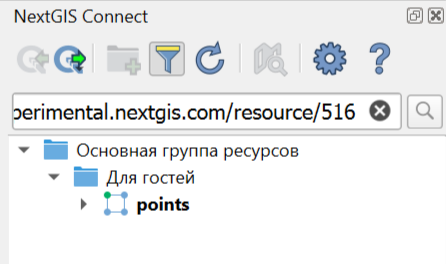
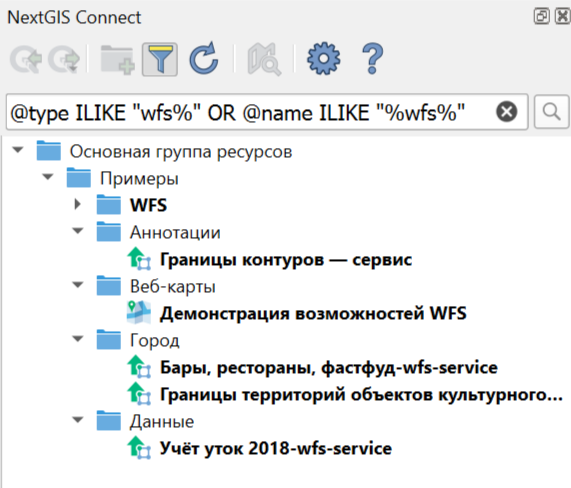
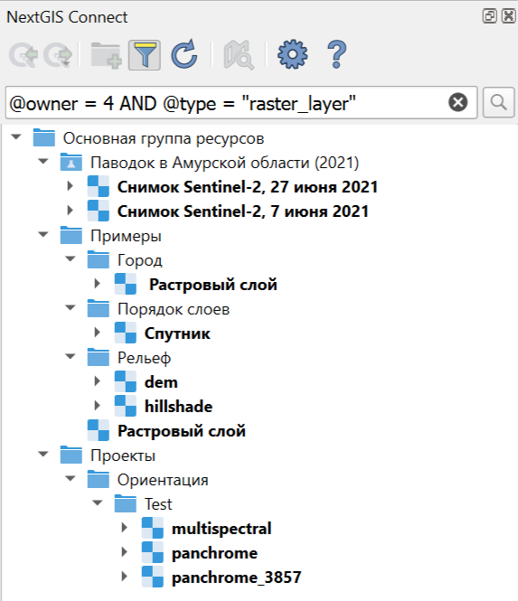
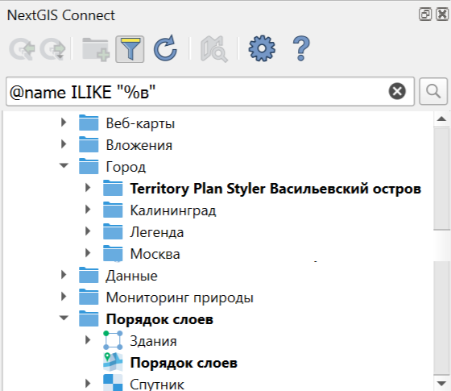
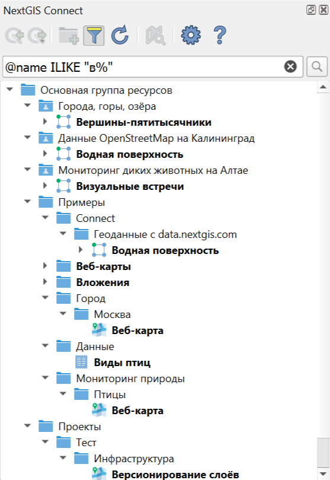
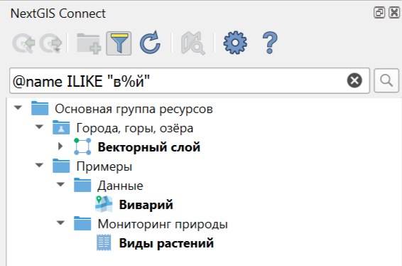
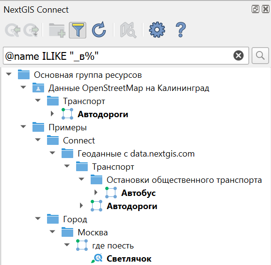
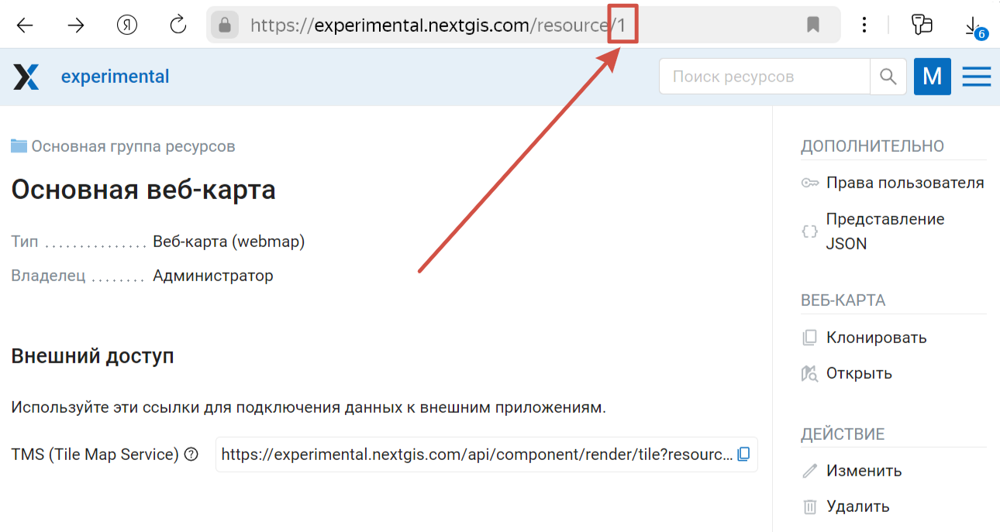
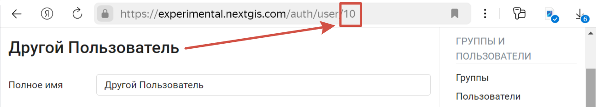
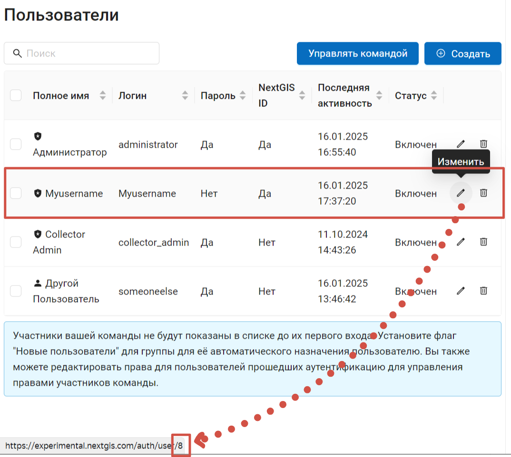

.. sectionauthor:: Юлия Григоренко <yulia.grigorenko@nextgis.com>

Поиск и фильтрация
======================

Модуль NextGIS Connect позволяет `искать ресурсы по названию <https://docs.nextgis.ru/docs_ngconnect/source/filter.html#ngc-search-name>`_ и `URL <https://docs.nextgis.ru/docs_ngconnect/source/filter.html#ngc-search-url>`_ или `фильтровать <https://docs.nextgis.ru/docs_ngconnect/source/filter.html#ngc-filter-expression>`_ дерево ресурсов по выражению.

Чтобы активировать поиск, нажмите кнопку |button_filter| в панели инструментов модуля.

.. _ngc_search_name:

Поиск по названию
----------------------------

Для поиска по названию введите слово, несколько слов, или символ(ы), входящие в название (если не уверены в использованной форме слова, например). В дереве останутся только те ресурсы, названия которых содержат введённые символы, и путь к ним в дереве ресурсов. Найденные ресурсы выделяются жирным.

Обратите внимание, что такие буквы, как Е и Ё являются разными символами, поэтому поисковые запросы "учёт" и "учет" дадут разные результаты. Чтобы найти ресурсы с обоими написаниями, можно ввести "уч", но тогда в фильтр попадут также ресурсы, содержащие, например, слово "участок".

Для поиска точных соответствий заключите ключевые слова для поиска в кавычки.

.. _ngc_search_url:

Поиск по ссылке
-------------------

Если у вас есть ссылка на ресурс, вы можете найти его расположение в дереве ресурсов при помощи панели Connect. В дереве слоёв будет показан ресурс и путь к нему.

   Поиск по URL

Также если вы знаете номер ресурса, вы можете найти его не только при помощи `выражения <https://docs.nextgis.ru/docs_ngconnect/source/filter.html#ngc-filter-expression>`_, но и подставив его в ссылку вида ``https://mywebgis.nextgis.com/resource/id``, например https://experimental.nextgis.com/resource/516.

.. _ngc_filter_expression:

Фильтр по выражению
--------------------------------

Помимо названия, можно фильтровать дерево ресурсов по другим параметрам (список см. ниже), при помощи выражений  с условиями ``=, IN, ILIKE``. Логические операторы ``AND`` и ``OR``  можно использовать несколько раз в одном выражении, но не комбинировать их между собой. 

Примеры выражений: 

``@type ILIKE "wfs%" OR @name ILIKE "%wfs%"``. В панели Коннекта будут показаны все соединения, слои и сервисы WFS, а также ресурсы, которые содержат буквы "wfs" в названии (например, веб-карта "Демонстрация возможностей WFS").

   Все ресурсы, связанные с WFS

``@owner = 4 AND @type = "raster_layer"``. В панели Коннекта будут показаны все растровые слои, владельцем которых является пользователь с ID 4.

   Все растровые слои определённого пользователя

Доступна фильтрация по следующим параметрам:

* ``@id`` - идентификационный номер ресурса. Перейти к нужному ресурсу в дереве Connect также можно, подставив его ID в `ссылку на Веб ГИС <https://docs.nextgis.ru/docs_ngconnect/source/filter.html#ngc-search-url>`_
* ``@parent`` - идентификационный номер ресурса-родителя, будут показаны все дочерние ресурсы (например, все ресурсы в конкретной папке или все стили и формы определённого слоя)
* ``@owner`` - владелец ресурса, идентификационный номер пользователя

Значения этих параметров записываются цифрами, без кавычек. `Как узнать эти номера? <https://docs.nextgis.ru/docs_ngconnect/source/filter.html#ngc-find-id>`_

Для администраторов также доступен поиск по имени владельца ресурса.

* ``@type`` - тип ресурса (группа ресурсов, векторный слой, справочник и т.п.), список возможных значений `см. ниже <https://docs.nextgis.ru/docs_ngconnect/source/filter.html#resource-types>`_
* ``@name`` - наименование ресурса, аналогично простому `поиску по названию <https://docs.nextgis.ru/docs_ngconnect/source/filter.html#ngc-search-name>`_, но может комбинироваться с другими параметрами. ``@name = "text"`` ищет полное точное соответствие, а обычный поиск формирует запрос ``@name ILIKE "%text%"``
* ``@keyname`` - ключ ресурса
* ``@description`` - описание ресурса

Значения этих параметров представляют собой строки и записываются в кавычках. Также к ним можно добавить ``_`` - один любой символ и ``%`` - любое количество любых символов. 

Как это будет работать, например, для выражения @name ILIKE …

* ``"%в"`` - строка заканчивается буквой В, например, "Группа ресурсо\ **в**"
* ``"в%"`` - строка начинается с буквы В, например "**В**\ екторный стиль QGIS"
* ``"в%й"`` - строка начинается с буквы В и заканчивается буквой Й, например "**В**\ осточны\ **й**\ " или "**В**\ екторный сло\ **й**\ "
*  ``"_в%"`` - вторая буква в строке - В, например "А\ **в**\ тодороги"

.. _resource_types:

Типы ресурсов
--------------------------
В выражениях используйте следующие обозначения типов ресурсов:

* Веб-карта - webmap
* Векторный слой - vector_layer
* Векторный стиль QGIS - qgis_vector_style
* Группа ресурсов - resource_group
* Группа трекеров - trackers_group
* Демо-проект - demo_project
* Набор тайлов – tileset
* Подложка - baselayers
* Проект Collector - collector_project
* Растровый слой - raster_layer
* Растровый стиль - raster_style
* Растровый тиль QGIS - qgis_raster_style
* Сервис OGC API – Features - ogcfserver_service
* Сервис WFS - wfsserver_service
* Сервис WMS - wmsserver_service
* Слой PostGIS - postgis_layer
* Слой TMS – tmsclient_layer
* Слой WFS – wfsclient_layer
* Слой WMS - wmsclient_layer
* Соединение PostGIS - postgis_connection
* Соединение TMS – tmsclient_connection
* Соединение WFS – wfsclient_connection
* Соединение WMS - wmsclient_connection
* Справочник - lookup_table
* Стиль MapServer - mapserver_style
* Трекер - tracker
* Форма - formbuilder_form
* Хранилище файлов - file_bucket
* Библиотека маркеров SVG – svg_marker_library

.. _ngc_find_id:

Как узнать идентификационный номер
------------------------------------------------------------------

ID ресурса, как и ID пользователя, содержатся в адресной строке браузера при просмотре Веб ГИС.

Чтобы узнать ID ресурса, откройте его страницу (это можно сделать из контекстного меню из панели Connect или из панели слоёв, если ресурс добавлен в QGIS). Число в конце адресной строки - идентификатор ресурса.

   Идентификационный номер Основной веб-карты в строке браузера: 1

Чтобы узнать ID пользователя, в Веб ГИС в `Панели управления <https://docs.nextgis.ru/docs_ngweb/source/admin_interface.html#ngw-control-panel>`_ зайдите в раздел `Пользователи <https://docs.nextgis.ru/docs_ngweb/source/users.html>`_, найдите нужного пользователя в списке и отройте режим редактирования (или наведите курсор на значок редактирования, чтобы увидеть ссылку, не котрывая окно, если это позволяет ваш браузер).

   Идентификационный номер пользователя "Другой пользователь": 10

   При наведении курсора видна ссылка на редактирование профиля. Идентификационный номер пользователя "Myusername": 8

