.. _ng_connect_data_transfer:

Data transfer
==============

NextGIS Connect module allows you to share geodata between QGIS and Web GIS in both directions. See below for the specifics.

.. _ng_connect_types:

Resource types 
--------------

The following types of resources are available for data exchange and operation:

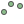
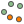
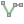
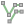
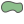
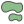

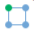

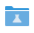

- |vector_layer| - Vector layer (NGW Vector Layer), which can be:  
  |resource_vector_point| - Point vector layer (NGW Vector Layer); 
  |resource_vector_mpoint| - Multipoint vector layer (NGW Vector Layer);  
  |resource_vector_line| - Line vector layer (NGW Vector Layer); 
  |resource_vector_line| - Multiline vector layer (NGW Vector Layer); 
  |resource_vector_polygon| - Polygon vector layer (NGW Vector Layer); 
  |resource_vector_mpolygon| - Multipolygon vector layer (NGW Vector Layer); 

- |resource_style| - Vector layer style.
- |resource_wfs| - WFS Service (NGW WFS Service)
- |resource_wms| - WMS Service (NGW WMS Service)
- |tms_service_symbol| - TMS Layer
- |postgis_layer_symbol| - PostGIS Layer
- |wfs_layer_symbol| - WFS Layer
- |raster_layer| - Raster layer (NGW Raster Layer)
- |basemap_symbol| - Basemap
- |resource_webmap| - Web Map (NGW Web Map)
- |resource_group| - Resource group

.. _ng_connect_import:

From QGIS to Web GIS
----------------------------------

With NextGIS Connect you can upload to Web GIS:

1. Vector data
2. Raster data
3. Basemaps
4. Layer groups
5. Entire QGIS project

Connect plugin also allows to publish vector data using standard protocols :term:`WFS`, :term:`WMS` and OGC.

See detailed step-by-step instructions for various data types `here <https://docs.nextgis.com/docs_ngconnect/source/resources.html>`_.

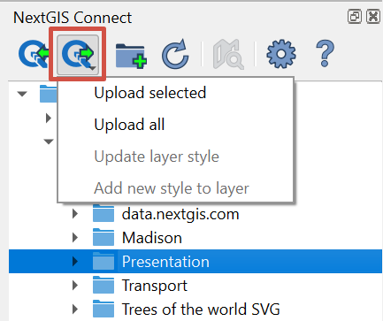
   
   Upload menu in the NG Connect panel

Alternatively you can upload data to Web GIS from the Layers panel. In the context menu select it as one of the ways to export a layer, a group of layers or the entire project.

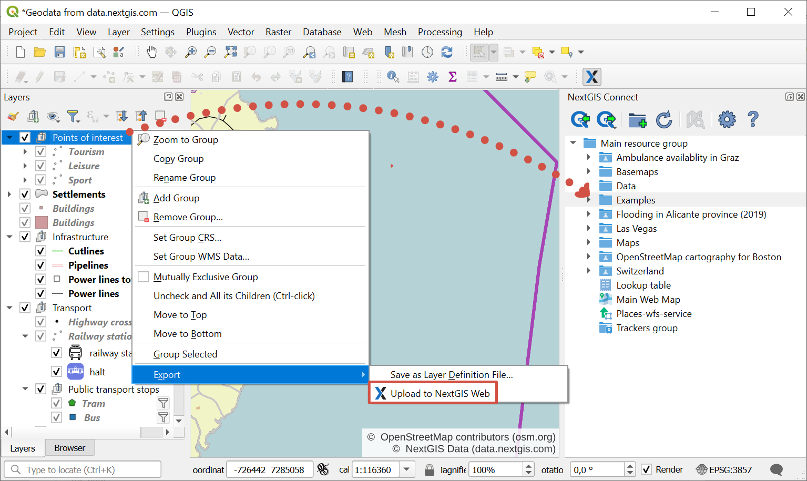

   Uploading data to Web GIS via layer context menu

- Vector layer – vector layer with its style will be imported into Web GIS.  
  You can later add this style to a Web Map.
- Raster layer – raster layer with a default style will be created in Web GIS.  
  Style can be added directly to Web Map.
- Upload all - All layers for which the import option is available will be added to Web GIS, as well as all groups, retaining the hierarchy from QGIS Layers Panel.  Also a Web Map will be created and all imported layers will be added to it retaining hierarchy and visibility of QGIS Layers Panel. While importing a project you need to specify the name of the new resource group which will be created in Web GIS. This group will hold all resources imported along with the project. When the process is complete, the Web Map will be opened automatically if corresponding option is selected in plugin settings.
- Update layer style - Web GIS will update the style of the layer to match the style of the selected layer in QGIS.
- Add new style to layer - Web GIS will add to the layer a new style, similar to the selected layer in QGIS.

If a layer has **multiple styles**, they will all be uploaded. Their names will be kept. If the style name is "default", the layer's name will be used instead. 

Imported resources will be added to the group selected in NextGIS Connect panel. 

* If other type of resource but a group is selected, import will be performed to the closest parent group to selected resource.
* If no resource is selected, import will be performed to the Main resource group (the root directory).

Attachments made in QGIS are also supported. See how it works in our video:

.. raw:: html

   <iframe width="560" height="315" src="https://www.youtube.com/embed/k427UYcXLOI?si=XCYPA-O3sEQuyyzm" title="YouTube video player" frameborder="0" allow="accelerometer; autoplay; clipboard-write; encrypted-media; gyroscope; picture-in-picture; web-share" referrerpolicy="strict-origin-when-cross-origin" allowfullscreen></iframe>

Watch on `youtube <https://youtu.be/k427UYcXLOI?si=oZ9vX7p6tGpmKv2r>`_.

.. warning::

    **Photos** made via NextGIS Collector/Mobile apps and uploaded to Web GIS as attachments to layers **wouldn't be available** in desktop NextGIS QGIS after downloading these layers through NextGIS Connect plugin.

.. ng_connect_keep_photo:

How to keep attachments
~~~~~~~~~~~~~~~~~~~~~~~

To **keep the photos** intact while modifying the style, perform the following steps:

1. Add the layer's style from Web GIS to QGIS using NextGIS Connect.
2. Modify the style.
3. Update the style using NextGIS Connect. 

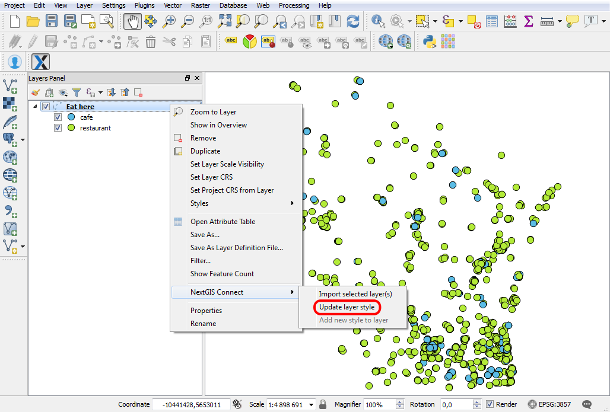
   
   Updating a style

.. _ng_connect_export:

From Web GIS to QGIS
---------------------------------

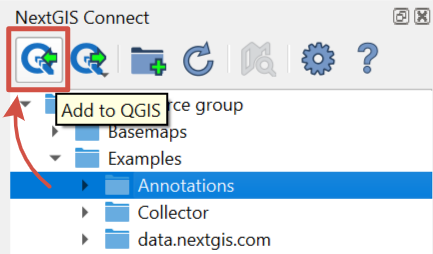
   
   Button for data transfer to QGIS

Option is available if one of the following resources is selected in NextGIS Web resource tree:

- Vector layer (NGW Vector Layer) |vector_layer| - GeoJSON vector layer will be created in QGIS; 

- WFS Layer |wfs_layer_symbol| - a WFS layer will be created in QGIS;
- WFS service (NGW WFS Service) |resource_wfs| - WFS layer will be created in QGIS; 

- WMS Layer - the selected WMS layer will be added to QGIS;
- WMS Service - a WMS layer will be created in QGIS, the data source for which the selected WMS Service will be;
- WMS Connection - you can select the WMS layer from the list to add to QGIS;
- TMS Layer |tms_service_symbol|;
- TMS Connection |tms_connection_symbol|;
- PostGIS Layeer |postgis_layer_symbol|;
- QGIS Vector Layer style |resource_style| - if it's a style of a vector layer, a GeoJSON vector layer with the identical style will be created in QGIS; if it's a style of a WFS layer, a WFS with that style will be created;
- Raster layer (NGW Raster layer)  |raster_layer|  - a GeoTIFF raster layer will be created in QGIS;
- Basemap |basemap_symbol|;
- Web Map |resource_webmap| - a QGIS project will be created containing layers, styles and basemaps. A mutually exclusive group will be created for all the basemap layers.
- `Demo Project <https://docs.nextgis.com/docs_ngcom/source/demoprojects.html>`_ |demo_project_symbol| - a QGIS project will be created, containing layers, styles and basemaps;
- Resource group |resource_group| - the group and resources inside it will be added to the QGIS project.

For layers with **multiple styles**:

* If you select a layer with multiple styles in the Connect window, all the styles will be added, but you need to chose current style in a dialog window.
* If you select a style in the Connect window, all the styles of the layer will be added, with the selected style chosen as current style.
* If you select a resource group containing layers with multiple styles, all the styles will be added. The style used as current will be the one with the same name as the layer or the first in alphabetical order.  No dialog will be displayed.
* If you add WFS/OGCF, the style with the same name as the layer or the first in alphabetical order will be chosen.

See how to work with multi-style layers in our video:

.. raw:: html

   <iframe width="560" height="315" src="https://www.youtube.com/embed/7vwt1k6Cv3k?si=5FIwWTQU4UeCNMw3" title="YouTube video player" frameborder="0" allow="accelerometer; autoplay; clipboard-write; encrypted-media; gyroscope; picture-in-picture; web-share" referrerpolicy="strict-origin-when-cross-origin" allowfullscreen></iframe>

Watch on `youtube <https://youtu.be/7vwt1k6Cv3k?si=db1YkX-aS7f3_sd7>`_.

Detailed instructions for adding various data types to QGIS `here <https://docs.nextgis.com/docs_ngconnect/source/resources.html#ngcom-ngqgis-connect-data-export>`_.

Vector layers added from Web GIS can be `edited in QGIS <https://docs.nextgis.com/docs_ngconnect/source/edit.html#>`_ right away.

.. _ng_connect_cont_menu:

Context Menu
----------------
Context menu may differ depending on resource type.  

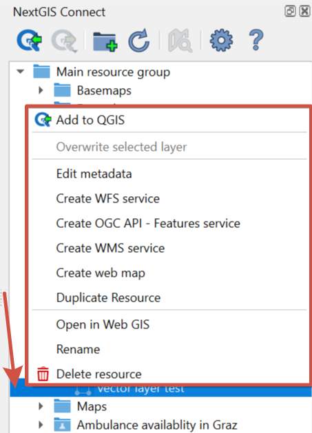
   
   Context menu example

Common options for all resource types:

- Open in WebGIS – open the page of the selected resource in Web GIS, see :numref:`ngc_open_from_layertree_pic`;

- Rename resource;

- `Delete resource <https://docs.nextgis.com/docs_ngconnect/source/ngc_data_transfer.html#connect-resource-delete>`_;

- Edit metadata.

Variable options – depend on resource type:

- Add to QGIS - `see above <https://docs.nextgis.com/docs_ngconnect/source/ngc_data_transfer.html#ng-connect-export>`_ for the types of resources that can be added and other details;

- `Create Web Map <https://docs.nextgis.com/docs_ngconnect/source/resources.html#web-map>`_ - available for: Vector layer, Vector style, Raster layer, WMS Layer;

- `Download as QML <https://docs.nextgis.com/docs_ngconnect/source/export.html#connect-save-style>`_ - only available for QGIS Vector style;

- `Copy style <https://docs.nextgis.com/docs_ngconnect/source/edit.html#connect-style-copy>`_ - only available for QGIS Vector style;

- `Create WFS service <https://docs.nextgis.com/docs_ngconnect/source/resources.html#wfs>`_ - only available for Vector layer;

- `Create OGC API - Features service <https://docs.nextgis.com/docs_ngconnect/source/resources.html#ogc-api-features>`_ - only available for Vector layer;

- `Create WMS service <https://docs.nextgis.com/docs_ngconnect/source/resources.html#wms>`_ - only available for Vector layer;

- `Duplicate resource <https://docs.nextgis.com/docs_ngcom/source/ngqgis_connect.html#ngcom-connect-resource-double>`_ - available only for Vector layer and Raster layer;

- `Overwrite selected layer <https://docs.nextgis.com/docs_ngconnect/source/edit.html#connect-data-overwrite>`_ - only available for Vector layer.

The plugin also allows you to navigate to the Web GIS data directly from the the Layers panel in QGIS. In the layer's context menu find "NextGIS Connect" and press "Open in Web GIS".

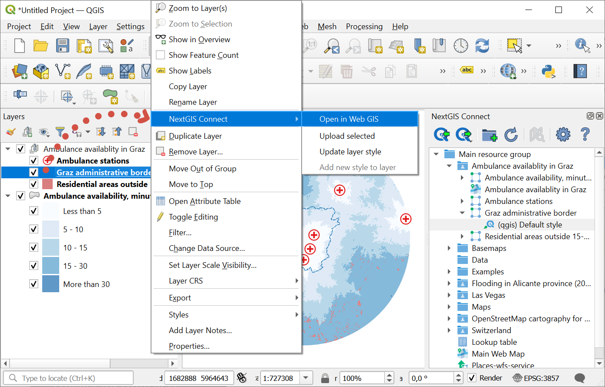

   Opening Web GIS data from QGIS layer tree

.. _connect_resource_double:

Duplicate resource
-----------------------

With NG Connect you can copy an existing Web GIS layer. This option is available for Vector and Raster layers. 

* To make a copy of a layer, select it in the Connect panel, then in the context menu click **Duplicate resource**.
* In the pop-up window confirm copying.

Copy will be created in the same group. The layer's style will also be duplicated.

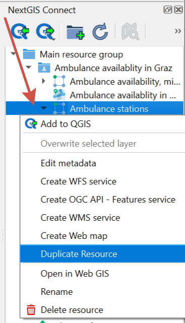

   Duplicating resource

.. _connect_resource_delete:

Delete resource
-------------------

With NextGIS Connect you can quickly create and delete any resource in your Web GIS. 

* In the NextGIS Connect panel select the resource you wish to delete;
* In the context menu select **Delete**;
* If the resource is deleted successfully, it disappears from the Web GIS layer tree.
 

.. _ng_connect_res_group:

Create resource group
-------------------------

In the top menu of the NextGIS Connect plugin you'll find a "Create group" button.

A new group will be created:

* If a resource group is selected in the Connect panel - in that group;
* If other type of resources but a group is selected - in the closest parent group 

* If no resource is selected - in the main resource group.

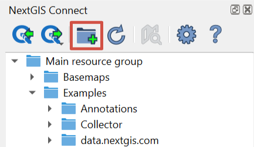

   Creating resource group

.. _connect_refresh:

Refresh
----------

In the top menu of the NextGIS Connect plugin you'll find a "Create group" button.

The "refresh" operation will update the entire Web GIS resource tree to the current state.

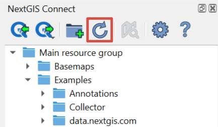

   Refreshing Web GIS data

.. _connect_open_webmap:

Open Web Map in browser
-----------------------------

In the top menu of the NextGIS Connect plugin you'll find a "Create group" button.

Option is available if a Web Map (|resource_webmap| NGW Web Map) is selected in NextGIS Connect resource tree. 
The Web Map will be opened in a new tab of default browser.

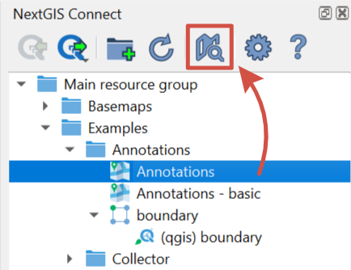

   Opening a Web Map

Context menu also allows to `open the Web GIS page of any resource <https://docs.nextgis.com/docs_ngconnect/source/ngc_data_transfer.html#ng-connect-cont-menu>`_ in browser.
