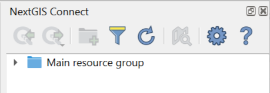
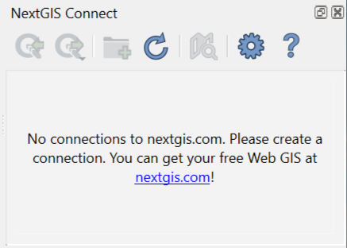
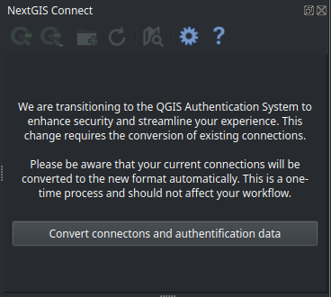
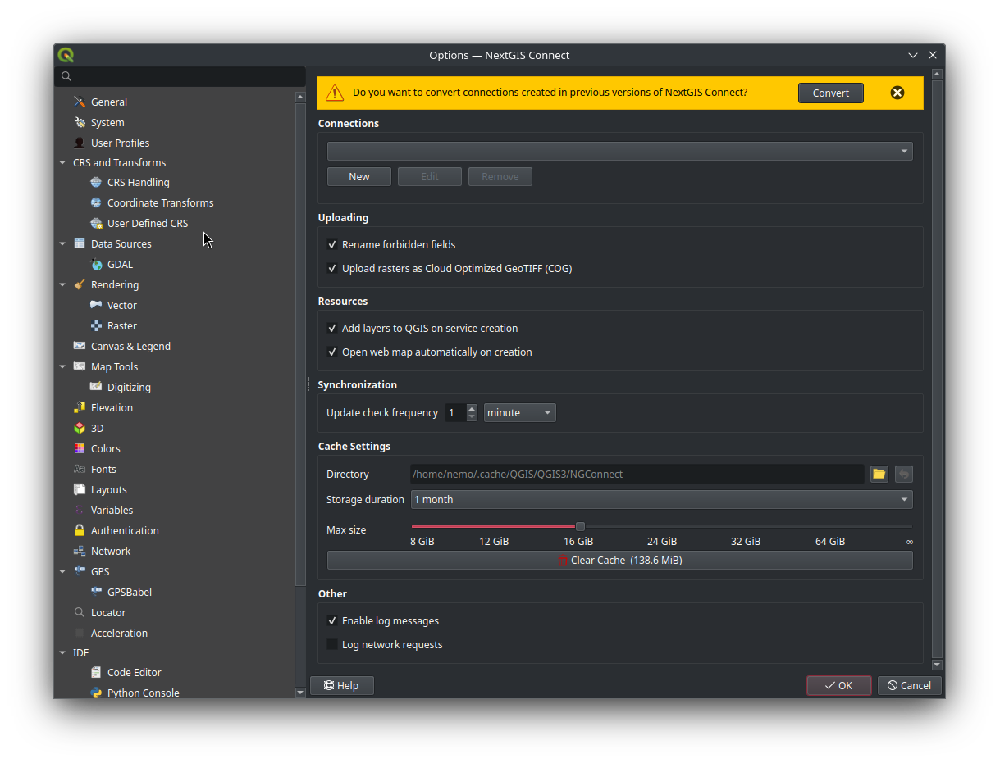
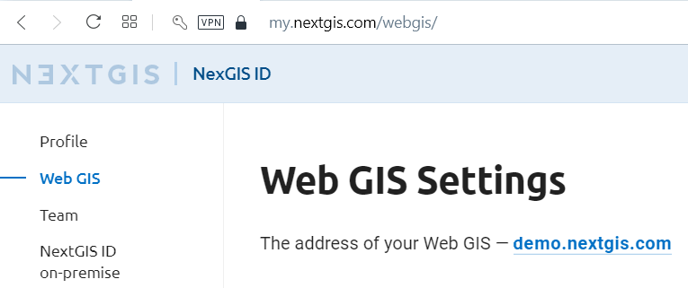
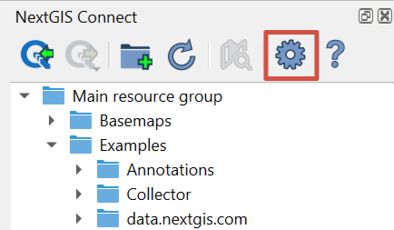
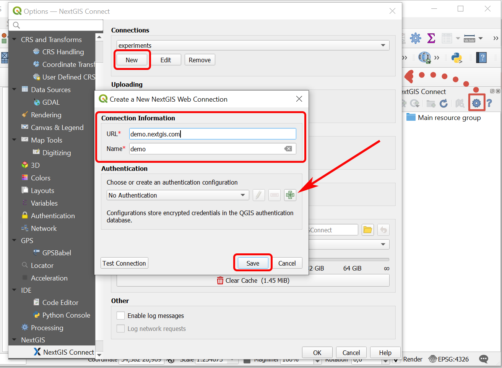
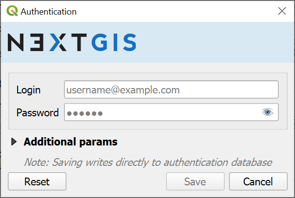

.. _ng_connect_install:

Installation
==============

To download NextGIS Connect plugin, from the main menu open *Plugins ‣ Manage and install plugins*. Start typing the name of the plugin in the search bar, select it in the list and press **Install**.

NextGIS Connect plugin is a part of `NextGIS QGIS <http://nextgis.com/nextgis-qgis/>`_ distributive and is ready to go right after installation of desktop app.

If you need to check the version of the plugin or update it, go to *Plugins‣ Manage and install plugins ‣ NextGIS Connect*. 

.. _ng_connect_connection:

Connecting to your Web GIS
===========================

When the plugin is installed, its icon appears in the toolbar:  

Click on the icon to open NextGIS Connect panel.

   
   NextGIS Connect panel

.. |button_filter| image:: _static/button_filter.png
   :width: 6mm
   :alt: funnel

.. |button_settings| image:: _static/button_settings.png
   :width: 6mm
   :alt: blue gear

Buttons on the panel:

* |button_to_qgis| `Add to QGIS <https://docs.nextgis.com/docs_ngconnect/source/ngc_data_transfer.html#qgis>`_

* |button_to_wg| `Add to Web GIS <https://docs.nextgis.com/docs_ngconnect/source/ngc_data_transfer.html#ng-connect-export>`_

* |button_newfolder| `Create resource group <https://docs.nextgis.com/docs_ngconnect/source/ngc_data_transfer.html#ng-connect-res-group>`_

* |button_filter| `Search and filter resources <https://docs.nextgis.com/docs_ngconnect/source/filter.html>`_

* |button_refresh| `Refresh resource tree <https://docs.nextgis.com/docs_ngconnect/source/ngc_data_transfer.html#connect-refresh>`_

* |button_openmap| `Open Web Map in browser <https://docs.nextgis.com/docs_ngconnect/source/ngc_data_transfer.html#connect-open-webmap>`_

* |button_settings| `Plugin settings <https://docs.nextgis.com/docs_ngconnect/source/ngc_settings.html>`_

* |button_help| Help - opens this manual
 

If no connection is set at the moment, the following message will be shown:

   
   NextGIS Connect panel if there is no connection

If the previously used version of NextGIS Connect didn't support QGIS authentication, after the update you will need to convert all existing connections and authentication data. You can do it in the NextGIS Connect panel or in the plugin settings.

   Message announcing the need to convert connections

   Message announcing the need to convert connections in NextGIS Connect settings

.. _ng_connect_new_connection:

Create a connection
--------------------

To create a connection you need to know the address of your Web GIS.
The address for your own Web GIS can be found at
https://my.nextgis.com/webgis

   
   Web GIS address

Click on **Settings** button in NextGIS Connect panel.

   Opening Settings menu

In the pop-up window press **New** and fill in the fields: 

1.	URL – address of the target Web GIS.
2.	Name – connection id, how it will be shown in the list of connections.

   
   Adding new connection

Next, in the *Authentication* section, add a new configuration or select a previously created one (the list items consist of configuration name, user name and authentication type).

The default setting, "No Authentication" can be used if you don't need to perform actions that a Guest has no permissions for.
For instance, only the Web GIS owner and the `team members <https://docs.nextgis.com/docs_ngcom/source/create.html#team-management>`_ can create and delete resources.

To **add a new configuration**, press the button with a green plus.

The "Authentication" dialog will pop up.

   
   Adding authentication configuration

1. Enter *Username* and *Password* of your NextGIS ID;
2. Press **Save**.

Make sure that the correct configuration is selected. To check if the credentials are correct, press **Test Connection**. 

If guest or user chosen for authentication does not have access at least to the Main resource group of the Web GIS, an error message will appear. Select a different authentication configuration or contact the administrator of the Web GIS to get access permission.

Next press **Save** in the connection creating dialog (:numref:`create_connection_pic`). 

Click **OK**. 

The connection selected in the "Connections" dropdown menu of the Settings dialog will become active **after** the dialog is closed.

Keycloak authentication in NextGIS QGIS
----------------------------------------

Desktop app NextGIS QGIS, NextGIS Web, and NextGIS Connect which serves as a link between them handle geoinformation systems that use Keycloak authorization. 

This option is relevant for corporate users who have a Web GIS deployed `on-premise <https://nextgis.com/pricing/>`_.
