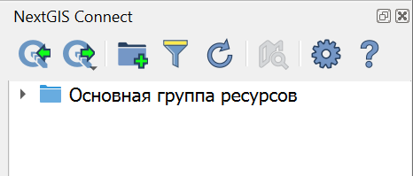
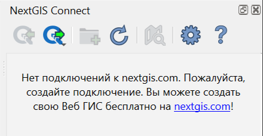
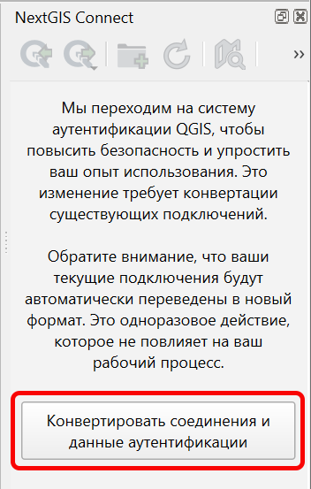
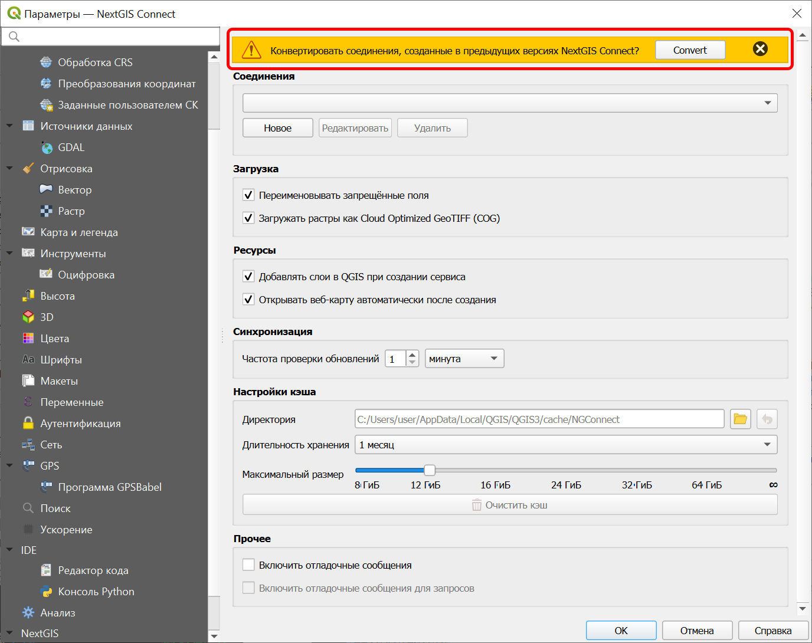
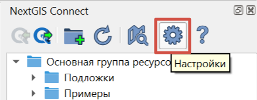
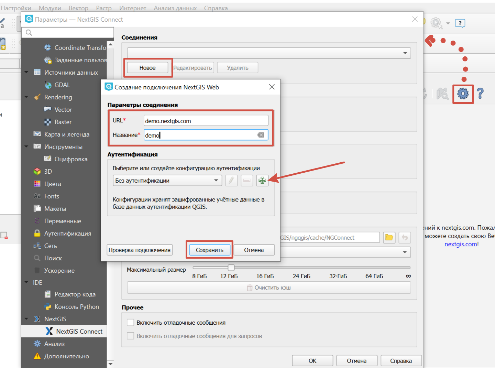
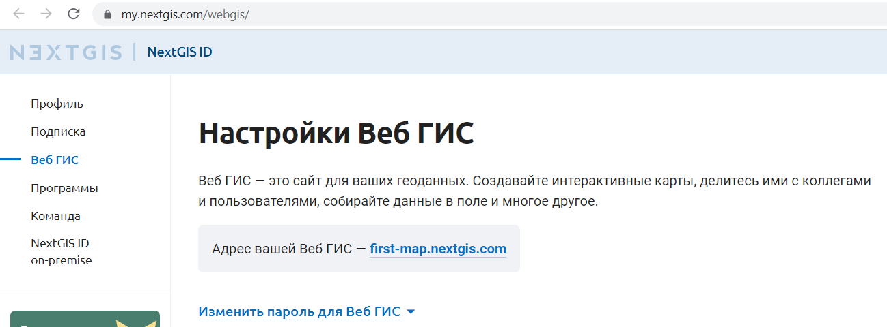
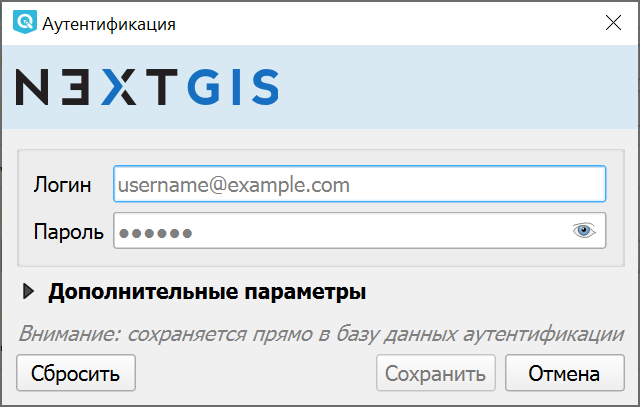
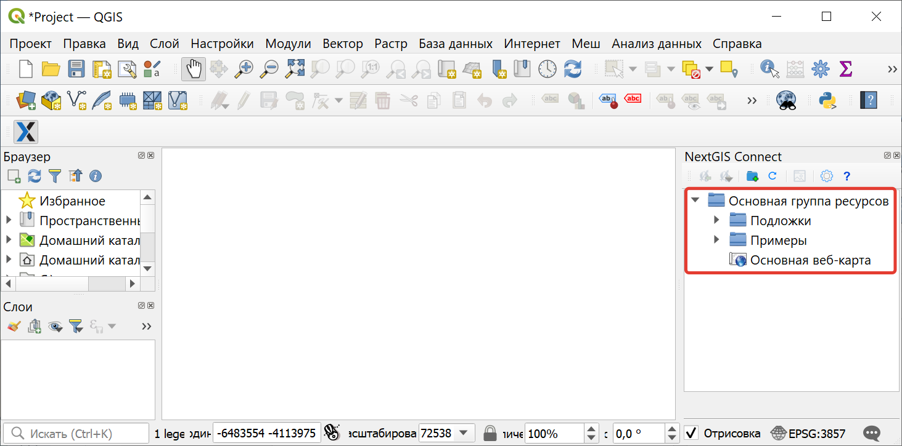

.. _ng_connect_install:

Установка
=========

Для загрузки модуля NextGIS Connect перейдите в меню настройки модулей из главной панели: *Модули ‣ Управление модулями*. Начните набирать в поиске название модуля, выберите его в списке и нажмите кнопку **Установить модуль**.

В ПО `NextGIS QGIS <http://nextgis.ru/nextgis-qgis/>`_ модуль NextGIS Connect включен в поставку, вы можете сразу начинать работу.

При необходимости проверить/обновить версию модуля можно в разделе меню *Модули ‣ Управление модулями ‣ NextGIS Connect*. 

.. raw:: html

   <iframe width="560" height="315" src="https://rutube.ru/play/embed/5f96ea9ca914a0a06cf365e6330c16b2/" frameBorder="0" allow="clipboard-write; autoplay" webkitAllowFullScreen mozallowfullscreen allowFullScreen></iframe>

Посмотреть видео на `youtube <https://youtu.be/6UX0_Bn2L-A>`_, `rutube <https://rutube.ru/video/5f96ea9ca914a0a06cf365e6330c16b2/>`_.

.. _ng_connect_connection:

Панель модуля
----------------

После установки модуля на панели инструментов появится иконка: 

.. figure:: _static/logo_connect.png
   :align: center
   :alt: Иконка модуля расширения NextGIS Connect.

При нажатии на иконку откроется панель управления ресурсами Веб ГИС.

   
   Панель модуля расширения NextGIS Connect

.. |button_to_qgis| image:: _static/button_to_qgis.png
   :width: 6mm

.. |button_to_wg| image:: _static/button_to_wg.png
   :width: 6mm

.. |button_newfolder| image:: _static/button_newfolder.png
   :width: 6mm

.. |button_filter| image:: _static/button_filter.png
   :width: 6mm
   :alt: воронка

.. |button_refresh| image:: _static/button_refresh.png
   :width: 6mm

.. |button_openmap| image:: _static/button_openmap.png
   :width: 6mm
   :alt: карта с лупой

.. |button_settings| image:: _static/button_settings.png
   :width: 6mm
   :alt: синяя шестерёнка

.. |button_help| image:: _static/button_help.png
   :width: 6mm
   :alt: знак вопроса

На панели расположены следующие кнопки:

* |button_to_qgis| `Загрузить в QGIS <https://docs.nextgis.ru/docs_ngconnect/source/ngc_data_transfer.html#qgis>`_

* |button_to_wg| `Добавить в Веб ГИС <https://docs.nextgis.ru/docs_ngconnect/source/ngc_data_transfer.html#ng-connect-export>`_

* |button_newfolder| `Создать группу ресурсов <https://docs.nextgis.ru/docs_ngconnect/source/ngc_data_transfer.html#ng-connect-res-group>`_

* |button_filter| `Поиск и фильтрация ресурсов <https://docs.nextgis.ru/docs_ngconnect/source/filter.html>`_

* |button_refresh| `Обновить дерево ресурсов <https://docs.nextgis.ru/docs_ngconnect/source/ngc_data_transfer.html#connect-refresh>`_

* |button_openmap| `Открыть веб-карту в браузере <https://docs.nextgis.ru/docs_ngconnect/source/ngc_data_transfer.html#connect-open-webmap>`_

* |button_settings| `Настройки модуля <https://docs.nextgis.ru/docs_ngconnect/source/ngc_settings.html>`_

* |button_help| Справка - вы окажетесь здесь

Если на данный момент не настроено ни одно `подключение <https://docs.nextgis.ru/docs_ngconnect/source/ngc_install.html#ng-connect-new-connection>`_, вы увидите сообщение с предложением 
создать свою Веб ГИС.

   
   Панель модуля расширения NextGIS Connect при отсутствии подключения

Если ранее на устройстве использовалась версия NextGIS Connect, не поддерживавшая аутентификацию QGIS, то при включении обновленной версии будет предложено конвертировать существующие соединения и данные аутентификации. Это можно сделать через окно NextGIS Connect, а также в настройках модуля.

   Предупреждение о необходимости конвертации соединений

   Настройки модуля расширения NextGIS Connect после обновления с сообщением о конвертации

.. _ng_connect_new_connection:

Создание подключения
--------------------

Для начала работы создайте подключение к Веб ГИС. 

1. Нажмите кнопку |button_settings| Настройки на панели модуля расширения NextGIS Connect.

   Вызов диалога настроек

2. В открывшемся окне нажмите кнопку **Новое** и заполните поля:

* URL - адрес интересующей вас Веб ГИС.
* Название - идентификатор подключения для быстрого поиска в списке подключений.

   
   Добавление соединения

Если вы создали свою Веб ГИС, ее адрес вы можете узнать на странице: https://my.nextgis.com/webgis

   
   Адрес Веб ГИС

3. В разделе "Аутентификация" добавьте новую конфигурацию или выберите из существующих (в списке отражается название соединения и имя пользователя, а также тип аутентификации).

Можно подключиться "как гость", если нет необходимости выполнять действия, правами на которые не обладает неавторизованный пользователь. Для этого оставьте значение по умолчанию "Без аутентификации".

.. note:: 
   Создавать и удалять ресурсы Веб ГИС может ее владелец и пользователи, добавленные в `команду <https://docs.nextgis.ru/docs_ngcom/source/create.html#ngcom-team-management>`_.

Для того, чтобы **добавить новую конфигурацию**, нажмите кнопку с зеленым плюсом.

Откроется диалоговое окно "Аутентификация".

   
   Добавление конфигурации аутентификации

* Заполните поля *Логин* и *Пароль* данными вашего NextGIS ID;
* Нажмите **Сохранить**.

Убедитесь, что выбрана нужная конфигурация. Если хотите проверить правильность введенных данных, нажмите **Проверка подключения**. 

Если у гостя или пользователя, под которым вы пытаетесь зайти, недостаточно прав для доступа хотя бы к Основной группе ресурсов, появится сообщение об ошибке. В таком случае вам нужно авторизоваться под пользователем, имеющем такие права, или обратиться к администратору Веб ГИС, чтобы получить соответствующие права.

.. to do:: _static/ngc_permission_error_ru.png
   :name: auth_config_create_pic
   :align: center
   :width: 12cm

4. Нажмите **Сохранить** в окне "Создание подключения" (:numref:`create_connection_pic`) и затем кнопку **ОК**. 

Подключение, выбранное в выпадающем списке "Соединения" диалога "Настройки" станет активным **после закрытия** диалога.

В окне модуля появится дерево ресурсов вашей Веб ГИС. 

   

   
   Дерево ресурсов подключенной Веб ГИС в окне NextGIS Connect

Теперь можно приступить к `обмену данными <https://docs.nextgis.ru/docs_ngconnect/source/ngc_data_transfer.html>`_.

Keycloak-аутентификация в NextGIS QGIS
----------------------------------------

Настольная NextGIS QGIS, Веб ГИС NextGIS Web и NextGIS Connect – связующее звено между настольной и Веб ГИС – работают с геоинформационными системами, в которых авторизация происходит через Keycloak. 

Это актуально для корпоративных пользователей с Веб ГИС, развёрнутой `на своём сервере <https://nextgis.ru/pricing/>`_.
