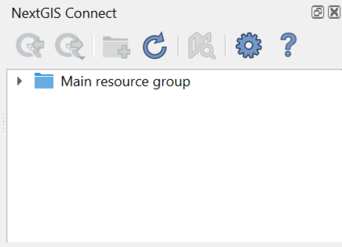
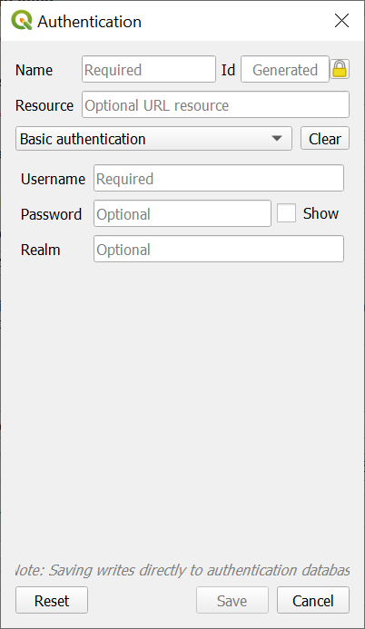

.. _ng_connect_install:

Installation
=========

To download NextGIS Connect plugin, from the main menu open *Plugins ‣ Manage and install plugins*. Start typing the name of the plugin in the search bar, select it in the list and press **Install**.

NextGIS Connect plugin is a part of `NextGIS QGIS <http://nextgis.com/nextgis-qgis/>`_ distributive and is ready to go right after installation of desktop app.

If you need to check the version of the plugin or update it, go to *Plugins‣ Manage and install plugins ‣ NextGIS Connect*. 

.. _ng_connect_connection:

Connecting to your Web GIS
=====================

When the plugin is installed, its icon appears in the toolbar:  

.. figure:: _static/logo_connect.png
   :align: center
   :alt: NextGIS Connect icon

Click on the icon to open NextGIS Connect panel.

   
   NextGIS Connect panel

If no connection is set at the moment, the following message will be shown 
.

.. figure:: _static/panel-no-connections_en.png
   :align: center
   :alt: Message if there is no connection
   :width: 10cm
   
   NextGIS Connect panel if there is no connection

If the previously used version of NextGIS Connect didn't support QGIS authentication, after the update you will need to convert all existing connections and authentication data. You can do it in the NextGIS Connect panel or in the plugin settings.

.. figure:: _static/connect_update_convert_en.png
   :align: center
   :name: connect_update_convert_pic
   :alt: NextGIS Connect panel after update
   :width: 10cm

   Message announcing the need to convert connections

.. figure:: _static/ngc_upd_convert_menu_en.png
   :align: center
   :name: ngc_upd_convert_menu_pic
   :alt: NextGIS Connect settings after update
   :width: 22cm

   Message announcing the need to convert connections in NextGIS Connect settings

.. _ng_connect_new_connection:

Create a connection
--------------------

To create a connection you need to know the address of your Web GIS.
The address for your own Web GIS can be found at
https://my.nextgis.com/webgis

.. figure:: _static/my_nextgis.png
   :align: center
   :alt: Web GIS address
   :width: 20cm
   
   Web GIS address

Click on **Settings** button in NextGIS Connect panel.

.. figure:: _static/call_settings_en.png
   :align: center
   :alt: Open settings dialog
   :width: 10cm

   Opening Settings menu

In the pop-up window press **New** and fill in the fields: 

1.	URL – address of the target Web GIS.
2.	Name – connection id, how it will be shown in the list of connections.

.. figure:: _static/create_connection_en.png
   :align: center
   :width: 24cm
   :name: create_connection_pic
   :alt: Adding new connection
   
   Adding new connection

Next, in the *Authentication* section, add a new configuration or select a previously created one (the list items consist of configuration name, user name and authentication type).

The default setting, "No Authentication" can be used if you don't need to perform actions that a Guest has no permissions for.
For instance, only the Web GIS owner and the `team members <https://docs.nextgis.com/docs_ngcom/source/create.html#team-management>`_ can create and delete resources.

To **add a new configuration**, press the button with a green plus.

The "Authentication" dialog will pop up.

   
   Adding authentication configuration

1. Enter a name for the new configuration in the corresponding field;
2. Select the Basic authentication in the dropdown menu below;
3. Enter *Username* and *Password* of your NextGIS ID;
4. Press **Save**.

Make sure that the correct configuration is selected. To check if the credentials are correct, press **Test Connection**. Next press **Save** in the connection creating dialog (:numref:`create_connection_pic`). 

Click **OK**. 

The connection selected in the "Connections" dropdown menu of the Settings dialog will become active **after** the dialog is closed.

Keycloak authentication in NextGIS QGIS
----------------------------------------

Desktop app NextGIS QGIS, NextGIS Web, and NextGIS Connect which serves as a link between them handle geoinformation systems that use Keycloak authorization. 

This option is relevant for corporate users who have a Web GIS deployed `on-premise <https://nextgis.com/pricing/>`_.
