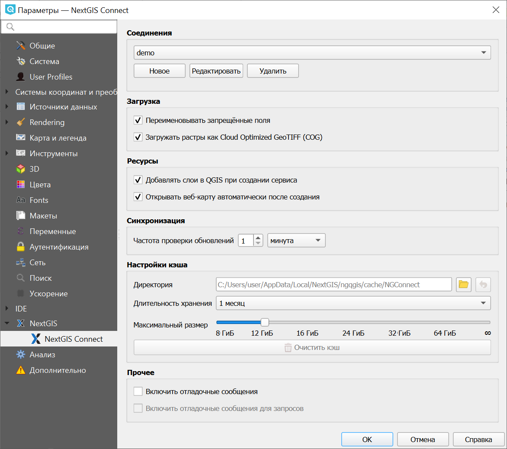
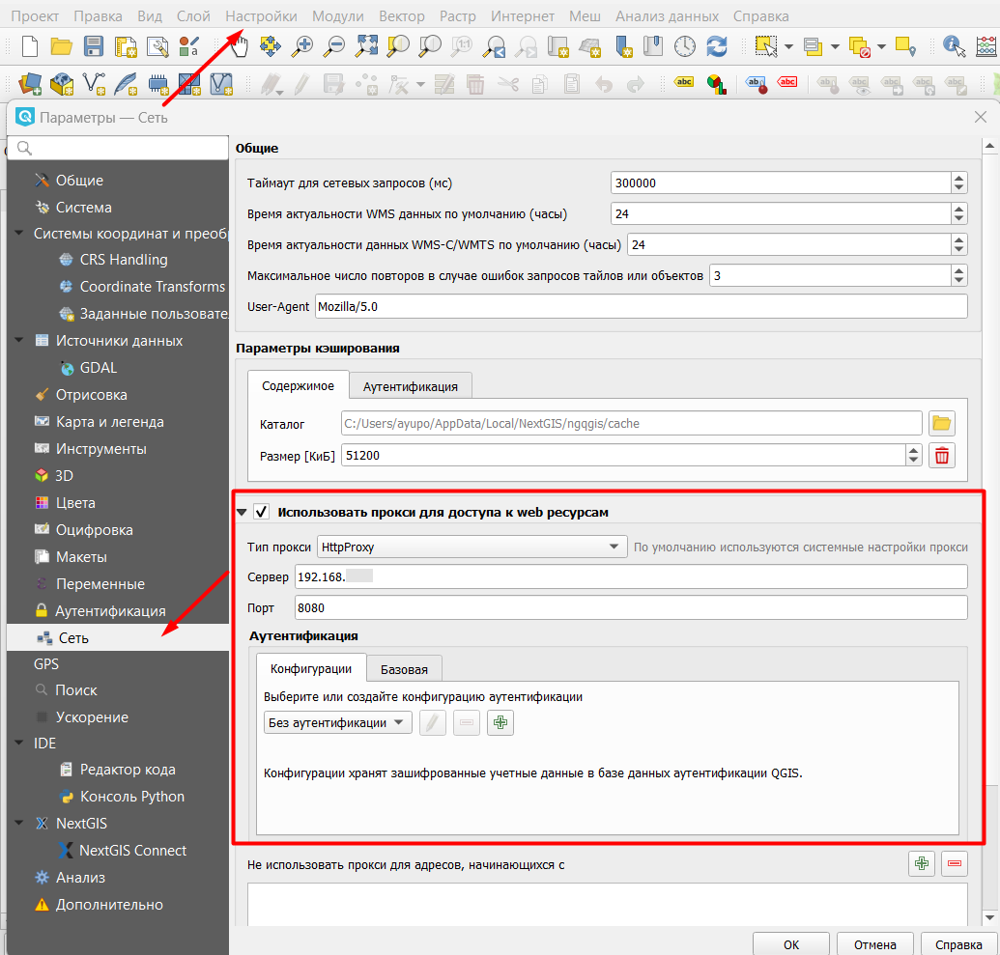

.. _ng_connect_main_settings:

Основные настройки
===================

Меню настроек можно открыть из верхнего меню или нажав кнопку с шестеренкой в панели NextGIS Connect.

.. figure:: _static/nextgis_connect/call_settings_ru.png
   :align: center
   :alt: Вызов диалога настроек
   :width: 10cm

   Вызов диалога настроек

   
   Диалог основных настроек подключения

.. _ngc_set_connect:

Соединения
~~~~~~~~~~~

В выпадающем списке выбирается подключение, которое станет активным **после закрытия** диалога.

Также здесь можно создать новое соединение, редактировать и удалять существующие.

.. _ngc_set_upload:

Загрузка
~~~~~~~~~

**Переименовывать запрещенные поля** - если опция выбрана, то при импорте слоя отдельно или в составе проекта модуль будет переименовывать запрещенные для добавления в Веб ГИС поля.

**Загружать растры как Cloud Optimized GeoTIFF (COG)** если опция выбрана, то растры загружаются с использованием пирамид, в зависимости от зума, и нет необходимости ждать, пока скачается растр целиком.

.. _ngc_set_resources:

Ресурсы
~~~~~~~~

**Добавлять слои в QGIS при создании сервиса** - если опция выбрана, то после завершения операций, в ходе которых был создан сервис WFS, WMS или OGC API - Features, он будет автоматически добавлен в QGIS. 

**Открывать веб-карту автоматически после создания** - если опция выбрана, то после завершения операций, в ходе которых была создана веб-карта, она будет открыта в браузере автоматически.

.. _ngc_set_sync:

Синхронизация
~~~~~~~~~~~~~~

Здесь можно настроить частоту проверки обновлений. Интервалы задаются в минутах или часах в диапазоне 1-59.

Увеличение интервала полезно при работе с большим количеством слоев, чтобы программа не находилась в режиме синхронизации постоянно.

.. _ngc_set_cache:

Настройки кэша
~~~~~~~~~~~~~~~~~

Можно настроить следующие параметры сохранения кэша:

**Директория** - адрес размещения кэша, по умолчанию это папка, куда установлена программа.

**Длительность хранения кэша** - устанавливает интервал очистки кэша: 1 день, неделя или месяц. Также можно выбрать бессрочное хранение.

**Максимальный размер кэша** - 8, 12, 16, 24, 32, 64 гигабайта или без ограничений (знак бесконечности).

Также доступна **очистка кэша**.

.. _ngc_set_other:

Прочее
~~~~~~~

Это пригодится, если нужно сообщить разработчикам о багах. Отладочные сообщения позволяют получить информацию том, что происходило до ошибки и место, в котором она возникла. 

**Включить отладочные сообщения** - если опция выбрана, то все отладочные сообщения будут автоматически выводиться на экран в панели “Отладочные сообщения”. 

**Включить отладочные сообщения для запросов** - опция  добавляет информацию о том, какие запросы были произведены, их содержимое и ответ.

.. _ng_connect_proxy:

Настройки Прокси-сервера
------------------------

Если в вашей организации используется свой прокси-сервер, нужно прописать его настройках NextGIS QGIS:

*Верхнее меню > Настроки > Параметры > Сеть > Использовать прокси для доступа к web ресурсам*.

   
   Настройки прокси сервера
