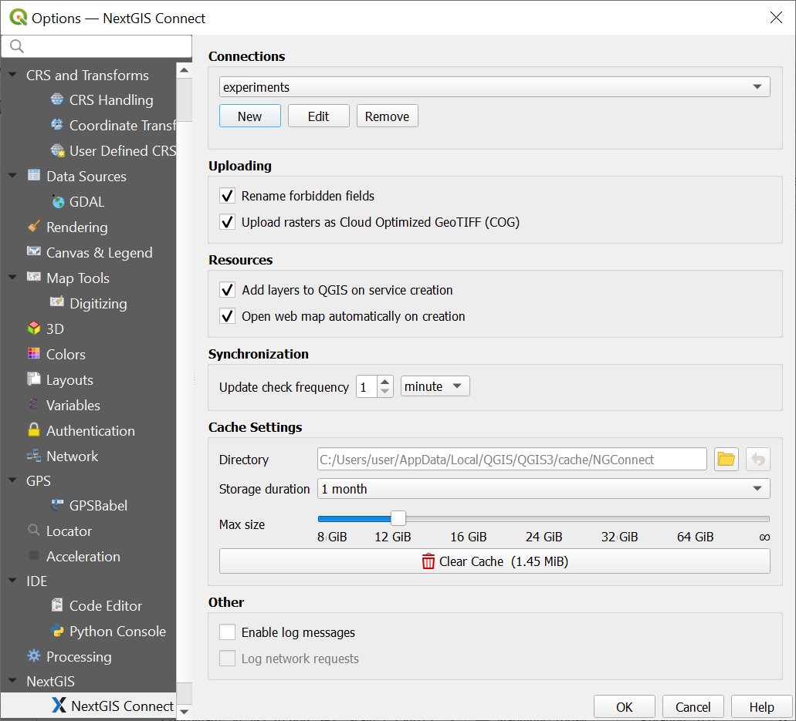
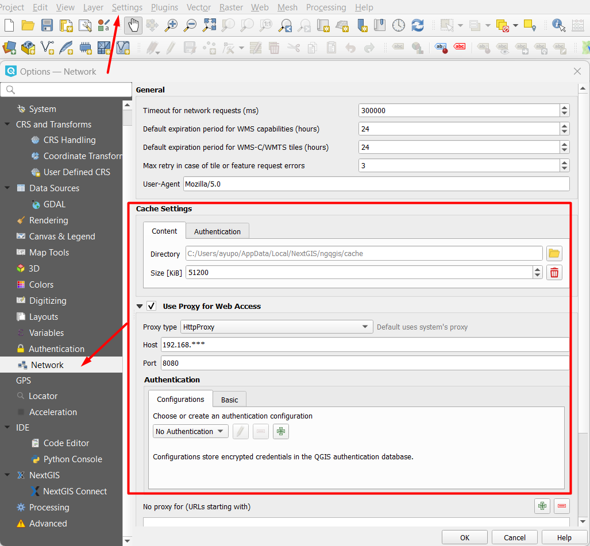

.. _ng_connect_main_settings:

Main Settings
===================

You can access this dialog via top menu *Settings > Options > NextGIS Connect*, or from NextGIS Connect panel by clicking on the gear button.

.. figure:: _static/call_settings_en.png
   :align: center
   :alt: Open settings dialog
   :width: 10cm

   Opening Settings menu

   
   Main settings dialog

Connections
-----------

Connection, selected in the dropdown list, becomes active **after** the Settings dialog is closed.

Also, in this section you can create, edit or delete connections.

Uploading
-----------

**Rename forbidden fields** - if selected, the plugin renames fields forbidden for Web GIS during the export of a layer separately or within a project.

**Upload rasters as Cloud Optimized GeoTIFF (COG)** - if this option is selected, pyramids will be used for loading rasters depending on zoom level, so there's no need to wait for the entire raster to finish loading.

Resources
--------------

**Add layers to QGIS on service creation** – after creation of WFS, WMS or OGC API - Features service in Web GIS it will be automatically added to QGIS as a layer. 

**Open Web Map automatically on creation** – after completing any operation that includes creation of a Web Map it will be automatically opened in browser. 

Synchronization
----------------

You can select how often the plugin checks for edits. The interval is set in minutes or hours, between 1 and 59.

A bigger interval can be helpful if there are many layers to prevent a constant state of synchronization.

Cache settings
-----------------

You can manage the following parameters:

**Directory** - path to the cache folder, by default - the folder containing the app.

**Storage duration** - determines how often is cache cleared: once a day, a week or a month. There is also the option to store cache indefinitely.

**Max size** - 8, 12, 16, 24, 32, 64 GiB or no restriction (the infinity symbol).

You can also **Clear cache**.

Other settings
-----------------

The following settings are used to inform the developers about software errors and bugs. Log messages contain the information on the events leading to an error and the place where it ocurred. 

**Enable log messages** - all debug messages will be automatically displayed in the “Debug messages” panel. 

**Log network requests** - adds information about requests made, their contents and the response to the debug messages.

.. _ng_connect_proxy:

Proxy server settings
------------------------

If your company uses its own proxy server, you need to specify it in the NextGIS QGIS settings:

*Main menu > Settings > Options > Network > Use Proxy for Web Access*.

   
   Proxy server settings

