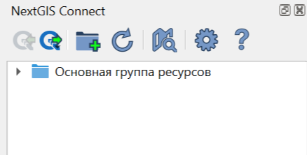
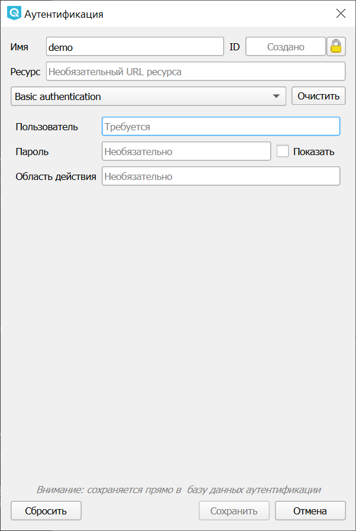

.. sectionauthor:: Дмитрий Барышников <dmitry.baryshnikov@nextgis.ru>
.. sectionauthor:: Роман Гайнуллов <roman.gainullov@nextgis.ru>

.. _ng_connect_overview:
    
Обзор
=====

С помощью данного модуля расширения пользователь QGIS получает возможность обмениваться 
ресурсами с Веб ГИС или NextGIS Web (далее будет использоваться только термин "Веб ГИС") непосредственно из интерфейса QGIS.

С помощью модуля расширения NextGIS Connect возможно:

1. Экспортировать геоданные из Веб ГИС в настольную ГИС;
2. Импортировать векторные и растровые слои из настольной ГИС в Веб ГИС;
3. Загружать целиком проекты QGIS в Веб ГИС с сохранением стилей оформления, иерархией слоев, и т.п.;
4. Создавать WFS-сервисы в один клик и редактировать данные прямо в Веб ГИС;
5. Создайте WMS-сервис в один клик;
6. Обновлять геоданные, сохраняя стили и атрибуты;
7. Создавать группы ресурсов и удалять любые ресурсы;
8. Копировать QML-стиль слоя в Веб ГИС для применения его к слою в QGIS;
9. Добавлять новые стили векторного слоя из QGIS к уже имеющемуся стилю этого слоя в Веб-ГИС.

.. warning::

   Стоит обратить внимание на то, что **фотографии**, которые были собраны в мобильных приложениях NextGIS Collector/Mobile и загружены в веб ГИС вместе со слоями в виде вложений, **не будут** доступны в настольной NextGIS QGIS после загрузки этих слоев через модуль NextGIS Connect!
   
   
Пользователь может столкнуться с задачей, когда нужно изменить стилевые настройки слоя, **не потеряв при этом фотографии**. 

Порядок действий в данном случае следующий:

1. Добавить стиль слоя через NextGIS Connect из Веб ГИС в QGIS.
2. Внести необходимые изменения в стиль.
3. Обновить стиль слоя через NextGIS Connect.

.. figure:: _static/nextgis_connect/ngconnect_modify_keep_photo_ru.png
   :align: center
   :width: 20cm   
   
   Обновление стиля

.. _ng_connect_install:

Установка
=========

Для загрузки модуля NextGIS Connect перейдите в меню настройки модулей из главной панели: *Модули ‣ Управление модулями*. Начните набирать в поиске название модуля, выберите его в списке и нажмите кнопку **Установить модуль**.

В ПО `NextGIS QGIS <http://nextgis.ru/nextgis-qgis/>`_ модуль NextGIS Connect включен в поставку, вы можете сразу начинать работу.

При необходимости проверить/обновить версию модуля можно в разделе меню *Модули ‣ Управление модулями ‣ NextGIS Connect*. 

.. _ng_connect_connection:

Подключение к Веб ГИС
=====================

После установки модуля на панели инструментов появится иконка: 

.. figure:: _static/nextgis_connect/logo.png
   :align: center
   :alt: Иконка модуля расширения NextGIS Connect.

При нажатии на иконку появится панель управления ресурсами Веб ГИС.

   
   Панель модуля расширения NextGIS Connect

Если на данный момент не настроено ни одно подключение, вы увидите сообщение с предложением 
создать свою Веб ГИС.

.. figure:: _static/nextgis_connect/panel-no-connections_ru.png
   :align: center
   :alt: Панель модуля расширения NextGIS Connect при отсутствии подключения
   :width: 10cm
   
   Панель модуля расширения NextGIS Connect при отсутствии подключения

Если ранее на устройстве использовалась версия NextGIS Connect, не поддерживавшая аутентификацию QGIS, то при включении обновленной версии будет предложено конвертировать существующие соединения и данные аутентификации. Это можно сделать через окно NextGIS Connect, а также в настройках модуля.

.. figure:: _static/nextgis_connect/connect_update_convert_ru.png
   :align: center
   :name: connect_update_convert_pic
   :alt: Панель модуля расширения NextGIS Connect после обновления
   :width: 8cm

   Предупреждение о необходимости конвертации соединений

.. figure:: _static/nextgis_connect/ngc_upd_convert_menu_ru.png
   :align: center
   :name: ngc_upd_convert_menu_pic
   :alt: Настройки модуля расширения NextGIS Connect после обновления
   :width: 20cm

   Настройки модуля расширения NextGIS Connect после обновления с сообщением о конвертации

.. _ng_connect_new_connection:

Создание подключения
--------------------

Для создания подключения вам необходимо знать адрес вашей Веб ГИС.
Например, если вы создали свою Веб ГИС, ее адрес вы можете узнать на странице:
https://my.nextgis.com/webgis

.. figure:: _static/nextgis_connect/my_nextgis.png
   :align: center
   :alt: Адрес Веб ГИС
   
   Адрес Веб ГИС

Нажмите кнопку "Настройки" на панели модуля расширения NextGIS Connect.

.. figure:: _static/nextgis_connect/call_settings_ru.png
   :align: center
   :alt: Вызов диалога настроек
   :width: 10cm

   Вызов диалога настроек

В открывшемся окне нажмите кнопку **Новое** и заполните поля:

1. URL - адрес интересующей вас Веб ГИС.
2. Название - идентификатор подключения для быстрого поиска в списке подключений.

.. figure:: _static/nextgis_connect/create_connection_ru.png
   :align: center
   :width: 24cm
   :name: create_connection_pic
   :alt: Добавление соединения
   
   Добавление соединения

Далее в разделе "Аутентификация" добавьте новую конфигурацию или выберите из существующих (в списке отражается название соединения и имя пользователя, а также тип аутентификации).

Можно оставить значение по умолчанию "Без аутентификации", если нет необходимости выполнять действия, правами на которые не обладает неавторизованный пользователь (Гость).
Например,возможность создавать/удалять ресурсы недоступна неавторизованным пользователям, только владельцу Веб ГИС и участникам `команды <https://docs.nextgis.ru/docs_ngcom/source/create.html#ngcom-team-management>`_.

Для того, чтобы **добавить новую конфигурацию**, нажмите кнопку с зеленым плюсом.

Откроется диалоговое окно "Аутентификация".

   
   Добавление конфигурации аутентификации

1. Введите произвольное название конфигурации в поле *Имя*;
2. Выберите Basic-аутентификацию в выпадающем меню ниже;
3. Заполните поля *Пользователь* и *Пароль* данными вашего NextGIS ID;
4. Нажмите **Сохранить**.

Убедитесь, что выбрана нужная конфигурация. Если хотите проверить правильность введенных данных, нажмите "Проверка подключения". Затем нажмите **Сохранить** в окне "Создание подключения" (:numref: `create_connection_pic`). 

Нажмите кнопку "ОК". 

Подключение, выбранное в выпадающем списке "Соединения" диалога "Настройки" станет активным **после закрытия** диалога.

.. _ng_connect_main_settings:

Основные настройки
--------------------

.. figure:: _static/nextgis_connect/ngc_settings_ru.png
   :align: center
   :alt: Основные настройки
   :width: 20cm
   
   Диалог основных настроек подключения

Соединения
~~~~~~~~~~~

В выпадающем списке выбирается подключение, которое станет активным **после закрытия** диалога.

Также здесь можно создать новое соединение, редактировать и удалять существующие.

Загрузка
~~~~~~~~~

**Переименовывать запрещенные поля** - если опция выбрана, то при импорте слоя отдельно или в составе проекта модуль будет переименовывать запрещенные для добавления в Веб ГИС поля.

**Загружать растры как Cloud Optimized GeoTIFF (COG)** если опция выбрана, то растры загружаются с использованием пирамид, в зависимости от зума, и нет необходимости ждать, пока скачается растр целиком.

Ресурсы
~~~~~~~~

**Добавлять слои в QGIS при создании сервиса** - если опция выбрана, то после завершения операций, в ходе которых был создан сервис WFS, WMS или OGC API - Features, он будет автоматически добавлен в QGIS. 

**Открывать веб-карту автоматически после создания** - если опция выбрана, то после завершения операций, в ходе которых была создана веб-карта, она будет открыта в браузере автоматически.

Синхронизация
~~~~~~~~~~~~~~

Здесь можно настроить частоту проверки обновлений. Интервалы задаются в минутах или часах в диапазоне 1-59.

Настройки кэша
~~~~~~~~~~~~~~~~~

Можно настроить следующие параметры сохранения кэша:

**Директория** - адрес размещения кэша, по умолчанию это папка, куда установлена программа.

**Длительность хранения кэша* - устанавливает интервал очистки кэша: 1 день, неделя или месяц. Также можно выбрать бессрочное хранение.

**Максимальный размер кэша** - 8, 12, 16, 24, 32, 64 гигабайта или без ограничений (знак бесконечности).

Также доступна **очистка кэша**.

Прочее
~~~~~~~

Это пригодится, если нужно сообщить разработчикам о багах. Отладочные сообщения позволяют получить информацию том, что происходило до ошибки и место, в котором она возникла. 

**Включить отладочные сообщения** - если опция выбрана, то все отладочные сообщения будут автоматически выводиться на экран в панели “Отладочные сообщения”. 

**Включить отладочные сообщения для запросов** - опция  добавляет информацию о том, какие запросы были произведены, их содержимое и ответ.

.. _ng_connect_proxy:

Настройки Прокси-сервера
------------------------

Если в вашей организации используется свой прокси-сервер, нужно прописать его настройках NextGIS QGIS:

*Верхнее меню > Настроки > Параметры > Сеть > Использовать прокси для доступа к web ресурсам*.

.. figure:: _static/nextgis_connect/proxy.png
   :align: center
   :alt: Настройки прокси сервера
   
   Настройки прокси сервера

.. _ng_connect_data_transfer:

Обмен данными
==============

Модуль NextGIS Connect позволяет обмениваться геоданными между QGIS и Веб ГИС в обоих направлениях, но со своими особенностями.

.. _ng_connect_types:

Типы ресурсов 
--------------

Для обмена данными и работы доступны следующие типы ресурсов:

.. |resource_vector_point| image:: _static/nextgis_connect/vector_layer_point.png
.. |resource_vector_mpoint| image:: _static/nextgis_connect/vector_layer_mpoint.png
.. |resource_vector_line| image:: _static/nextgis_connect/vector_layer_line.png
.. |resource_vector_mline| image:: _static/nextgis_connect/vector_layer_mline.png
.. |resource_vector_polygon| image:: _static/nextgis_connect/vector_layer_polygon.png
.. |resource_vector_mpolygon| image:: _static/nextgis_connect/vector_layer_mpolygon.png
.. |resource_wfs| image:: _static/nextgis_connect/resource_wfs_symbol.png
.. |resource_wms| image:: _static/nextgis_connect/resource_wms_symbol.png
.. |resource_style| image:: _static/nextgis_connect/resource_style_symbol.png
.. |resource_webmap| image:: _static/nextgis_connect/resource_webmap_symbol.png
.. |resource_group| image:: _static/nextgis_connect/resource_group.png
.. |raster_layer| image:: _static/nextgis_connect/raster_layer.png
.. |vector_layer| image:: _static/nextgis_connect/vector_layer_symbol.png
.. |basemap_symbol| image:: _static/nextgis_connect/basemap_symbol.png
.. |tms_service_symbol| image:: _static/nextgis_connect/tms_service_symbol.png
.. |postgis_layer_symbol| image:: _static/nextgis_connect/postgis_layer_symbol.png

- |vector_layer| - Векторный слой (NGW Vector Layer), он может быть: 
  |resource_vector_point| Точечный; 
  |resource_vector_mpoint| Мультиточечный; 
  |resource_vector_line| Линейный; 
  |resource_vector_line| Мультилинейный; 
  |resource_vector_polygon| Полигональный; 
  |resource_vector_mpolygon| Мультиполигональный; 

- |resource_style| - Стиль векторного слоя. QGIS стиль помечается префиксом "(qgis)", стиль MapServer - "(ms)"
- |resource_wfs| - WFS Сервис (NGW WFS Service)
- |resource_wms| - WMS Сервис (NGW WMS Service)
- |tms_service_symbol| - Слой TMS
- |postgis_layer_symbol| - Слой PostGIS
- |raster_layer| - Растровый слой (NGW Raster Layer)
- |basemap_symbol| - Подложка
- |resource_webmap| - Веб карта (NGW Web Map)
- |resource_group| - Группа ресурсов (NGW Web Map)

.. _ng_connect_import:

Импорт данных в Веб ГИС из QGIS 
-------------------------------

Модуль NextGIS Connect позволяет импортировать:

1. Векторные данные
2. Растровые данные
3. Базовые карты (подложек) - только при наличии у Веб ГИС `тарифного плана 'Mini' или 'Premium' <https://nextgis.ru/pricing-base/>`_
4. Проект QGIS целиком

Алгоритм загрузки каждого типа данных описан `здесь <https://docs.nextgis.ru/docs_ngcom/source/ngqgis_connect.html#ngcom-ngqgis-connect-data-upload>`_.

.. figure:: _static/nextgis_connect/add_to_ngw_ru.png
   :align: center
   :width: 10cm
   
   Меню импорта данных

- Векторный слой - в Веб ГИС будет создан векторный слой и стиль, аналогичный стилю 
  выбранного слоя в QGIS, который можно добавить на веб-карту в Веб ГИС.
- Растровый слой - в Веб ГИС будет создан растровый слой со стилем по умолчанию, 
  который можно добавить на веб-карту в Веб ГИС.
- Загрузить всё - В Веб ГИС будут добавлены все слои, для которых доступна операция "Импортировать выбранный слой", и все группы в соответствии с иерархией в панели слоёв QGIS. Также будет создана веб-карта, на которую будут добавлены все импортируемые слои с учетом иерархии и видимости в панели слоёв QGIS. Вам необходимо ввести название новой группы, которая будет создана в Веб ГИС для размещения всех ресурсов, импортируемых в рамках данной операции. После импорта проекта созданная веб-карта откроется в браузере автоматически, если в настройках модуля выбрана соответствуюйщая опция.
- Обновить стиль слоя - В Веб ГИС будет обновлен стиль слоя аналогично стилю выбранного слоя в QGIS.
- Добавить новый стиль к слою - В Веб ГИС будет добавлен новый стиль к слою, аналогично выбранного слоя в QGIS.

При загрузке слоя с **несколькими стилями** в NGW, они загружаются со своими именами. Если название стиля - default (или "по умолчанию"), используется название слоя. 

Добавление ресурсов в Веб ГИС производится в выбранную на панели ресурсов Веб ГИС группу.

- Если выбрана не группа, а другой тип ресурса - в ближайшую родительскую группу выбранного ресурса.
- Если не выбран ресурс - в корневую группу.

.. _ng_connect_export:

Экспорт данных из Веб ГИС в QGIS
---------------------------------

.. figure:: _static/nextgis_connect/add_to_qgis_ru.png
   :align: center
   :alt: Добавить в QGIS
   :width: 10cm
   
   Кнопка экспорта данных в QGIS

Операция доступна, если в дереве ресурсов NextGIS выбран один из следующих видов ресурсов:

- Векторный слой (NGW Vector Layer) |vector_layer| - в QGIS будет создан векторный 
  слой GeoJSON;
- WFS Сервис (NGW WFS Service) |resource_wfs| - в QGIS будет создан WFS слой, источником 
  данных для которого будет выбранный WFS Сервис;
- WMS Слой |wms_layer_symbol| - в QGIS будет добавлен выбранный WMS слой;
- WMS Сервис |resource_wms| - в QGIS будет создан WMS слой, источником данных для которого будет выбранный WMS Сервис;
- WMS Соединение |wms_connection_symbol| - из списка можно будет выбрать WMS слой, который необходимо добавить в QGIS
- TMS Слой |tms_service_symbol|;
- PostGIS Слой |postgis_layer_symbol|;
- QGIS Стиль Векторного слоя |resource_style| - в QGIS будет создан векторный слой GeoJSON, со стилем идентичным выбранному стилю;
- Растровый слой |raster_layer| - в QGIS будет создан растровый слой GeoTIFF;
- Подложка |basemap_symbol|;
- Веб-карта |resource_webmap| - при добавлении в QGIS она будет представлена в виде проекта со слоями, стилями и подложками;
- `Демо-проект <https://docs.nextgis.ru/docs_ngcom/source/demoprojects.html>`_ |demo_project_symbol| - в QGIS будет создан проект, содержащий слои, стили и подложки.

Особенности загрузки слоев с **несколькими стилями**:

* При выборе в дереве Connect слоя с несколькими стилями, они подгрузятся все, но будет предложено выбрать текущий.
* При выборе в дереве Connect стиля слоя, добавятся все стили, по умолчанию будет выбранный.
* При добавлении группы ресурсов, которая содержит слои с несколькими стилями, будут добавлены все стили и выбран либо одноименный слою, либо первый по алфавиту. Диалог с выбором показан не будет.
* При добавлении WFS/OGCF стиль будет выбран либо одноименный слою, либо первый по алфавиту.

Алгоритм Экспорта данных в QGIS описан `здесь <https://docs.nextgis.ru/docs_ngcom/source/ngqgis_connect.html#ngcom-ngqgis-connect-data-export>`_.

.. _ng_connect_cont_menu:

Контекстное меню
----------------
Контекстное меню может отличаться у различных ресурсов. 

.. figure:: _static/nextgis_connect/context_menu_ru.png
   :align: center
   :alt: Контекстное меню qgis стиля векторного слоя
   :width: 10cm
   
   Пример контекстного меню

Общедоступные операции:

- Открыть в ВебГИС - открывает страницу выбранного ресурса в Веб ГИС;

- Переименовать ресурс;

- Удалить ресурс;

- Редактировать метаданные.

Опциональные - зависит от типа ресурса:

- Добавить в QGIS - операция описана выше;

- Создать Веб Карту - доступен только для ресурсов: Векторный слой, Стиль Векторного слоя, Растровый слой, слой WMS;

- Загрузить как QML - доступен только для ресурса QGIS Стиль Векторного слоя;

- Копировать стиль (буфер обмена)  - доступен только для ресурса QGIS Стиль Векторного слоя;

- Создать сервис WFS - доступен только для ресурса Векторный слой;

- Создать сервис OGC API - Features - доступен только для ресурса Векторный слой;

- Создать сервис WMS - доступен только для ресурса Векторный слой;

- Дублировать ресурс - доступен только для ресурсов: Векторный слой и Растровый слой;

- Перезаписать выбранный слой - доступен только для ресурса Векторный слой.

.. _ng_connect_edit_layer:

Редактирование слоя
---------------------

Векторные слои из вашей Веб ГИС можно редактировать сразу после добавления их в QGIS. Стили слоёв сохраняются как при импорте, так и при экспорте изменённого слоя в Веб ГИС.

.. note::
    Функция применима только для форматов векторных данных, используемых в QGIS.

1. Перейдите в режим редактирования в контекстном меню слоя или через панель инструментов.
2. Внесите необходимые изменения.
3. Выйдите из режима редактирования. В появившемся диалоговом окне сохраните изменения.
4. Синхронизация произойдет автоматически.

Чтобы проверить, когда последний раз был синхронизирован слой, наведите курсор на значок синхронизации.

.. figure:: _static/nextgis_connect/ngc_check_sync_ru.png
   :align: center
   :alt: Всплывающая подсказка с информацией о синхронизации
   :width: 18cm

   Всплывающая подсказка с информацией о синхронизации

При нажатии на значок откроется окно статуса слоя.

.. figure:: _static/nextgis_connect/ngc_layer_status_ru.png
   :align: center
   :width: 14cm

   Диалоговое окно статуса слоя

В нем отображается дата последней синхронизации, статус: синхронизирован - не синхронизирован, а также 
количество добавленных, удаленных и измененных объектов.

Можно запустить синхронизацию принудительно, нажав на кнопку "Синхронизация".

Пока слой находится в режиме редактирования, синхронизация недоступна.

.. _ng_connect_update_data:

Обновление данных и стилей
--------------------------

.. warning:: 
   При обновлении **слоя** Все данные целевого слоя, включая вложения (фото, документы), будут очищены. Если вам нужно их сохранить - используйте WFS. Если обновляется стиль, то вложения затронуты не будут.

Модуль NextGIS Connect позволяет редактировать данные в QGIS и после этого возвращать их Веб.
Таким образом происходит обновление данных в Веб ГИС.
Операция доступна, если в дереве ресурсов выбран векторный слой. 
Выберите векторный слой в дереве ресурсов и векторный слой в списке слоёв QGIS. Эта операция удалит все объекты из слоя в Веб ГИС и загрузит в тот слой все объекты из локального слоя. Похожий алгоритм работает и для стилей.
Подробно про обновление `данных <https://docs.nextgis.ru/docs_ngcom/source/ngqgis_connect.html#ngcom-ngqgis-connect-data-overwrite>`_ и `стилей <https://docs.nextgis.ru/docs_ngcom/source/ngqgis_connect.html#ngcom-ngqgis-connect-style-overwrite>`_.

.. _ng_connect_wfs_wms:

Публикация данных по протоколам WMS/WFS и OGC
----------------------------------------------

Модуль NextGIS Connect позволяет опубликовать векторные данные по стандартным протоколам :term:`WFS`, :term:`WMS` и OGC API - Features.
Для этого в модуле в контекстном меню необходимого слоя нужно выбрать соответствующую операцию.
Подробнее об этом `здесь <https://docs.nextgis.ru/docs_ngcom/source/ngqgis_connect.html#wfs-wms>`_.

.. _ng_connect_res_group:

Другие операции
----------------

Этот блок операций расположен в верхнем меню модуля NextGIS Connect.

Создать группу ресурсов
~~~~~~~~~~~~~~~~~~~~~~~~

Новая группа будет создана в группе ресурсов:

- которая выбрана в дереве ресурсов Веб ГИС;
- которая является ближайшей родительской группой для выбранного ресурса, если он 
  не является группой ресурсов;
- в основной группе ресурсов, если не выбран ни один ресурс в дереве ресурсов Веб ГИС.

.. figure:: _static/nextgis_connect/create_group_ru.png
   :align: center
   :alt: Создать новую группу ресурсов
   :width: 10cm

   Создание группы ресурсов

Обновить
~~~~~~~~~~~~~~~~~~

Операция обновит все дерево ресурсов Веб ГИС до актуального на текущий момент состояния.

.. figure:: _static/nextgis_connect/reload_ru.png
   :align: center
   :alt: Обновить дерево ресурсов
   :width: 10cm

   Актуализация данных Веб ГИС

Открыть веб-карту в браузере
~~~~~~~~~~~~~~~~~~~~

Если в дереве ресурсов выбран ресурс веб-карта (NGW Web Map) |resource_webmap|, 
то она откроется в новой вкладке браузера.

.. figure:: _static/nextgis_connect/open_webmap_ru.png
   :align: center
   :alt: Открыть веб-карту в браузере
   :width: 10cm

   Открытие веб-карты

