.. sectionauthor:: Дмитрий Барышников <dmitry.baryshnikov@nextgis.ru>
.. sectionauthor:: Роман Гайнуллов <roman.gainullov@nextgis.ru>

.. _ng_connect:
    
NextGIS Connect
===============

С помощью данного модуля расширения пользователь QGIS получает возможность обмениваться 
ресурсами с Веб ГИС или NextGIS Web (далее будет использоваться только термин "Веб ГИС") непосредственно из интерфейса QGIS.

С помощью модуля расширения NextGIS Connect возможно:

1. Экспортировать геоданные из Веб ГИС в настольную ГИС;
2. Импортировать векторные и растровые слои из настольной ГИС в Веб ГИС;
3. Загружать целиком проекты QGIS в Веб ГИС с сохранением стилей оформления, иерархией слоев, и т.п.;
4. Создавать WFS-сервисы в один клик и редактировать данные прямо в Веб ГИС;
5. Обновлять геоданные, сохраняя стили и атрибуты
6. Создавать группы ресурсов и удалять любые ресурсы.

.. important::
	Если вы планируете обмениваться через NextGIS Connect данными большого объема, то вам потребуется настройка таймаутов QGIS для сетевых запросов. Эта настройка находится в разделе меню **Установки** -> **Параметры** -> **Сеть** -> Таймаут для сетевых запросов. Рекомендуемое значение - **300 000**, при необходимости его можно увеличивать.

.. warning::

   Стоит обратить внимание на то, что **фотографии**, которые были собраны в мобильных приложениях NextGIS Collector/Mobile и загружены в веб ГИС вместе со слоями в виде вложений, **не будут** доступны в настольной NextGIS QGIS после загрузки этих слоев через модуль NextGIS Connect!
   Здесь пользователь может столкнуться с задачей, когда нужно изменить стилевые настройки слоя, не потеряв при этом фотографии. Порядок действий в данном случае следующий:

.. _ng_connect_install:

Установка модуля
------------------

В ПО `NextGIS QGIS <http://nextgis.ru/nextgis-qgis/>`_ модуль NextGIS Connect уже установлен по умолчанию, и вы можете сразу начинать работу. При необходимости проверить/обновить версию модуля можно в разделе меню **Модули -> Управление модулями -> NextGIS Connect**. Модуль также доступен и через официальный репозиторий плагинов 
QGIS, так что возможно начать работу с ним и если у вас другая сборка ПО.

.. _ng_connect_connection:

Создание и настройка подключения к Веб ГИС
------------------------------------------

После установки модуля на панели инструментов появится иконка: 

При нажатии на иконку появится панель управления ресурсами Веб ГИС.

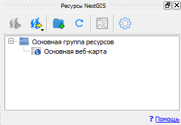

Если на данный момент не настроено ни одно подключение, вы увидите сообщение с предложением 
создать свою Веб ГИС.

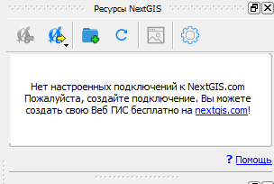

.. _ng_connect_set_connection:

Создание подключения
~~~~~~~~~~~~~~~~~~~~~~

Для создания подключения вам необходимо знать адрес вашей Веб ГИС.
Например, если вы создали свою Веб ГИС, ее адрес вы можете узнать на странице:
https://my.nextgis.com/webgis

.. figure:: _static/nextgis_connect/my_nextgis.png
   :align: center
   :alt: Адрес Веб ГИС

Нажмите кнопку "Настройки" на панели модуля расширения NextGIS Connect.

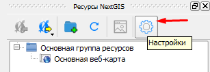

В открывшемся окне нажмите кнопку "Новое" и заполните поля:

1. URL - адрес интересующей вас Веб ГИС.
2. Имя - идентификатор подключения для быстрого поиска в списке подключений.

Снимите галку **Как гость** и заполните поля *Имя пользователя* и *Пароль*,
если вам необходимо выполнять действия, правами на которые не обладает неавторизованный пользователь (Гость).
Например, для того чтобы получить возможность создавать/удалять ресурсы - 
обычно эти действия недоступны неавторизованным пользователям. 

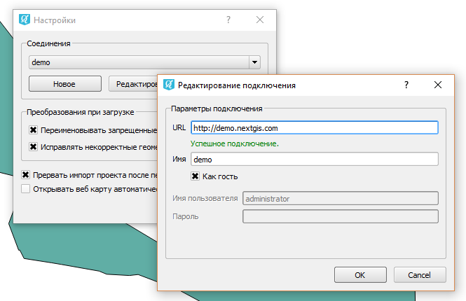

Нажмите кнопку "ОК". В выпадающем списке диалога "Настройки" выбираете подключение, 
которое станет активным **после закрытия** диалога.

.. _ng_connect_main_settings:

Основные настройки
~~~~~~~~~~~~~~~~~~

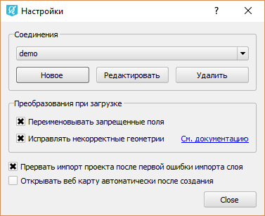

1. Переименовывать запрещенные поля - если опция выбрана, то при импорте слоя отдельно 
или в составе проекта модуль будет переименовывать запрещенные для добавления в Веб ГИС поля;

2. Исправлять некорректные геометрии - если опция выбрана, то при импорте слоя отдельно 
или в составе проекта модуль будет преобразовывать геометрии к одному типу;

3. Прерывать импорт проекта после первой ошибки импорта слоя - если опция выбрана, то 
модуль не будет продолжать процесс импорта, если не удалось импортировать один слой;

4. Открывать карту автоматически после создания - если опция выбрана, то после завершения 
операций, в ходе которых была создана веб карта, она будет открыта в браузере автоматически.

.. _ng_connect_types:

Типы ресурсов 
--------------

Для обмена данными и работы доступны следующие типы ресурсов:

.. |resource_vector_point| image:: _static/nextgis_connect/vector_layer_point.png
.. |resource_vector_mpoint| image:: _static/nextgis_connect/vector_layer_mpoint.png
.. |resource_vector_line| image:: _static/nextgis_connect/vector_layer_line.png
.. |resource_vector_mline| image:: _static/nextgis_connect/vector_layer_mline.png
.. |resource_vector_polygon| image:: _static/nextgis_connect/vector_layer_polygon.png
.. |resource_vector_mpolygon| image:: _static/nextgis_connect/vector_layer_mpolygon.png
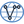

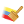

.. |resource_group| image:: _static/nextgis_connect/resource_group.png
- |resource_vector_point| - Точечный векторный слой (NGW Vector Layer)
- |resource_vector_mpoint| - Мультиточечный векторный слой (NGW Vector Layer)
- |resource_vector_line| - Линейный векторный слой (NGW Vector Layer)
- |resource_vector_line| - Мультилинейный векторный слой (NGW Vector Layer)
- |resource_vector_polygon| - Полигональный векторный слой (NGW Vector Layer)
- |resource_vector_mpolygon| - Мультиполигональный векторный слой (NGW Vector Layer)
- |resource_style| - Стиль векторного слоя. QGIS стиль помечается префиксом "(qgis)", стиль MapServer - "(ms)"
- |resource_wfs| - WFS Сервис (NGW WFS Service)
- |resource_wms| - WMS Сервис (NGW WMS Service)
- |resource_webmap| - Веб карта (NGW Web Map)
- |resource_group| - Группа ресурсов (NGW Web Map)

.. _ng_connect_data_imp_exp:

Обмен данными между Веб ГИС и QGIS
-----------------------------------

Модуль NextGIS Connect позволяет обмениваться геоданными между QGIS и Веб ГИС в обоих направлениях, но со своими особенностями.

.. _ng_connect_import:

Импорт данных в Веб ГИС из QGIS 
~~~~~~~~~~~~~~~~~~~~~~~~~~~~~~~~

Модуль NextGIS Connect позволяет импортировать:

1. Векторные данные
2. Растровые данные
3. Базовые карты (подложек) - только при наличии у Веб ГИС тарифного плана 'Mini' или 'Premium'
4. Проект QGIS целиком

Алгоритм загрузки каждого типа данных описан `здесь <https://docs.nextgis.ru/docs_ngcom/source/ngqgis_connect.html#ngcom-ngqgis-connect-data-upload>`_.

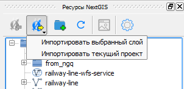

- Векторный слой - в Веб ГИС будет создан векторный слой и стиль, аналогичный стилю 
  выбранного слоя в QGIS, который можно добавить на веб-карту в Веб ГИС.
- Растровый слой - в Веб ГИС будет создан растровый слой со стилем по умолчанию, 
  который можно добавить на веб-карту в Веб ГИС.
- Текущий проект - В Веб ГИС будут добавлены все слои, для которых доступна операция "Импортировать выбранный слой", и все группы в соответствии с иерархией в панели слоёв QGIS. Также будет создана веб-карта, на которую будут добавлены все импортируемые слои с учетом иерархии и видимости в панели слоёв QGIS. Вам необходимо ввести название новой группы, которая будет создана в Веб ГИС для размещения всех ресурсов, импортируемых в рамках данной операции. После импорта проекта созданная веб-карта откроется в браузере автоматически, если в настройках модуля выбрана соответствуйщая опция.

Добавление ресурсов в Веб ГИС производится в выбранную на панели ресурсов Веб ГИС группу.

- Если выбрана не группа, а другой тип ресурса - в ближайшую родительскую группу выбранного ресурса.
- Если не выбран ресурс - в корневую группу.

.. _ng_connect_export:

Экспорт данных из Веб ГИС в QGIS
~~~~~~~~~~~~~~~~~~~~~~~~~~~~~~~~

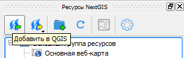

Операция доступна, если в дереве ресурсов NextGIS выбран один из следующих видов ресурсов:

- Векторный слой (NGW Vector Layer) |resource_vector| - в QGIS будет создан векторный 
  слой GeoJSON;
- WFS Сервис (NGW WFS Service) |resource_wfs| - в QGIS будет создан WFS слой, источником 
  данных для которого будет выбранный WFS Сервис;
- WMS Слой - в QGIS будет добавлен выбранный WMS слой.
- WMS Сервис - в QGIS будет создан WMS слой, источником 
  данных для которого будет выбранный WMS Сервис;
- WFS Соединение - из списка можно будет выбрать WMS слой, который необходимо добавить в QGIS
- QGIS Стиль Векторного слоя |resource_style| - в QGIS будет создан векторный слой GeoJSON, со стилем идентичным выбранному стилю.

Алгоритм Экспорта данных в QGIS описан `здесь <https://docs.nextgis.ru/docs_ngcom/source/ngqgis_connect.html#ngcom-ngqgis-connect-data-export>`_.

.. _ng_connect_update_data:

Обновление данных и стилей
--------------------------

.. warning:: 
   При обновлении **слоя** Все данные целевого слоя, включая вложения (фото, документы), будут очищены. Если вам нужно их сохранить - используйте WFS. Если обновляется стиль, то вложения затронуты не будут.

Модуль NextGIS Connect позволяет редактировать данные в QGIS и после этого возвращать их Веб.
Таким образом происходит обновление данных в Веб ГИС.
Операция доступна, если в дереве ресурсов выбран векторный слой. 
Выберите векторный слой в дереве ресурсов и векторный слой в списке слоёв QGIS. Эта операция удалит все объекты из слоя в Веб ГИС и загрузит в тот слой все объекты из локального слоя. Похожий алгоритм работает и для стилей.
Подробно про обновление `данных <https://docs.nextgis.ru/docs_ngcom/source/ngqgis_connect.html#ngcom-ngqgis-connect-data-overwrite>`_ и `стилей <https://docs.nextgis.ru/docs_ngcom/source/ngqgis_connect.html#ngcom-ngqgis-connect-style-overwrite>`_.

.. _ng_connect_wfs_wms:

Публикация данных по WMS/WFS протоколам
----------------------------------------

Модуль NextGIS Connect позволяет опубликовать векторные данные по стандартным протоколам :term:`WFS` и :term:`WMS`.
Для этого в модуле в контекстном меню необходимого слоя нужно выбрать соответствующую операцию.
Подробнее об этом `здесь <https://docs.nextgis.ru/docs_ngcom/source/ngqgis_connect.html#wfs-wms>`_.

.. _ng_connect_res_group:

Создание групп, удаление, обновление дерева ресурсов и открытие Веб Карты
------------------------------------------------------------------------

Этот блок операций расположен в верхнем меню модуля NextGIS Connect.

Новая группа будет создана в группе ресурсов:

- которая выбрана в дереве ресурсов Веб ГИС;
- которая является ближайшей родительской группой для выбранного ресурса, если он 
  не является группой ресурсов;
- в основной группе ресурсов, если не выбран ни один ресурс в дереве ресурсов Веб ГИС.

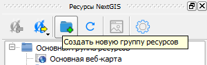

Операция "обновления" обновит все дерево ресурсов Веб ГИС до актуального на текущий момент состояния.

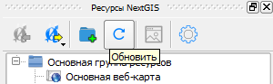

Удаление ресурса безвозвратно удаляет выбранные геоданные.

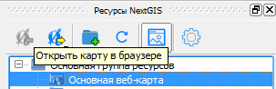

Если в дереве ресурсов выбран ресурс веб-карта (NGW Web Map) |resource_webmap|, 
то она откроется в новой вкладке браузера.

.. _ng_connect_cont_menu:

Контекстное меню
-----------------------
Контекстное меню может отличаться у различных ресурсов. 

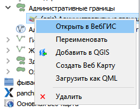

Общедоступные операции:

- Открыть в ВебГИС - открывать страницу выбранного ресурса в Веб ГИС;

- Переименовать - переименовать ресурс;

- Удалить - удалить ресурс.

Опциональные - зависит от типа ресурса:

- Добавить в QGIS - операция описана выше;

- Создать Веб Карту - доступен только для ресурсов: Векторный слой и Стиль Векторного слоя;

- Загрузить как QML - доступен только для ресурса QGIS Стиль Векторного слоя.

