.. _connect_data_upload:

Создание ресурсов и загрузка данных
====================================

Модуль NextGIS Connect позволяет быстро загружать в Веб ГИС растровые и векторные данные, а также `целиком проекты QGIS <https://docs.nextgis.ru/docs_ngconnect/source/resources.html#qgis-project>`_. Это позволит вам легко опубликовать в интернете свои карты и геоданные.

Также при помощи модуля вы можете `добавлять ресурсы из Веб ГИС <https://docs.nextgis.ru/docs_ngconnect/source/resources.html#connect-data-export>`_ в QGIS, чтобы редактировать их в настольном приложении.

.. _vector_data:

Загрузка векторных данных
------------------------------

.. important:: 
   Вы можете избежать `ограничений по форматам данных <https://docs.nextgis.ru/docs_ngweb/source/layers.html#ngw-vector-data-requirements>`_ при загрузке векторных данных в Веб ГИС через NextGIS Connect, применив опции "Переименовывать запрещенные поля" и "Исправлять некорректные геометрии" в диалоге :guilabel:`Настройки`.

* Создайте в QGIS "с нуля" или добавьте из файлов векторные слои :term:`ESRI Shape`, :term:`GeoJSON` или :term:`CSV`. Настройте стили их отображения;
* Выберите в дереве ресурсов Веб ГИС в окне модуля NextGIS Connect Группу ресурсов, в которую вы хотите загрузить данные (или создайте её с помощью кнопки "`Создать новую группу ресурсов <https://docs.nextgis.ru/docs_ngconnect/source/ngc_data_transfer.html#ng-connect-res-group>`_");
* Выберите в панели слоев QGIS векторный слой, который вы хотите загрузить в Веб ГИС;
* Нажмите кнопку **Добавить в Веб ГИС** на панели инструментов модуля и кликните **Загрузить выбранное** в меню или нажмите **NextGIS Connect --> Загрузить выбранное** в контекстном меню слоя;
* Если данные загрузились успешно, то в соответствующей Группе ресурсов появится новый Векторный слой, внутри которого будет создан `Стиль QGIS <https://docs.nextgis.ru/docs_ngweb/source/mapstyles.html>`_ с заданными настройками стиля.

При загрузке слоя **с несколькими стилями** в Веб ГИС, они загружаются со своими именами. Если название стиля - default (или "по умолчанию"), используется название слоя. 

.. _raster_data:

Загрузка растровых данных
----------------------------

* Добавьте в QGIS из файлов растровые слои :term:`GeoTIFF`;
* Выберите в дереве ресурсов Веб ГИС в окне модуля NextGIS Connect Группу ресурсов, в которую вы хотите загрузить данные;
* Выберите в панели слоев QGIS растровый слой, который вы хотите загрузить в Веб ГИС;
* Нажмите кнопку **Добавить в Веб ГИС** на панели инструментов модуля и кликните **Загрузить выбранное** в меню или нажмите **NextGIS Connect --> Загрузить выбранное** в контекстном меню слоя;
* Если данные загрузились успешно, то в соответствующей Группе ресурсов появится новый Растровый слой , внутри которого будет создан `Растровый стиль <https://docs.nextgis.ru/docs_ngweb/source/layers.html#qgis>`_ с настройками стиля по умолчанию.

Посмотрите, как это работает, в видео:

.. raw:: html

   <iframe width="560" height="315" src="https://rutube.ru/play/embed/be92d2c9959a434d09f41ec1e715b276/" frameBorder="0" allow="clipboard-write; autoplay" webkitAllowFullScreen mozallowfullscreen allowFullScreen></iframe>

Посмотреть видео на `youtube <https://youtu.be/b2CudmkYUOQ>`_, `rutube <https://rutube.ru/video/be92d2c9959a434d09f41ec1e715b276/>`_.

.. _basemaps:

Загрузка базовых карт (подложек)
---------------------------------

* Добавьте в QGIS базовую карту (подложку);
* Выберите в дереве ресурсов Веб ГИС в окне модуля NextGIS Connect Группу ресурсов, в которую вы хотите добавить подложку;
* Выберите в панели слоев QGIS подложку, которую вы хотите загрузить в Веб ГИС;
* Нажмите кнопку **Добавить в Веб ГИС** на панели инструментов модуля и кликните **Загрузить выбранное** в меню или нажмите **NextGIS Connect --> Загрузить выбранное** в контекстном меню слоя;
* Если подложка загрузилась успешно, то она появится в соответствующей Группе ресурсов.

Для работы с подложками ваша Веб ГИС должна быть на плане `Мини или Премиум <https://nextgis.ru/pricing-base/>`_, в противном случае вы не сможете импортировать их в Веб ГИС.

.. _qgis_project:

Загрузка проекта QGIS целиком
-------------------------------

* Соберите в QGIS проект из растровых и векторных слоев. Настройте их стили отображения, иерархию, группировку, видимость. Настройте охват карты;
* Выберите в дереве ресурсов Веб ГИС в окне модуля NextGIS Connect Группу ресурсов, в которую вы хотите загрузить проект;
* Нажмите кнопку **Загрузить всё** на панели инструментов модуля;

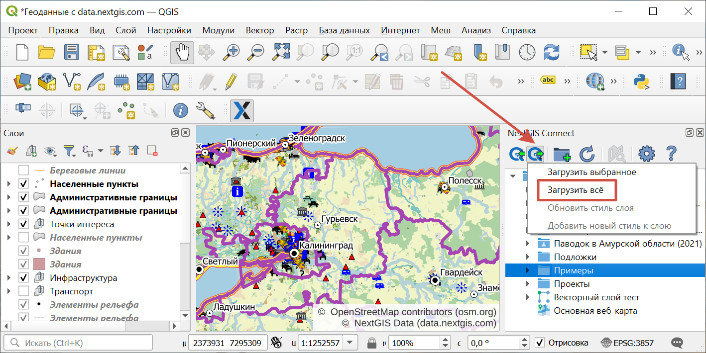
   
   Импорт текущего проекта
   
* В открывшемся диалоговом окне укажите название новой Группы ресурсов, в которую будет загружен проект;

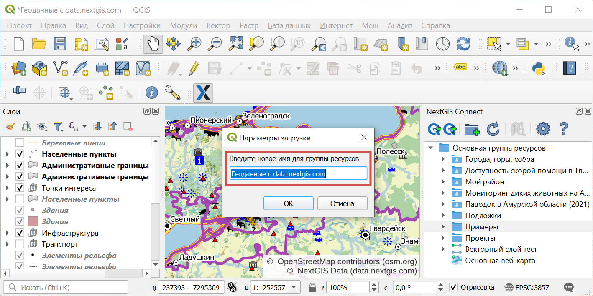
   
   Указание имени импортируемого проекта

* Если проект загрузился успешно, то в соответствующей Группе ресурсов появится новая Группа ресурсов с заданным названием, внутри которой будут находиться: 
1) все Растровые и Векторные слои, для которых доступна операция *Добавить в Веб ГИС*, а также их Стили;
2) автоматически созданная `Веб-карта <https://docs.nextgis.ru/docs_ngweb/source/webmaps_client.html#ngw-webmaps-client>`_ с заданным охватом, на которую будут добавлены все импортированные слои с учетом их группировки, иерархии и видимости в панели слоёв QGIS.

.. note:: 
	Быстро перейти к Веб-карте можно, нажав кнопку **Открыть карту в браузере** на панели инструментов модуля или выбрав соответствующую команду в контекстном меню Веб-карты.

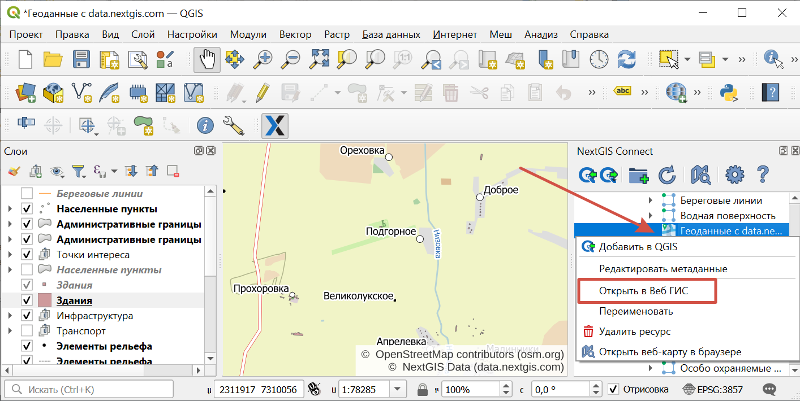
   
   Открытие импортированного проекта в Веб ГИС через контекстное меню

При добавлении группы ресурсов, которая содержит слои **с несколькими стилями**, будут добавлены все стили и выбран в качестве текущего либо одноименный слою, либо первый по алфавиту. Диалог с выбором показан не будет.

.. raw:: html

   <iframe width="560" height="315" src="https://rutube.ru/play/embed/f374bd300335a78dddd017a0c0934eec/" frameBorder="0" allow="clipboard-write; autoplay" webkitAllowFullScreen mozallowfullscreen allowFullScreen></iframe>

Смотреть на `youtube <https://youtu.be/qIByQEqZ4oQ>`_, `rutube <https://rutube.ru/video/f374bd300335a78dddd017a0c0934eec/>`_.

.. _ng_connect_lookup:

Загрузка справочников
------------------------------------------------

В Веб ГИС можно создавать `справочники <https://docs.nextgis.ru/docs_ngweb/source/create_other.html#ngw-create-lookup-table>`_ и подключать их к векторным слоям.

При экспорте слоя из Веб ГИС в QGIS значения справочника будут добавлены в слой как Карта значений (виджет value map). После этого в настольном приложении в режиме редактирования они будут доступны для выбора в соответствующем поле таблицы.

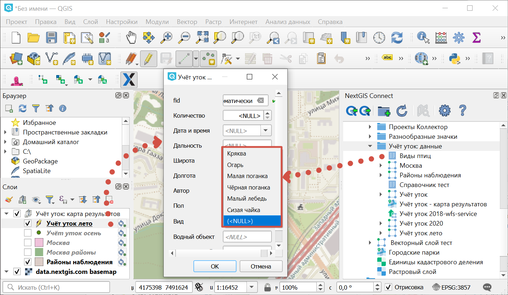

   Значения из справочника доступны при редактировании слоя в QGIS

В QGIS, в свою очередь, вы можете при помощи виджета Связанное значение (value relation) использовать в качестве справочника векторный слой или загрузить CSV-файл. При отправке слоя с геометриями в облако в Веб ГИС будет создан ресурс справочника.

.. _connect_services:

Создание Сервисов: WFS, WMS, OGC API - Features
-------------------------------------------------

Модуль NextGIS Connect позволяет быстро публиковать Векторные слои в Веб ГИС по стандартным протоколам :term:`WFS`, :term:`WMS` и OGC API - Features. 

.. _create_wfs_service:

Создание сервиса WFS
~~~~~~~~~~~~~~~~~~~~~

Для этого в модуле доступна операция быстрого создания Сервиса WFS:

* В настольном приложении (QGIS) в дереве ресурсов Веб ГИС модуля NextGIS Connect выберите **Векторный слой**, который вы хотите опубликовать по протоколу WFS;

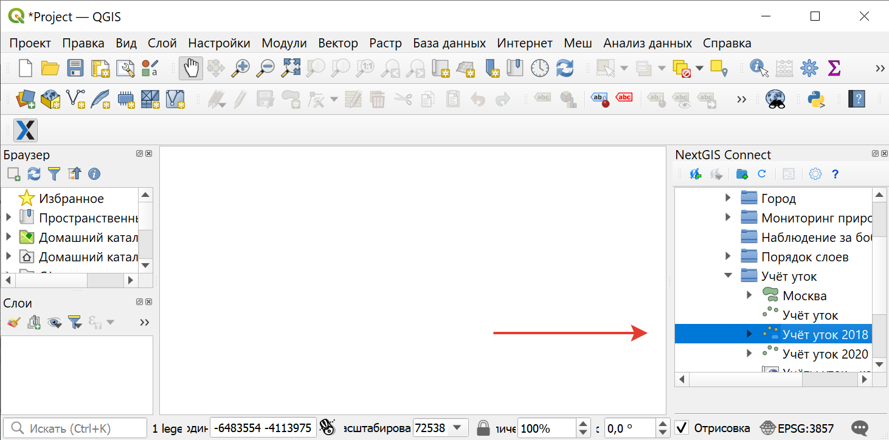
   
   Выбор слоя

* Выберите пункт **Создать сервис WFS** в контекстном меню слоя;

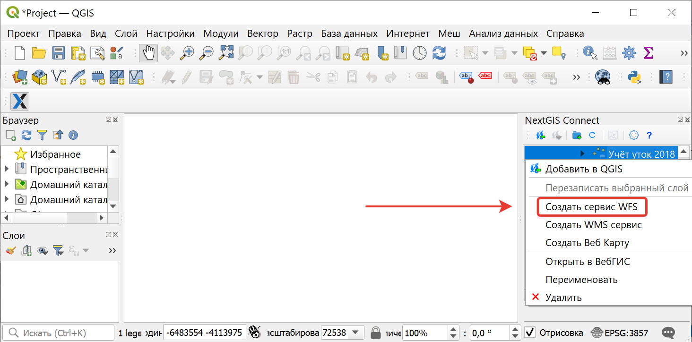
   
   Контекстное меню слоя
   
* В открывшемся диалоговом окне укажите число объектов слоя, которое должен публиковать Сервис WFS;

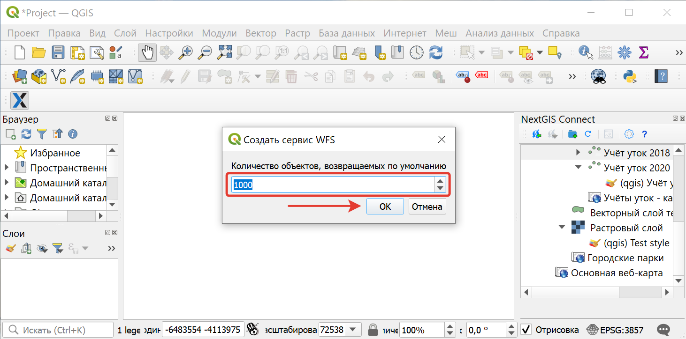
   
   Число публикуемых объектов слоя

* Если Сервис WFS создался успешно, то в соответствующей Группе ресурсов появится новый Сервис WFS, в который уже подключен ваш Векторный слой.

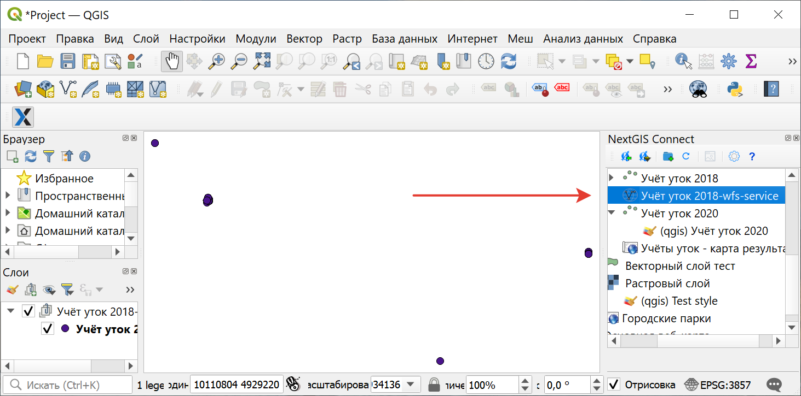
   
   Созданный сервис WFS в дереве ресурсов
   
.. note:: 
	Отредактировать настройки созданного таким образом Сервиса WFS (включая его название, публикуемые слои и их настройки) можно через веб-интерфейс Веб ГИС.

.. _create_ogc_api_feat_service:

Создание сервиса OGC API - Features
~~~~~~~~~~~~~~~~~~~~~~~~~~~~~~~~~~~~

Для этого в модуле доступна операция быстрого создания Сервиса OGC API - Features:

* В настольном приложении (QGIS) в дереве ресурсов Веб ГИС модуля NextGIS Connect выберите **Векторный слой**, который вы хотите опубликовать по протоколу OGC API - Features;

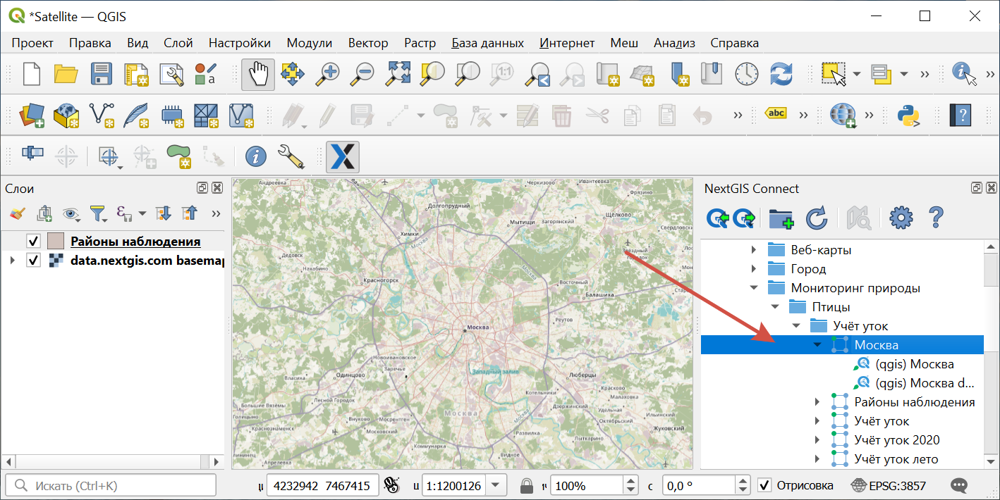
   
   Выбор слоя

* Выберите пункт **Создать сервис OGC API - Features** в контекстном меню слоя;

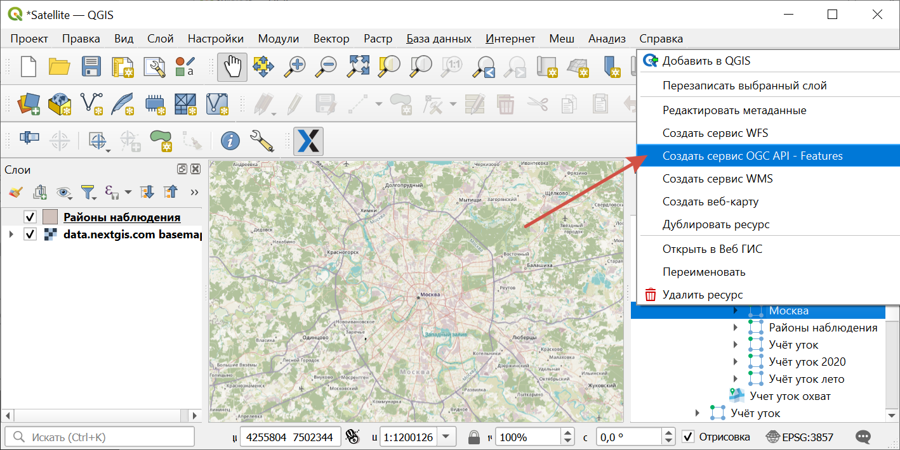
   
   Контекстное меню слоя
   
* В открывшемся диалоговом окне укажите число объектов слоя, которое должен публиковать Сервис OGC API - Features;

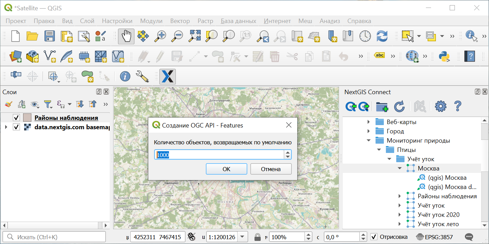
   
   Число публикуемых объектов слоя

* Если Сервис OGC API - Features создался успешно, то в соответствующей Группе ресурсов появится новый Сервис OGC API - Features, в который уже подключен ваш Векторный слой.

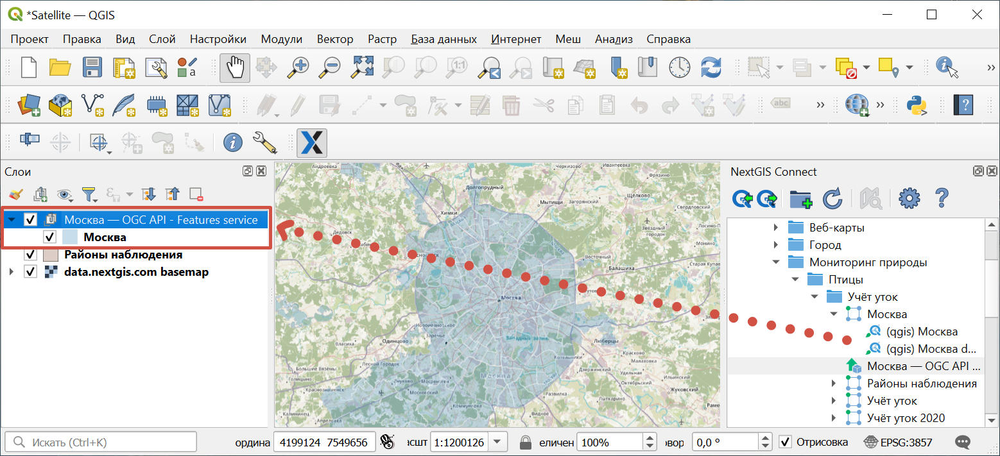
   
   Созданный сервис OGC API - Features в дереве ресурсов

.. _create_wms_service:

Создание сервиса WMS
~~~~~~~~~~~~~~~~~~~~~

Для этого в модуле доступна операция быстрого создания Сервиса WMS:

* В настольном приложении (QGIS) в дереве ресурсов Веб ГИС модуля NextGIS Connect выберите **Векторный слой**, который вы хотите опубликовать по протоколу WMS;

   
   Выбор слоя
   
* Выберите пункт **Создать WMS сервис** в контекстном меню слоя;

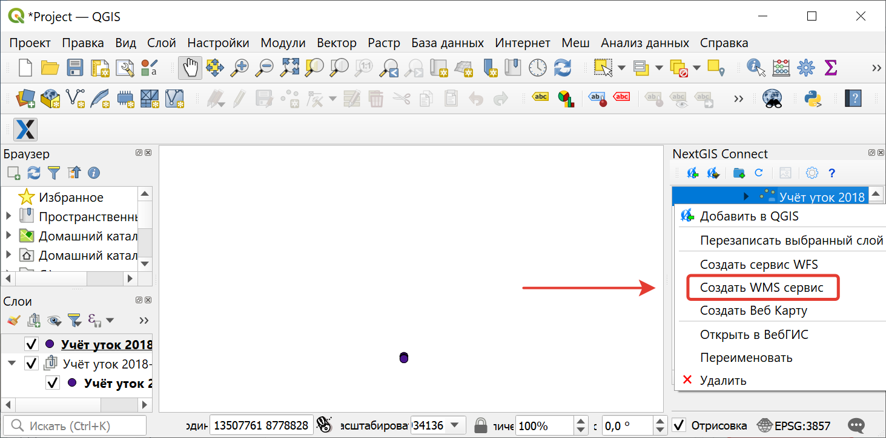
   
   Контекстное меню слоя
   
* В открывшемся диалоговом выберите стиль слоя для публикация Сервиса WMS;

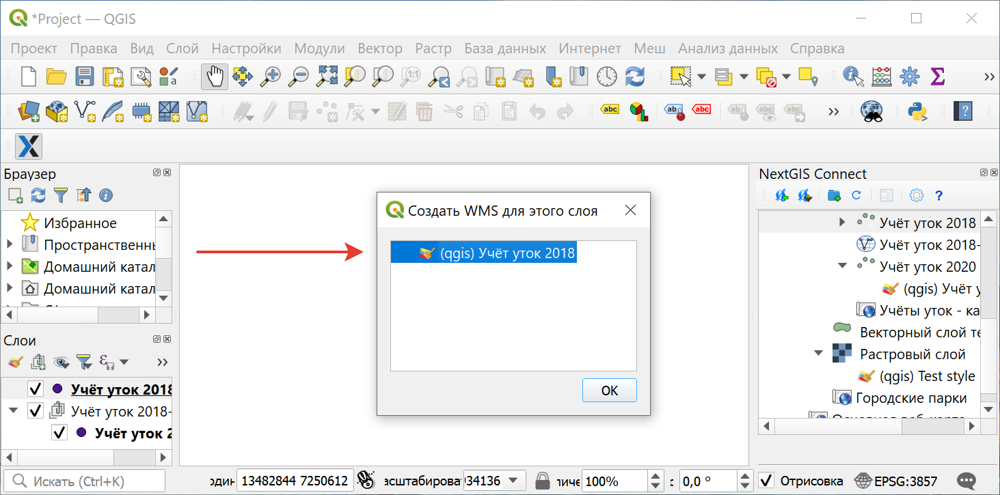
   
   Выбор стиля для публикации Сервиса WMS
   
* Если Сервис WMS создался успешно, то в соответствующей Группе ресурсов появится новый Сервис WMS, в который уже подключен ваш Векторный слой.

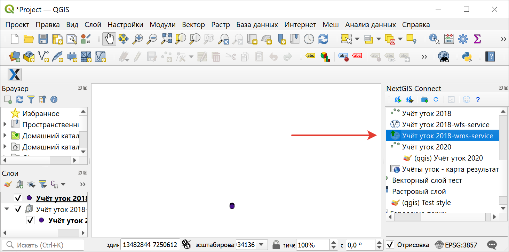
   
   Созданный Сервис WMS в дереве ресурсов

.. _web_map:

Создание веб-карты на основе слоя
----------------------------------

* Выберите в дереве ресурсов Веб ГИС в окне модуля NextGIS Connect векторный или растровый слой, который вы хотите представить на веб-карте;
* В контекстном меню выберите **Создать веб-карту**.

В той же группе ресурсов будет создана веб-карта с именем вида "имя_слоя-map". Для слоя будет создан стиль QGIS и добавлен на веб-карту. Начальный охват карты устанавливается по охвату слоя.

.. _connect_data_export:

Выгрузка данных из Веб ГИС в QGIS
---------------------------------------

Модуль NextGIS Connect позволяет быстро экспортировать векторные данные из Веб ГИС в QGIS для их последующей обработки, анализа, выгрузки и иных операций.

Для этого в модуле доступна операция быстрого создания векторных слоев GeoJSON в QGIS с использованием данных Векторных слоев Веб ГИС:

* Выберите в дереве ресурсов Веб ГИС в окне модуля NextGIS Connect Векторный слой, который вы хотите экспортировать в QGIS;
* Нажмите кнопку **Добавить в QGIS** на панели инструментов модуля или выберите пункт **Добавить в QGIS** в контекстном меню слоя;

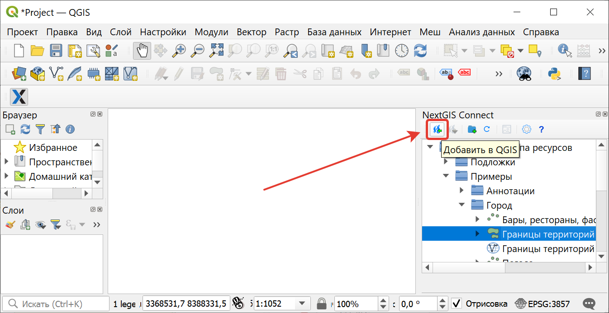
   
   Экспорт векторного слоя из Веб ГИС

* В случае, если слой имеет несколько стилей QGIS, сценарий зависит от того, что выделено для загрузки в окне Connect:

1. При выборе в дереве Connect **слоя с несколькими стилями**, они подгрузятся все, но будет предложено выбрать текущий. Это единственный вариант, при котором появляется диалоговое окно. Кликните дважды на нужном стиле, чтобы выбрать его.

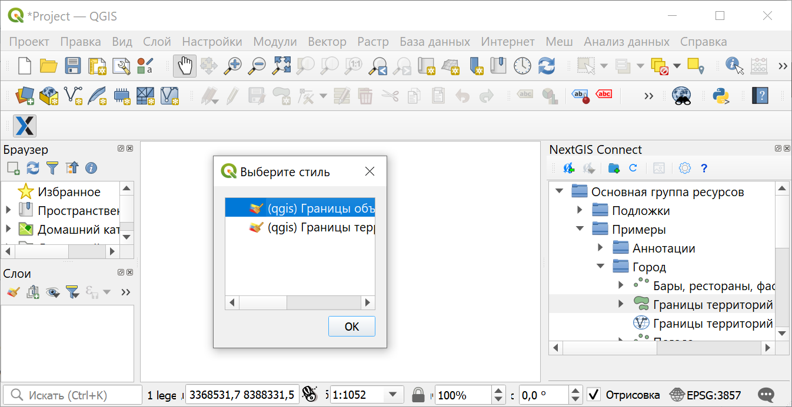
   
   Выбор текущего QGIS-стиля

2. При выборе в дереве Connect **стиля** слоя, добавятся все стили, по умолчанию будет выбранный.

3. При добавлении **группы ресурсов**, которая содержит слои с несколькими стилями, будут добавлены все стили и выбран либо одноименный слою, либо первый по алфавиту. Диалог с выбором показан не будет.

4. При добавлении WFS/OGCF диалога выбора не будет. Стиль будет выбран либо одноименный слою, либо первый по алфавиту.

Выбрать другой стиль для загруженного слоя можно будет в свойствах слоя.

Если слой экспортировался успешно, то в панели слоев QGIS появится новый векторный слой GeoJSON, который можно использовать в текущих проектах или сохранить на устройство в нужном формате.
