.. _connect_data_upload:

Create resources and transfer data
====================================

NextGIS Connect plugin enables a fast upload of raster and vector data and `entire QGIS projects <https://docs.nextgis.com/docs_ngconnect/source/resources.html#upload-entire-qgis-project>`_ to Web GIS. You’ll be able to publish your maps and geodata online very quick and easy.

With this plugin you can also `download data from Web GIS <https://docs.nextgis.com/docs_ngconnect/source/resources.html#connect-data-export>`_ to QGIS to edit it.

.. _vector_data:

Uploading vector data
------------------------------

.. important:: 
   You can avoid `data format limitations <https://docs.nextgis.com/docs_ngweb/source/layers.html#ngw-vector-data-requirements>`_ when uploading vector data to Web GIS through NextGIS Connect by switching on options "Rename forbidden fields" and "Fix incorrect geometries" in *Settings* dialog.

In QGIS create from scratch or upload from :term:`ESRI Shape`, :term:`GeoJSON` or :term:`CSV` files vector layers. Tailor their styles;
* In NextGIS Connect panel select Resource group to which you want to upload your data (or create a new one using `Create resource group <https://docs.nextgis.com/docs_ngconnect/source/ngc_data_transfer.html#ng-connect-res-group>`_ button);
* In QGIS Layers panel select the vector layer which you want to upload to Web GIS;
* Press **Add to Web GIS** button on NextGIS Connect control panel and click **Upload selected** or choose **NextGIS Connect --> Upload selected** in layer context menu;
* If data is uploaded successfully you'll see in the relevant Resource group a new Vector layer with `QGIS style <https://docs.nextgis.com/docs_ngweb/source/mapstyles.html>`_ tailored by you.

If a layer has **multiple styles**, they will all be uploaded. Their names will be kept. If the style name is "default", the layer's name will be used instead. 

.. _raster_data:

Upload raster data
----------------------------

* Add raster layers to QGIS from :term:`GeoTIFF` files;
* In NextGIS Connect panel select Resource group to which you want to upload your data;
* In QGIS Layers panel select a raster layer which you want to upload to Web GIS;
* Press **Add to Web GIS** button on NextGIS Connect control panel and click **Upload selected** or choose **NextGIS Connect --> Upload selected** in layer context menu;
* If data is uploaded successfully you'll see in the relevant Resource group a new Raster layer  with default `Raster style <https://docs.nextgis.com/docs_ngweb/source/layers.html#raster-style-qgis>`_.

See how to set transparancy for a raster layer, upload it and `create a Web Map <https://docs.nextgis.com/docs_ngconnect/source/resources.html#creating-web-map-from-a-layer>`_ from the layer in our video:

.. raw:: html

   <iframe width="560" height="315" src="https://www.youtube.com/embed/AA36g3CdGcU?si=YvqWTVMYnLt9-0sl" title="YouTube video player" frameborder="0" allow="accelerometer; autoplay; clipboard-write; encrypted-media; gyroscope; picture-in-picture; web-share" referrerpolicy="strict-origin-when-cross-origin" allowfullscreen></iframe>

Watch on `youtube <https://youtu.be/AA36g3CdGcU?si=d2JGjil-zMEbws4r>`_.

.. _basemaps:

Upload basemap
---------------------------------

* Add basemaps to QGIS via TMS;
* In NextGIS Connect panel select Resource group to which you want to add your basemap;
* In QGIS Layers panel select a basemap which you want to upload to Web GIS;
* Press **Add to Web GIS** button on NextGIS Connect control panel and click **Upload selected** or choose **NextGIS Connect --> Upload selected** in layer context menu;
* If a basemap is uploaded successfully you'll see it the relevant Resource group.

You need to be on `Mini or Premium <https://nextgis.com/pricing-base/>`_ to work with basemaps.

.. _qgis_project:

Upload entire QGIS project
-------------------------------

* Create a QGIS project with raster and vector layers. Tailor their styles, group them, set their hierarchy and visibility settings. Set the map extent;
* In NextGIS Connect panel select Resource group to which you want to upload the project;
* Press **Add to Web GIS** button on NextGIS Connect control panel and select **Upload all**;

.. figure:: _static/NGConnect_import_menu_en_2.png
   :name: NGConnect_import_menu_pic
   :align: center
   :width: 20cm
   
   Adding project in the NextGIS Connect panel. Target resource group is highligthed in blue
   
* In the opened dialog window enter the name of the new Resource group to which the project will be imported;

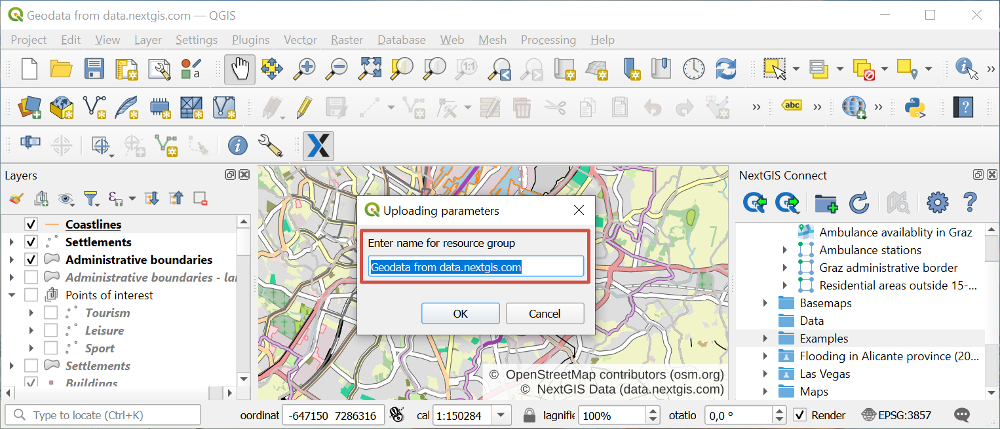
   
   Entering the name for the project

* If the project is uploaded successfully you'll see in a selected Resource group a newly created group with: 
1) all Raster and Vector layers to which **Add to Web GIS** operation is applicable, and their Styles;
2) automatically created `Web map <https://docs.nextgis.com/docs_ngweb/source/webmaps_client.html#ngw-webmaps-client>`_ with a set extent, to which all the imported layers are added with groups, hierarchy and visibility settings similar to QGIS. 

.. tip:: 
	To view the newly created Web map press **Open map in browser** button on NextGIS Connect control panel or select **Open map in browser** in the context menu.

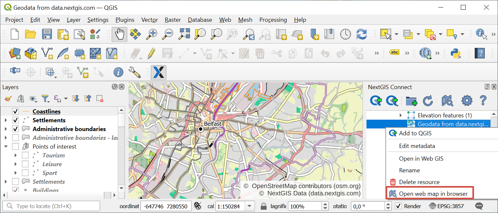
   
   Opening the newly created Web Map via context menu of the imported project

If you select a resource group containing layers with multiple styles, all the styles will be added. The style used as current will be the one with the same name as the layer or the first in alphabetical order. No dialog will be displayed.

.. raw:: html

   <iframe width="560" height="315" src="https://www.youtube.com/embed/Wwx1mowUAL4?si=pSrv-l2C2Nvqd9eH" title="YouTube video player" frameborder="0" allow="accelerometer; autoplay; clipboard-write; encrypted-media; gyroscope; picture-in-picture; web-share" referrerpolicy="strict-origin-when-cross-origin" allowfullscreen></iframe>

Watch on `youtube <https://youtu.be/Wwx1mowUAL4?si=g1ErxArjC4GewSsh>`_.

.. _ng_connect_lookup:

Lookup tables
------------------------------------------------

In Web GIS you can create `Lookup tables <https://docs.nextgis.com/docs_ngweb/source/create_other.html#ngcom-lookup-table-for-layer>`_ and link them to vector layers.

When the layer is exported from Web GIS to QGIS the values of the lookup table will be added to the layer using value map widget. After that they will be available in the desktop app in the corresponding field of the table when you enter edit mode.

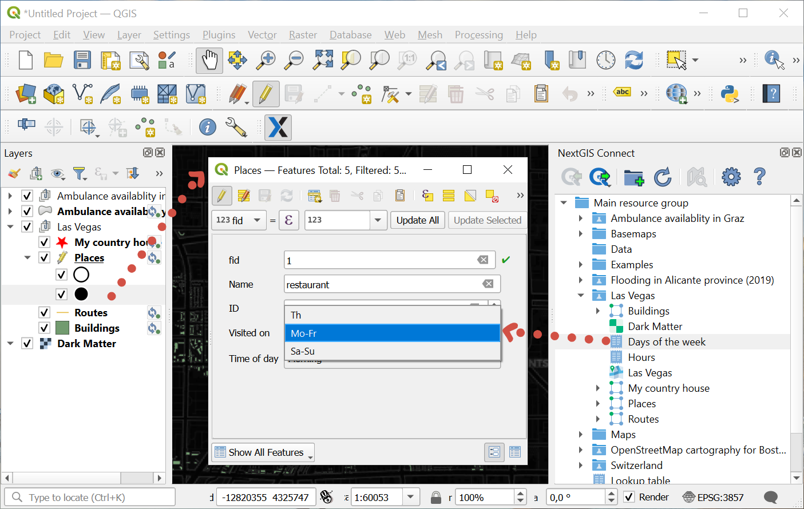

   Lookup table values available during editing in QGIS

In QGIS you can use Value relation widget to add another vector layer as a lookup table or upload a CSV file. When the layer is transfered to Web GIS, a Lookup table resource will be created for it.

.. _connect_services:

Create WFS, WMS, OGC API - Features services
-------------------------------------------------

NextGIS Connect plugin allows to quickly publish vector data using standard protocols :term:`WFS`, :term:`WMS` and OGC. 

.. _create_wfs_service:

Create WFS service
~~~~~~~~~~~~~~~~~~~~~

It's possible due to the quick creation of :ref:`WFS service <ngcom_wfs_service>` option in NextGIS Connect: 

* Select in NextGIS Connect Resources panel Vector layer which you want to publish using WFS protocol;

.. figure:: _static/NGConnect_wfs_select_en.png
   :name: NGConnect_wfs_select_pic
   :align: center
   :width: 20cm
   
   Selecting vector layer

* Select **Create WFS service** in layer context menu;

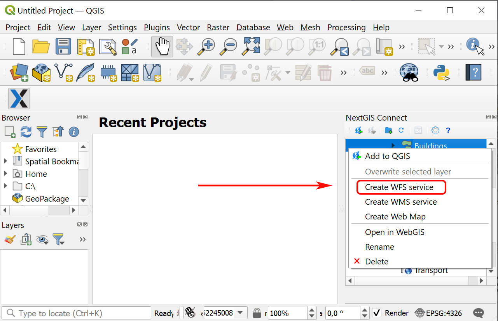
   
   Selecting "Create WFS service" in the Vector layer context menu
   
* In the opened dialog window set the number of layer's features to be published via WFS service by changing the value of the field **The number of objects returned by default**;

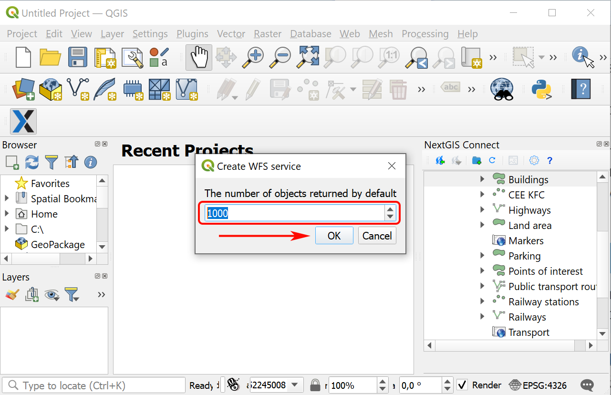
   
   Number of features returned by default

* If WFS service is created successfully you'll see it in the relevant Resource group. The Vector layer is already connected to it.

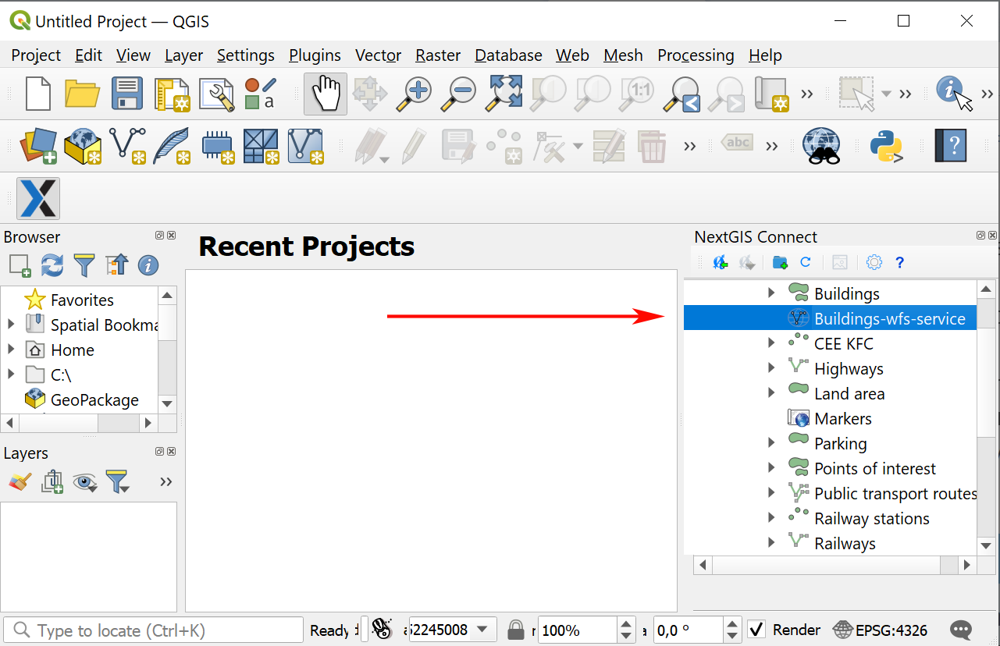
   
   Newly created WFS service
   
.. note:: 
	You can edit the settings of WFS service (including its name, published layers and their settings) in the user interface of your Web GIS.

.. _create_ogc_api_feat_service:

Create OGC API - Features service
~~~~~~~~~~~~~~~~~~~~~~~~~~~~~~~~~~~~

NextGIS Connect plugin enables a fast publication of Vector layers from your Web GIS using standard OGC API - Features protocol.

* Select in NextGIS Connect Resources panel a **Vector layer** from your Web GIS resource tree which you want to publish using OGCF protocol;

.. figure:: _static/NGConnect_ogc_select_en.png
   :name: NGConnect_wfs_select_pic
   :align: center
   :width: 20cm
   
   Selecting vector layer

* Select **Create OGC API - Features service** in layer context menu;

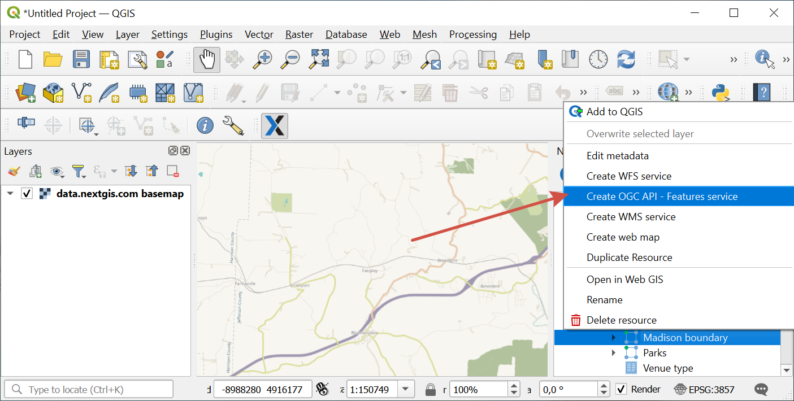
   
   Selecting "Create OGC API - Features service" in the Vector layer context menu
   
* In the opened dialog window set the number of layer's features to be published via OGCF service by changing the value of the field **The number of objects returned by default**;

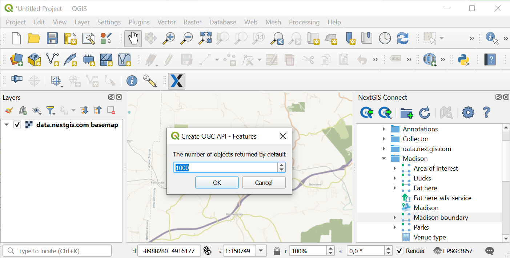
   
   Number of features returned by default

* If OGCF service is created successfully you'll see it in the relevant Resource group. The Vector layer is already connected to it.

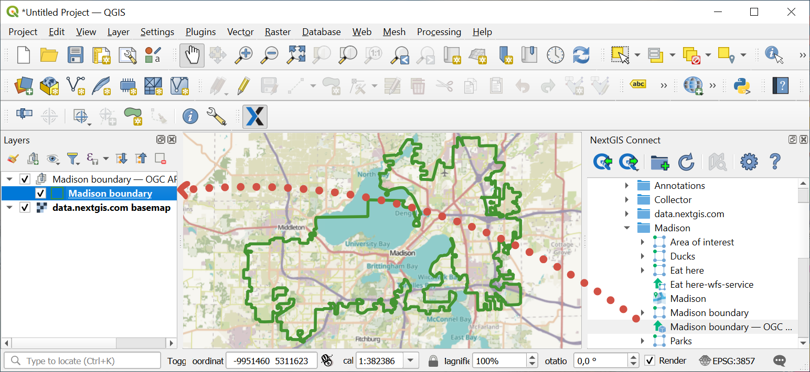
   
   Newly created OGC API - Features service

.. _create_wms_service:

Create WMS service
~~~~~~~~~~~~~~~~~~~~~

The process is similar to creation of WFS service (see above):

* In the desktop application (QGIS) in the resource Web GIS tree of module NextGIS Connect select **Vector layer** that you want to publish via the WMS protocol; 

.. figure:: _static/NGConnect_wfs_select_en.png
   :name: NGConnect_wfs_select_pic
   :align: center
   :width: 20cm
   
   Selecting vector layer
   
* Select **Create WMS Service** in the context menu of the layer;

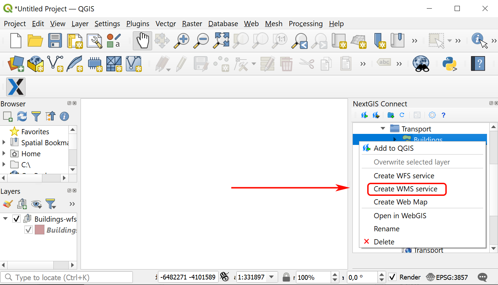
   
   Selecting "Create OGC API - Features service" in the Vector layer context menu
   
* In the dialog that opens select a layer style for publishing the WMS Service;

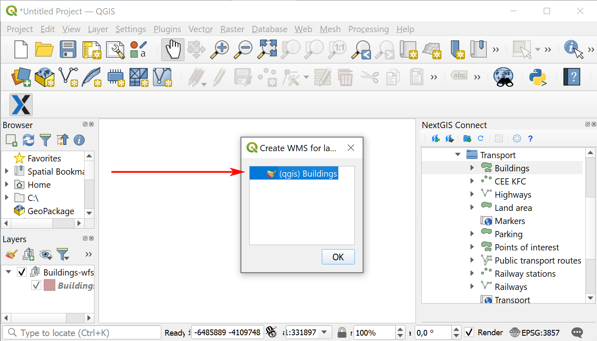
   
   Selecting layer style
   
* If the WMS Service has been created successfully, then a new WMS Service will appear in the corresponding Resource Group, to which your Vector Layer is already connected. 

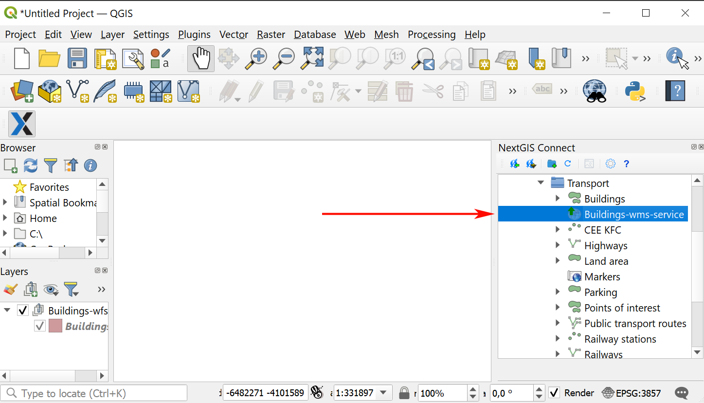
   
   Newly created WMS service

.. _web_map:

Creating Web Map from a layer
----------------------------------

* In NextGIS Connect panel select from the resource tree the Vector layer which you want to display on a Web Map;
* In the layer's context menu select **Create Web Map**.

A Web Map with the name "layer_name-map" will be created in the same resource group. A QGIS style will be created for the layer and added to Web Map. The map's initial extent is set by the layer.

.. _connect_data_export:

From Web GIS to QGIS
---------------------------------------

NextGIS Connect plugin enables a fast export of vector data from Web GIS to QGIS for further processing, analysis, saving in different formats and other data operations.

It’s possible due to the option of fast creation of GeoJSON vector layers in QGIS using vector data from Web GIS:

* Select in NextGIS Connect Resources panel Vector layer which you want to export to QGIS;
Press **Add to QGIS** button on NextGIS Connect control panel or select **Add to QGIS** in the layer context menu;

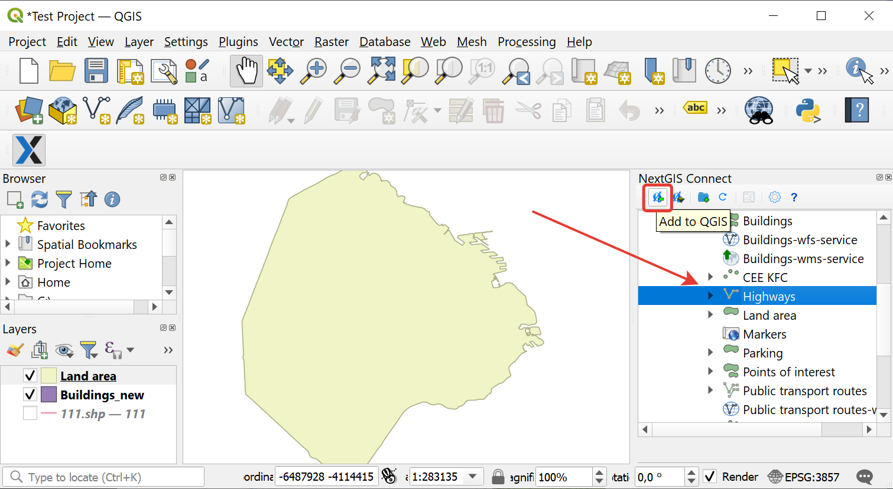
   
   Exporting vector layer from Web GIS

* If the layer has multiple QGIS styles, there are several options depending on what you select in the Connect window:

1. If you select a layer with **multiple styles** in the Connect window, all the styles will be added, but you need to chose current style in a dialog window. Double-click the style to select it. This is the only case in which a dialog pops up.

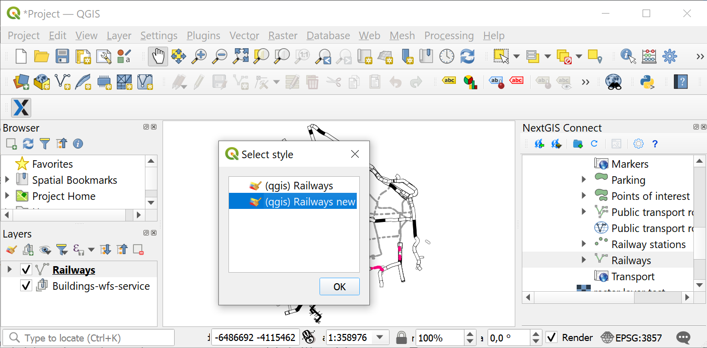
   
   Selecting QGIS style for export

2. If you select a **style** in the Connect window, all the styles of the layer will be added, with the selected style chosen as current style.

3. If you select a **resource group** containing layers with multiple styles, all the styles will be added. The style used as current will be the one with the same name as the layer or the first in alphabetical order. No dialog will be displayed.

4. If you add WFS/OGCF, no dialog will be displayed. The style with the same name as the layer or the first in alphabetical order will be chosen.

You can change current style in the layer properties.

If the layer is exported successfully you'll see in QGIS Layers panel a new GeoJSON vector layer which you can use in your projects or save to your device in a required format. 
