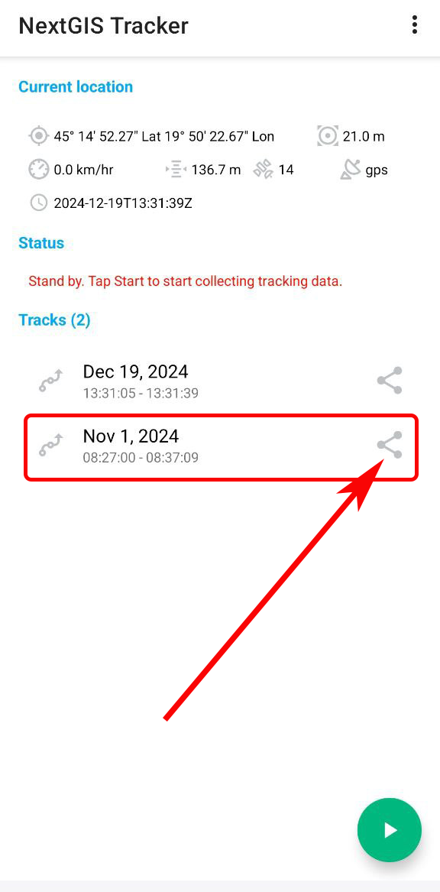
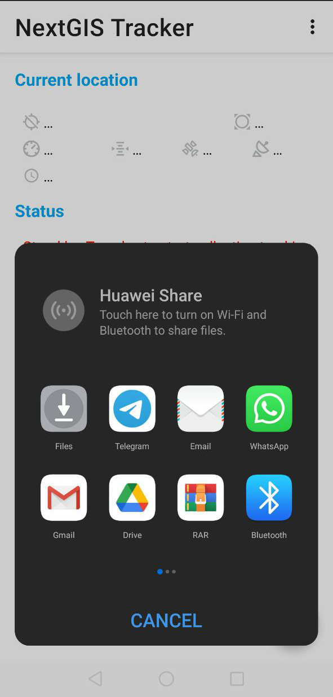

.. sectionauthor:: Alexander Myrov <alexander.myrov@nextgis.com>, Yulia Grigorenko <yulia.grigorenko@nextgis.com>

Export track as GPX
=============================

Tracks can be exported as GPX files.

On the main screen of the app in the "Tracks" section select the track you want to export, as shown on :numref:`select_track_share_pic`.

   Selecting track for export

Press **Share** on the right of the track and choose where to save or send it in GPX format.

   Saving or sending a track
