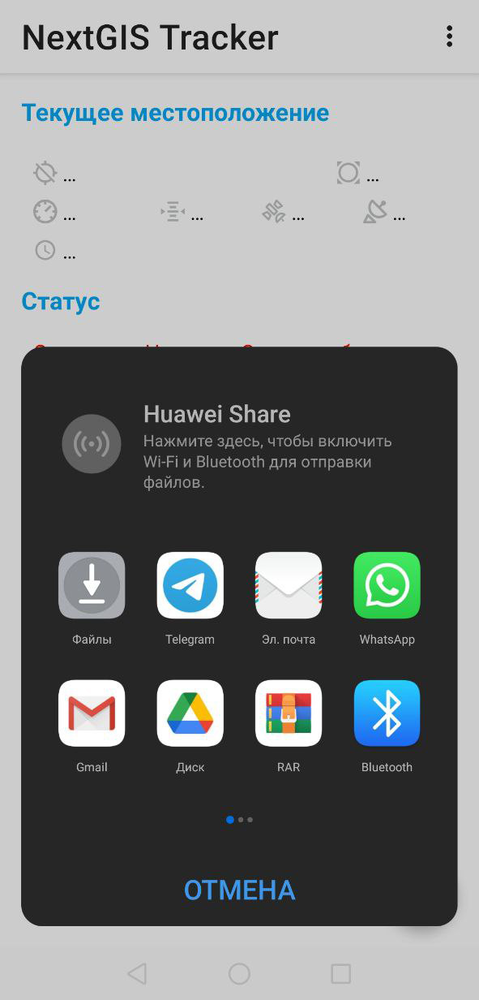

Экспорт трека в формат GPX
=============================

Записанный трек можно экспортировать в формат GPX.

Перейдите на главное окно приложения и в разделе «Треки» выберите трек, который необходимо экспортировать, как показано на :numref:`select_track_share_pic`.

.. figure:: _static/select_track_share_ru.png
   :name: select_track_share_pic
   :align: center
   :width: 8cm

   Выбор трека для экспорта

Справа от выбранного трека нажмите на кнопку **«Поделиться»** и сохраните или отправьте трек в формате GPX выбранным способом.

   Сохранение или пересылка выбранного трека
