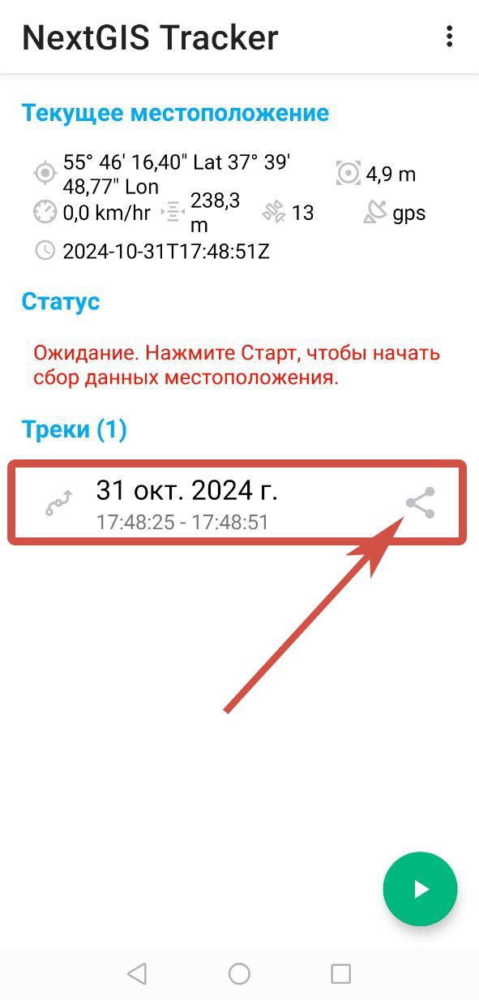

Экспорт трека в формат GPX
=============================

Записанный трек можно экспортировать в формат GPX.

Перейдите на главное окно приложения и в разделе «Треки» выберите трек, который необходимо экспортировать, как показано на Рис. 1.18.

   Выбор трека для экспорта

Справа от выбранного трека нажмите на кнопку **«Поделиться»** и сохраните трек в формате GPX, как показано на Рис. 1.18.

.. figure:: _static/_.png
   :name: 
   :align: center
   :width: 8cm

   Сохранение файла
