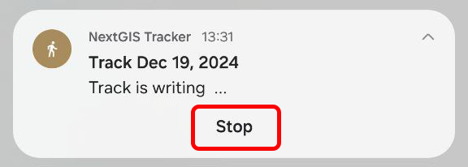
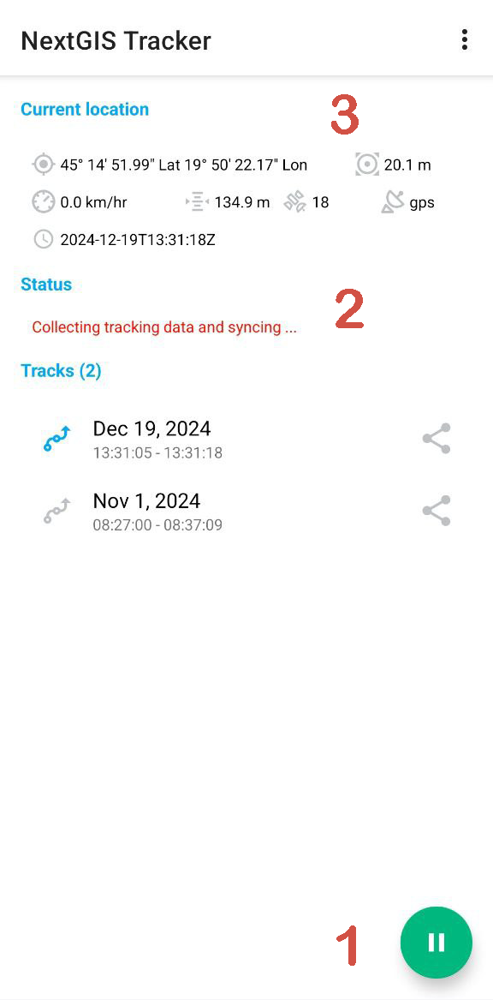

.. sectionauthor:: Alexander Myrov <alexander.myrov@nextgis.com>, Yulia Grigorenko <yulia.grigorenko@nextgis.com>

Track recording
===============
  
To record a new track in NextGIS Tracker app:

* Open the main screen of the app. In the bottom right corner press the green Start button, see :numref:`track_start_pic`.

.. figure:: _static/track_start_en.png
   :name: track_start_pic
   :align: center
   :width: 8cm

   Start button

* In your device settings allow the app to access location **continuously even when the app is not in use**. The dialog may vary depending on Android version.

In the notification panel of the device you'll see a walking figure indicating that track recording is in progress. 

If you open the panel, you can stop the recording by pressing **Stop**.

   Stop track recording

If you open the main app screen again, you'll also see that the recording is in progress. There are several indications:

   Stop button is available. Track recording in progress

1. The green Start button in the bottom right corner changed to Stop button;

2. In the "Status" section you'll see one of these messages: 

* "Collecting tracking data and syncing ..." - recording is in progress as well as synchronization with the Web GIS;
* "Collecting tracking data..." - recording is in progress, but there is no synchronization with Web GIS.

3. In the **Current location** section you'll see details about the recording track (left to right, top to bottom):

* latitude and longitude of the current location;
* current precision;
* current speed;
* current height;
* number of satellites used to get location;
* GPS connection;
* time when the latest point was recorded.
