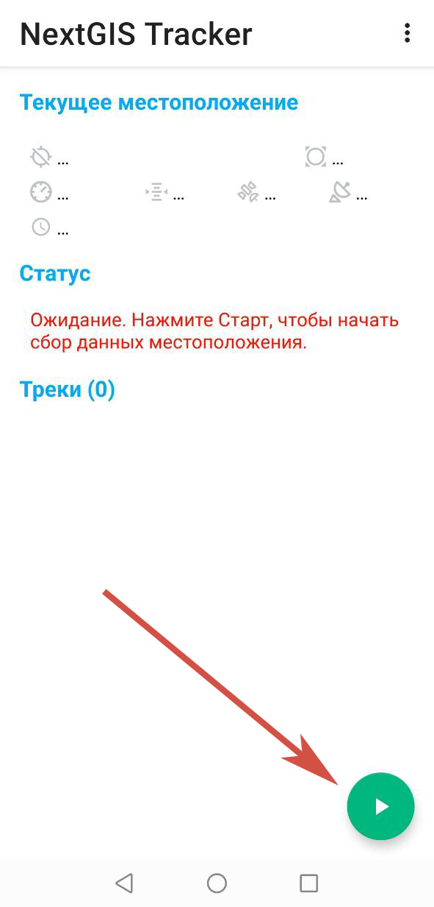
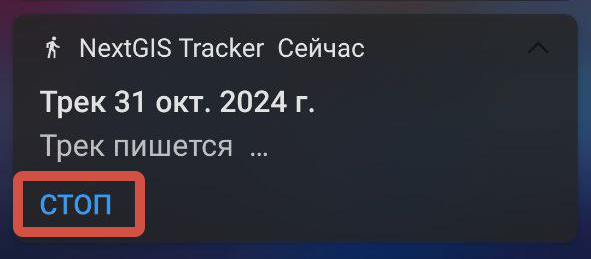
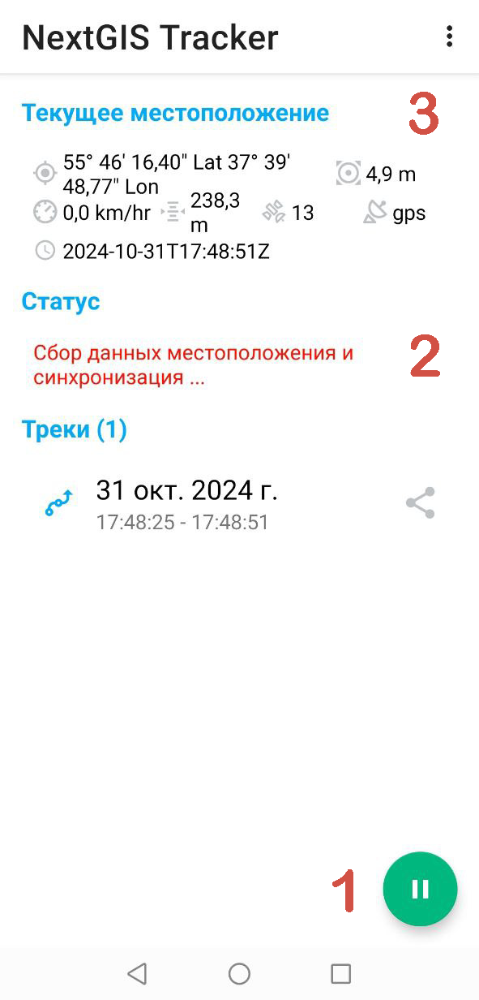

Запись трека
=============
  
Запись трека может быть осуществлена двумя способами:

* непосредственно через приложение NextGIS Tracker;
* с помощью ID из приложения NextGIS Tracker через NextGIS Web;

.. _ngtr_record_tracker:

Запись трека через NextGIS Tracker
------------------------------------------

Для того, чтобы запустить запись трека в приложении NextGIS Tracker:

* Перейдите на главное окно приложения, и снизу справа нажмите зеленую кнопку старта см. :numref:`track_start_pic`.

   Кнопка старта

* Разрешить использование местоположения **в любом режиме** в настройках мобильного устройства. Вид диалога запроса может отличаться в зависимости от версии Android.

В панели уведомлений мобильного устройства появился значок человека, который говорит о том, что идет запись трека. 

Открыв эту панель, можно остановить запись трека, посредством кнопки **Стоп**.

   Остановка записи трека

Вернувшись на главное окно приложения, вы также увидите, что запись трека началась. Об этом свидетельствует следующее:

   Кнопка "Стоп" доступна. Идёт запись трека

1. зеленая кнопка старта, расположенная снизу справа, стала кнопкой "Стоп";

2. в разделе «Статус» появилось одно из двух сообщений: 

* «Сбор данных местоположения  и синхронизация ...» - запись трека ведется, а также синхронизируется с ранее подключенной облачной Веб ГИС,
* «Сбор данных местоположения ...» - запись трека ведется, но синхронизация с Веб ГИС не произведена.

3. В разделе «Текущее местоположение» располагаются пояснительные характеристики записываемого трека (слева направо/сверху вниз):

* широта и долгота текущего местоположения;
* текущая точность;
* текущая скорость;
* текущая высота;
* кол-во спутников с которых берется информация;
* наличие подключения к GPS;
* время записи последней точки;

.. _ngtr_record_id:

