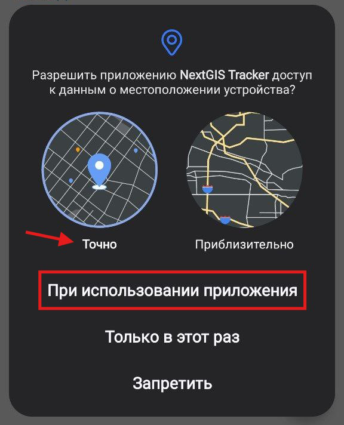
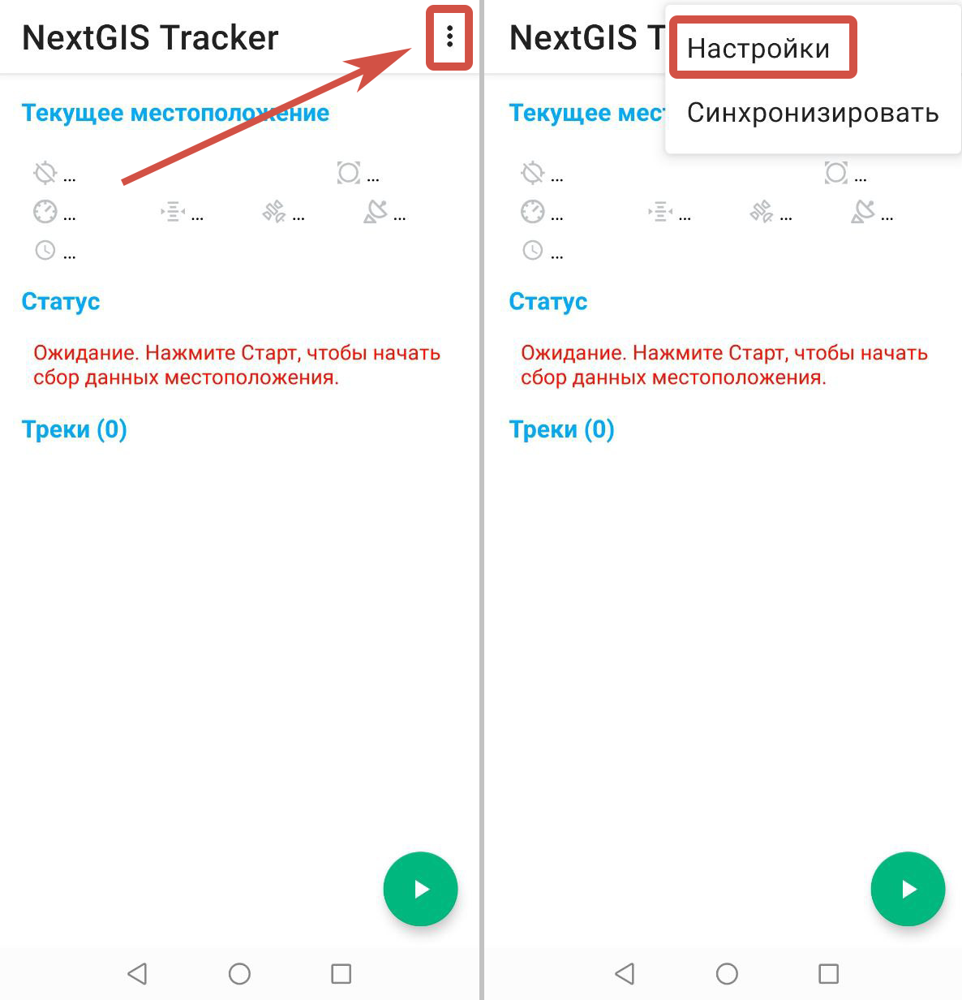

Настройка устройства
=========================

После установки приложения на мобильное устройство, необходимо настроить его для дальнейшей работы.

.. _ngtr_set_record:

Настройка записи трека
-----------------------

При первом открытии приложения дайте следующие разрешения:

* разрешить приложению NextGIS Tracker доступ к данным о местоположении устройства.

Если появляется диалог, показанный на :numref:`ngtr_allow_location_pic`, необходимо выбрать **Точно** и **При использовании приложения**.

   Доступ к данным о местоположении

* в более новых версиях Android также нужно разрешить приложению NextGIS Tracker отправлять уведомления.

.. _ngtr_set_send:

Настройка отправки треков в Веб ГИС
-----------------------------------

Для загрузки треков в облачную Веб ГИС (или в Веб ГИС на своём сервере) нужно настроить синхронизацию.

Нажмите кнопку вызова меню в правой верхней части веб-интерфейса приложения, и перейдите в раздел «Настройки».

   Вызов настроек

На экране настроек нужно перевести кнопку-переключатель **Синхронизировать с облаком** в рабочее положение (см. :numref:`sync_with_cloud_pic`), ввести данные от своей учетной записи в Веб ГИС и сохранить, как показано на :numref:`webgis_creds_pic`.

.. figure:: _static/sync_with_cloud_ru.png
   :name: sync_with_cloud_pic
   :align: center
   :width: 8cm

   Переключатель синхронизации с облаком

.. figure:: _static/webgis_creds_ru.png
   :name: webgis_creds_pic
   :align: center
   :width: 8cm

   Введение адреса, логина и пароля Веб ГИС

После этого появится сообщение: «Трекер создан», а под кнопкой-переключателем «Синхронизировать с облаком» появится сообщение: «Автоматически отправлять информацию об отслеживании в *адрес указанной Веб ГИС*», как показано на :numref:`synced_success_pic`.

.. figure:: _static/synced_success_ru.png
   :name: synced_success_pic
   :align: center
   :width: 8cm

   Синхронизация с Веб ГИС включена
