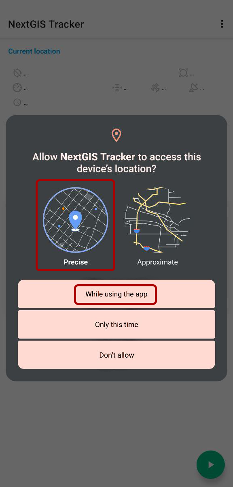
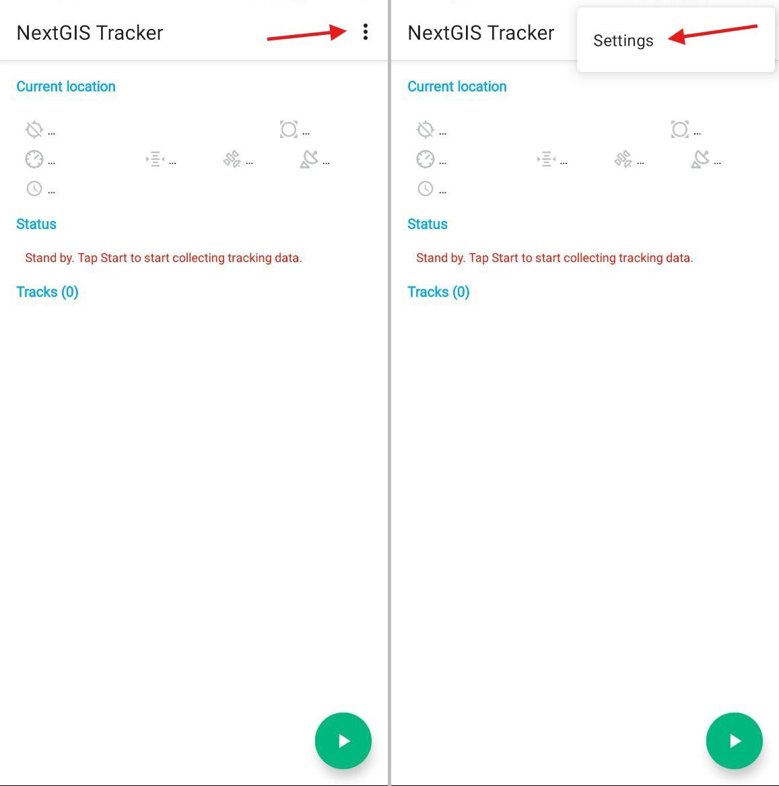
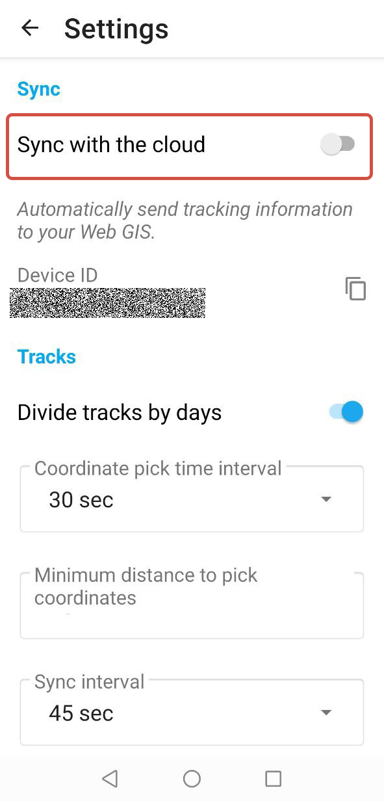
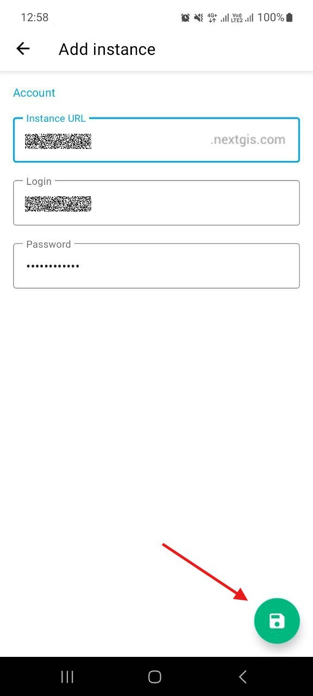
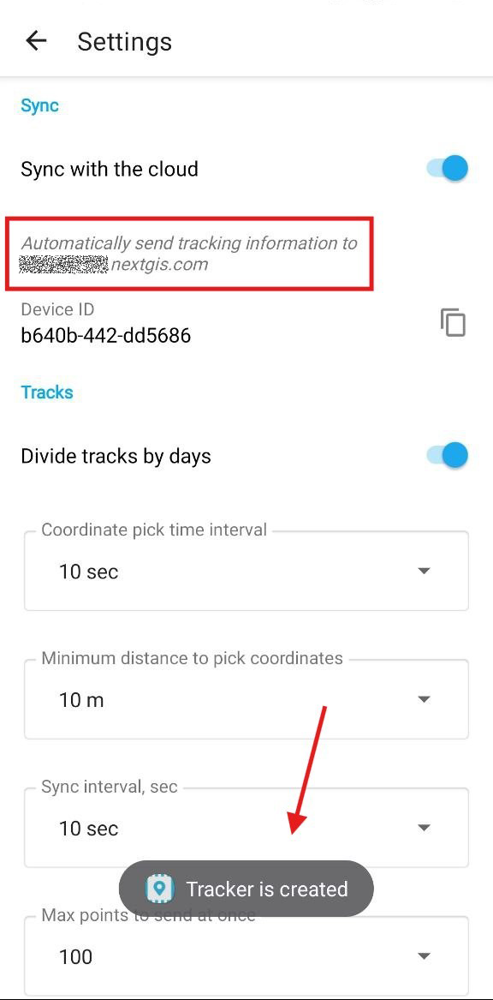

.. sectionauthor:: Alexander Myrov <alexander.myrov@nextgis.com>, Yulia Grigorenko <yulia.grigorenko@nextgis.com>

Setting up
=========================

After the app is installed to your device, you need to set it up to begin track recording.

.. _ngtr_set_record:

Track recording settings
-----------------------

When you open the app for the first time, give the following permissions:

* allow NextGIS Tracker to access location.

If you see the dialog shown on :numref:`ngtr_allow_location_pic`, select **Precise** and **While using app**.

   Allow access to location

* in the newer Android version you also need to allow notifications from NextGIS Tracker.

.. _ngtr_set_send:

Setting up sending tracks to Web GIS
-----------------------------------

To upload tracks to your Web GIS (cloud-based or on-premise), set up synchronization.

Tap the menu button in the top right corner of the app screen and go to "Settings".

   Opening Settings

In the Settings turn on **Sync with the cloud** (see :numref:`sync_with_cloud_pic`), then enter your Web GIS credentials and save, as shown on :numref:`webgis_creds_pic`.

   Turning on synchronization

   Entering Web GIS URL, login and password

When the settings are saved, you'll get a notification saying "Tracker is created". Under the "Sync" slider you'll see a message: "Automatically send tracking information to *Web GIS URL*", as shown on :numref:`synced_success_pic`.

   Synchronization with Web GIS is enabled
