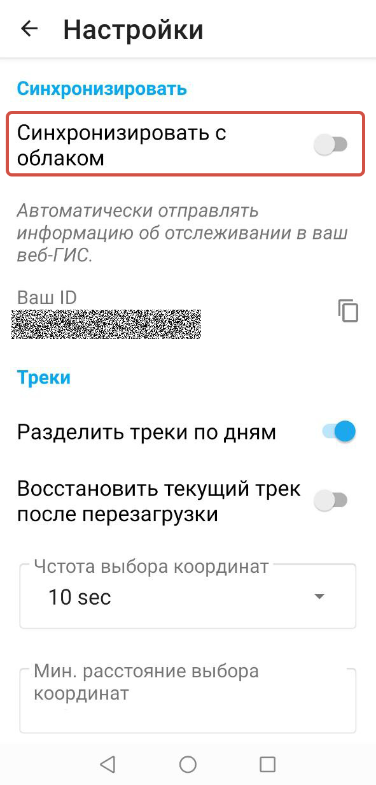
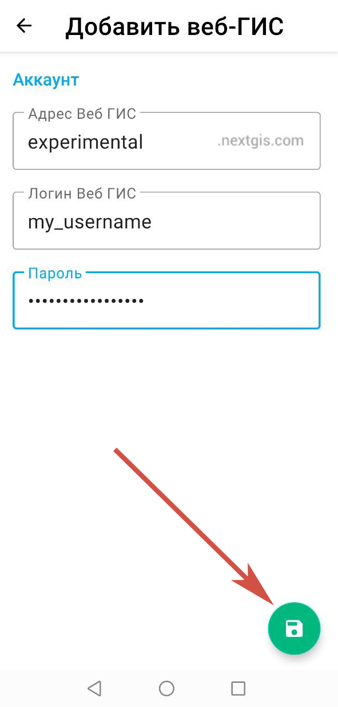

Настройка устройства
=========================

После установки приложения на мобильное устройство, необходимо настроить его для дальнейшей работы.

.. _ngtr_set_record:

Настройка записи трека
-----------------------

* разрешить приложению NextGIS Tracker доступ к данным о местоположении устройства: необходимо выбрать **Точно** и **При использовании приложения**, как показано на Рис. 1.1.

.. figure:: _static/_.png
   :name: 
   :align: center
   :width: 8cm

* разрешить приложению NextGIS Tracker отправлять уведомления: необходимо выбрать **Разрешить**, как показано на Рис. 1.2.

.. figure:: _static/_.png
   :name: 
   :align: center
   :width: 8cm

.. _ngtr_set_send:

Настройка отправки треков в Веб ГИС
-----------------------------------

Для загрузки треков в облачную Веб ГИС (или в Веб ГИС на своём сервере), необходимо нажать кнопку вызова контекстного меню в правой верхней части веб-интерфейса приложения, и перейти в меню «Настройки», как показано на Рис. 1.3. и Рис. 1.4.

.. figure:: _static/_.png
   :name: 
   :align: center
   :width: 8cm

.. figure:: _static/_.png
   :name: 
   :align: center
   :width: 8cm

Далее нужно перевести кнопку-переключатель **Синхронизировать с облаком** в рабочее положение (см. :numref:`sync_with_cloud_pic`), и ввести данные от своей учетной записи в Веб ГИС и сохранить, как показано на :numref:`webgis_creds_pic`.

   Переключатель синхронизации с облаком

   Введение адреса, логина и пароля Веб ГИС

После этого в меню «Настройки» появится сообщение: «Трекер создан», а под кнопкой-переключателем «Синхронизировать с облаком» появится сообщение: «Автоматически отправлять информацию об отслеживании в *адрес указанной Веб ГИС*», как показано на :numref:`synced_success_pic`.

.. figure:: _static/synced_success_ru.png
   :name: synced_success_pic
   :align: center
   :width: 8cm

   Синхронизация с Веб ГИС включена
