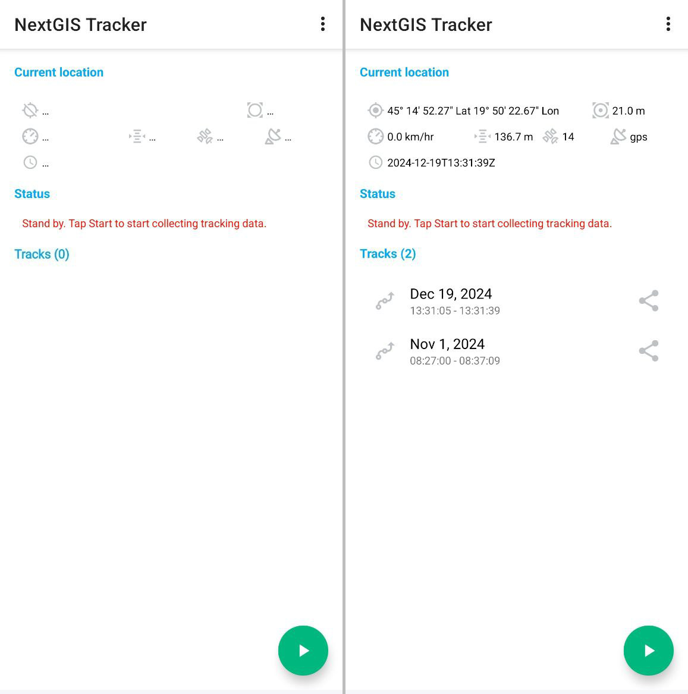
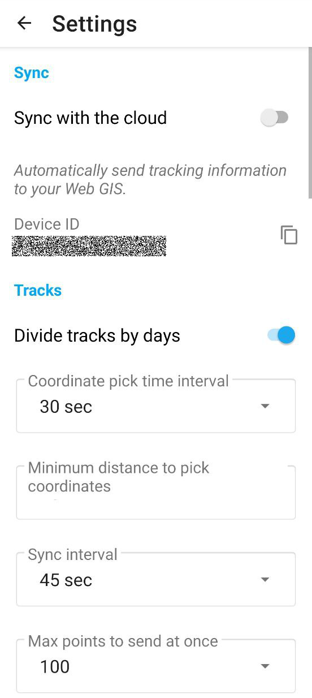

.. sectionauthor:: Alexander Myrov <alexander.myrov@nextgis.com>, Yulia Grigorenko <yulia.grigorenko@nextgis.com>

User interface
==============================
  
NextGIS Tracker app has two principal screens:

* Main screen;
* Settings screen.

.. _ngtr_main:

Main screen
-------------

The main screen of the app is shown on :numref:`tracker_main_pic`. 

   Main screen

The main screen shows information about track recording.

In the **Current location** section:

* Information about the track in progress (if GPS is available);
* No information about the track in progress (no GPS access);

In the **Status** section:

* If no recording is in progress, the message is: "Stand by. Tap Start to start collecting tracking data.";
* If a recording is in progress, the message is "Collecting tracking data and syncing …";

In the **Tracks** section:

* If you have recorded tracks, they are shown in this section. Tracks can be exported to GPX file;
* If there are no tracks, the section is empty;
* Button that starts/stops track recording.

.. _ngtr_settings:

Settings
--------------

Settings screen is shown on :numref:`tr_settings_pic`. 

   Settings screen

On the Settings screen you can configure the following parameters:

In the **Sync** section:

* "Sync with the cloud" - enable or disable synchronization with Web GIS;
* "Device ID" - copy the ID of your device;

In the **Tracks** section:

* "Divide tracks by days" - at midnight the current track stops and a new one begins;
* "Coordinate pick time interval" - how often the app detects and records coordinates. Select from a dropdown list an interval between 1 second and 45 min.;
* "Minimum distance to pick coordinates" - select the smallest change in distance to be marked as a new location (1-300 m);
* "Sync interval, sec" - select from a dropdown list how often to synchronize tracks with Web GIS (min 1 sec., max 45 min.);
* "Max points to send at once" - select from a dropdown list a number between 1 and 300.
 
