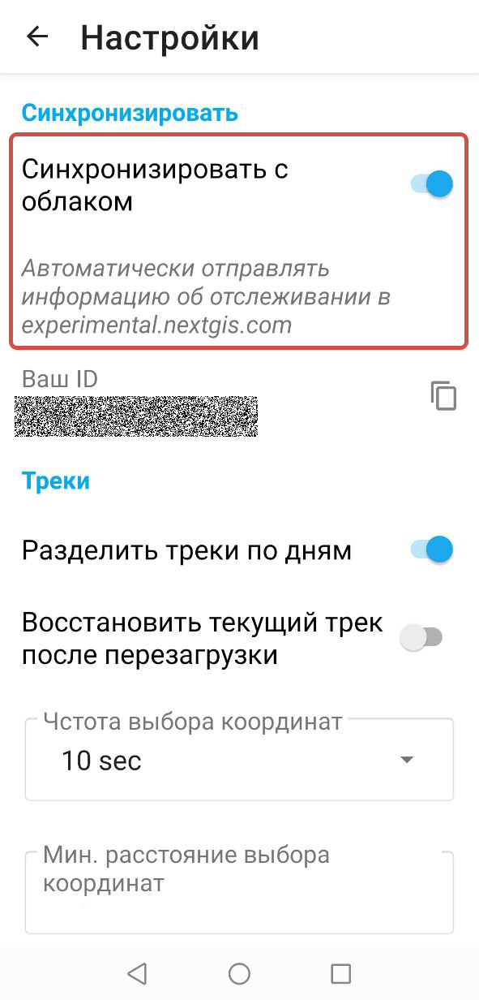
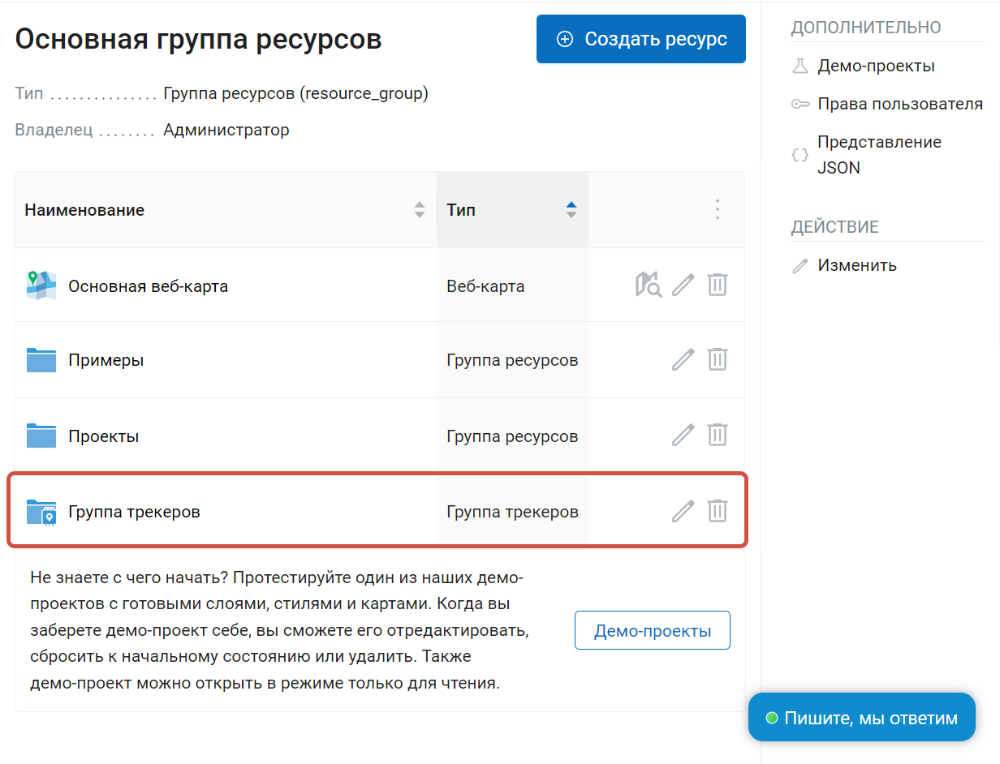
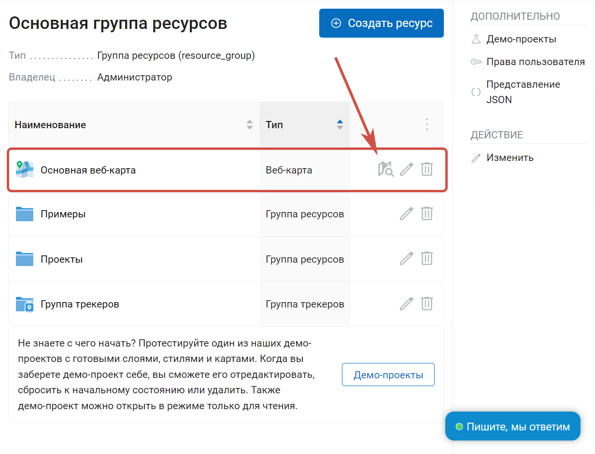
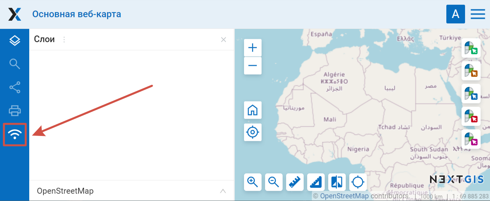
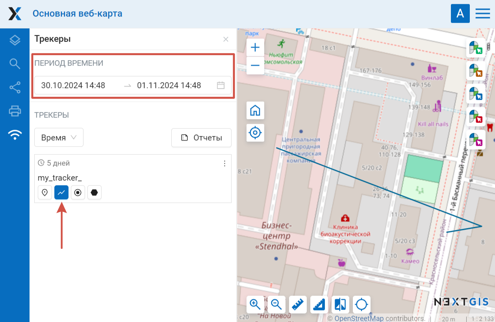
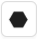
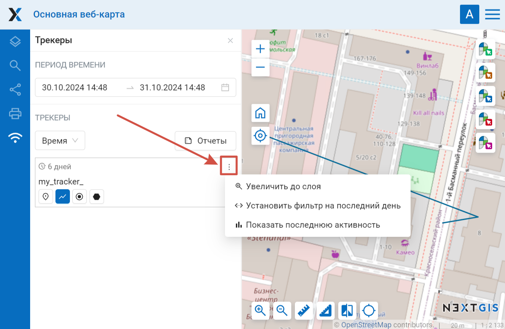

Просмотр записанного трека через Веб-карту в Веб ГИС
=========================================================
  
Если приложение синхронизировано с Веб ГИС, то записанный трек можно просмотреть через Веб-карту.

Перед началом записи трека убедитесь в том, что приложение синхронизировано с ВебГИС (см. `как это сделать <https://docs.nextgis.ru/docs_ngtracker/source/setting_up.html#ngtr-set-send>`_).

   Синхронизация с Веб ГИС включена

После окончания `записи трека <https://docs.nextgis.ru/docs_ngtracker/source/rec_track.html>`_, необходимо перейти в Веб ГИС, с которой была осуществлена синхронизация.

В «Основной группе ресурсов» можно обнаружить группу трекеров, внутри которой расположен записанный трекер, как показано на :numref:`trackers_group_pic`.

   Группа трекеров в Основной группе ресурсов

Далее необходимо открыть веб-карту :numref:`open_main_webmap_pic` или создать новую (кнопка «Создать ресурс», `подробнее <https://docs.nextgis.ru/docs_ngweb/source/webmaps_admin.html>`_).

   Открытие веб-карты

На веб-карте нажмите кнопку «Трекеры» |panel_trackers|, в левой боковой панели, как показано на :numref:`trackers_panel_select_pic`.

.. |panel_trackers| image:: _static/panel_trackers.png
   :width: 6mm
   :alt: похожую на значок Wi-Fi

   Активация панели трекеров

В появившейся панели «Трекеры» внизу вы увидите список доступных трекеров. Их можно отсортировать по названию трекера и времени записи.

Чтобы трек отобразился на веб-карте:

1. в поле «Период времени» выберите время записи нужных треков, 
2. в трекере (трекерах) отметьте, какие элементы треков отображать на карте.

   Отображение трека на карте

Для отображения доступны следующие элементы: 

* |button_tracker_lastpoint| последняя точка
* |button_tracker_line| GPS-треки - сами линии маршрутов данного трекера
* |button_tracker_points| точки треков
* |button_tracker_stops| остановки (их может не быть в конкретном треке)

В меню каждого трекера вы можете поставить фильтр даты на последний день его активности, чтобы отобразить последний записанный трек. Также можно посмотреть график активности трекера по часам на выбранную дату.

   Меню трекера
