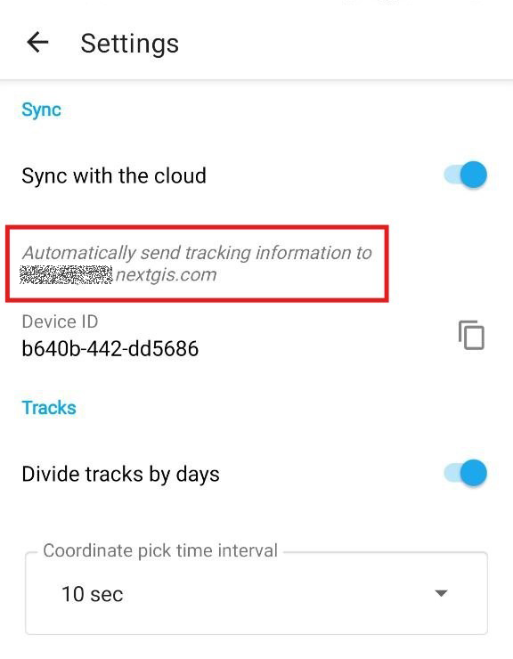
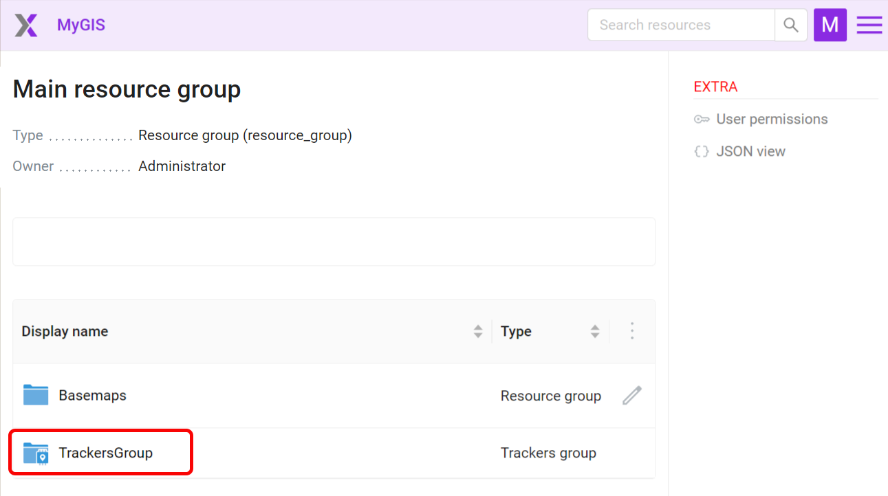
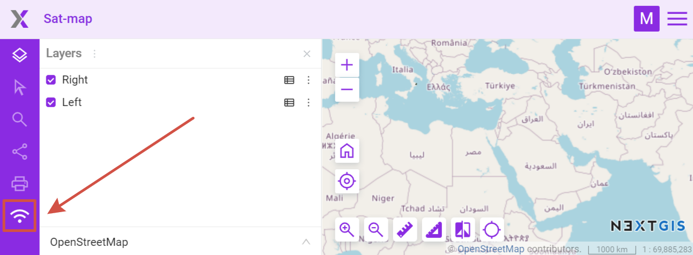
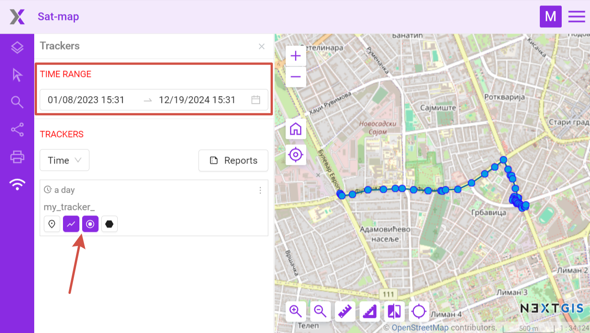
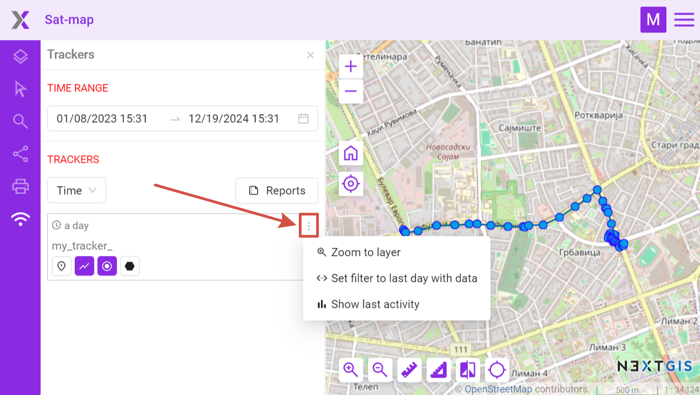

.. sectionauthor:: Alexander Myrov <alexander.myrov@nextgis.com>, Yulia Grigorenko <yulia.grigorenko@nextgis.com>

Viewing tracks on a Web Map in Web GIS
=========================================================
  
If the app is synced with a Web GIS, you can view the tracks on a Web Map.

Before recording a track make sure the synchronization is enabled (see `how to do it <https://docs.nextgis.com/docs_ngtracker/source/setting_up.html#ngtr-set-send>`_).

   Synchronization with Web GIS is enabled

When you finish `recording the track <https://docs.nextgis.com/docs_ngtracker/source/rec_track.html>`_, open the Web GIS synchronized with the app.

In the Main resource group you'll find a Tracker group with a Tracker inside, see :numref:`trackers_group_pic`.

   Tracker group in the Main resource group

Open any Web Map in the Web GIS :numref:`open_main_webmap_pic` or create a new one ("Create resource" button, `learn more <https://docs.nextgis.com/docs_ngweb/source/webmaps_admin.html>`_).

.. figure:: _static/open_main_webmap_en.png
   :name: open_main_webmap_pic
   :align: center
   :width: 20cm

   Opening a Web Map

On the Web Map on the left panel press the "Trackers" icon, see :numref:`trackers_panel_select_pic`.

   Opening Trackers panel

It will open the Trackers panel that has a list of all available trackers. Trackers can be sorted by name or time of the recording.

To view a track on the Web Map:

1. in the "Time range" field select the time interval when the track was recorded; 
2. in the track list select the element(s) of the track(s) you want to display on the map.

   Viewing track on Web Map

Elements you can view: 

* |button_tracker_lastpoint| last point of the track
* |button_tracker_line| the route lines of the GPS-tracks
* |button_tracker_points| points where coordinates were picked
* |button_tracker_stops| stops (not all tracks have them)

.. |button_tracker_lastpoint| image:: _static/button_tracker_lastpoint.png
   :width: 6mm

.. |button_tracker_line| image:: _static/button_tracker_line.png
   :width: 6mm

.. |button_tracker_points| image:: _static/button_tracker_points.png
   :width: 6mm

.. |button_tracker_stops| image:: _static/button_tracker_stops_h.png
   :width: 6mm

In the context menu of a tracker you can set the time range to the last day of its activity to see the latest track recorded by the tracker. You can also see tracker activity chart for a selected day (points per hour).

   Tracker menu
