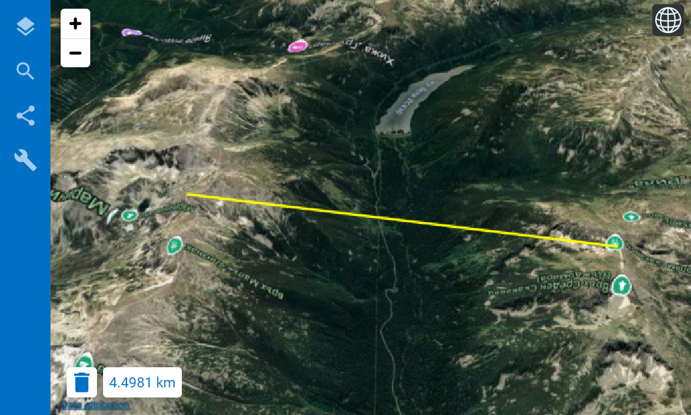
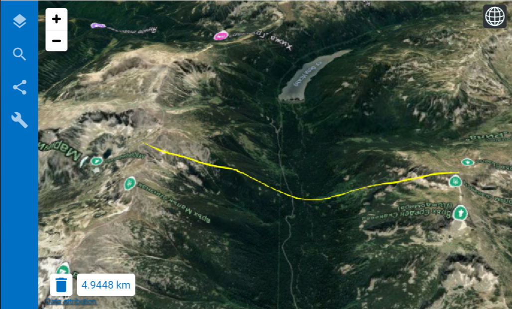
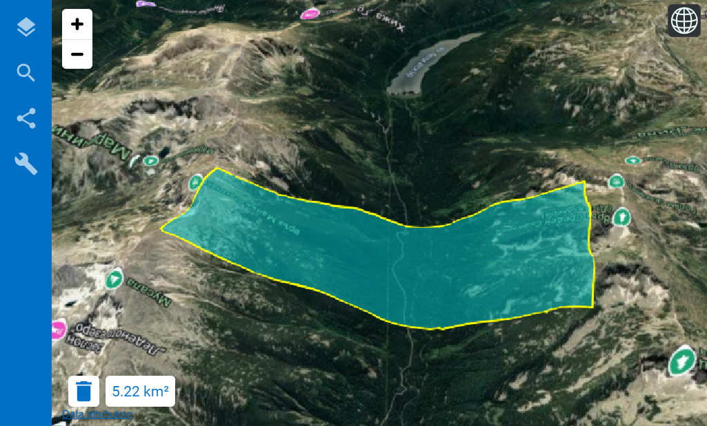

Инструменты измерения
======================

В веб-клиенте для просмотра 3D-сцены можно производить измерения расстояний и поверхности. Поддерживается три вида измерений:

* |button_measure_direct| измерение расстояния по прямой;
* |button_measure_terrain| измерение расстояния по рельефу;
* |button_measure_area| измерение площади по эллипсоиду с учётом рельефа.

Для того, чтобы провести измерение, выберите нужный инструмент в окне карты. Затем нарисуйте на карте линию или полигон, задав их вершины (минимум две для линии, минимум три для полигона). Для этого кликните по карте левой кнопкой мыши, один раз - чтобы добавить точку, дважды - чтобы завершить ввод. 

   Измерение расстояния между двумя точками по прямой

   Измерение расстояния между двумя точками по рельефу

   Измерение площади по эллипсоиду с учётом рельефа

.. figure:: _static/measure_multi_ru.png
   :name: measure_multi_pic
   :align: center
   :width: 20cm

   Измерение ломаной

Чтобы начать новое измерение, сбросьте выделение на карте, нажав на иконку корзины рядом с результатом измерения.
