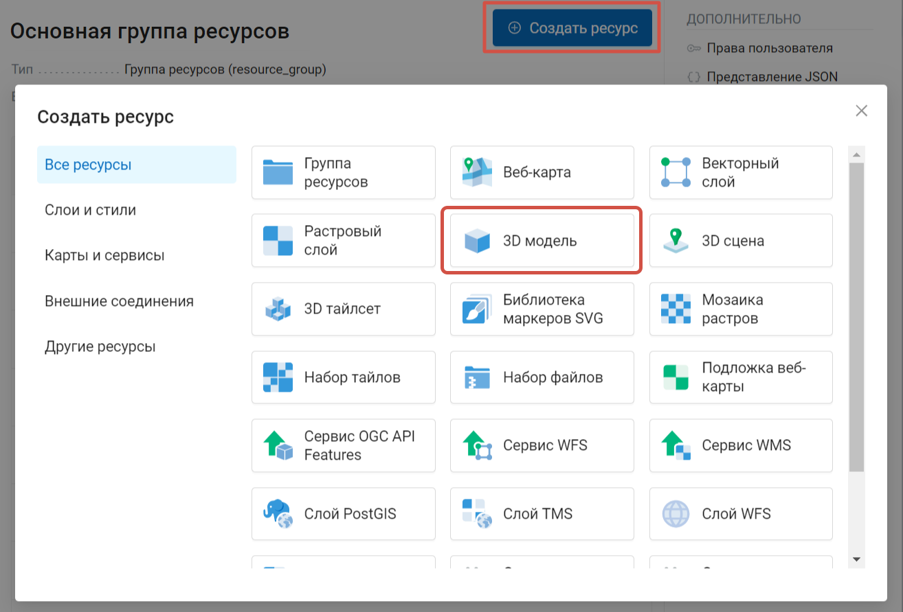
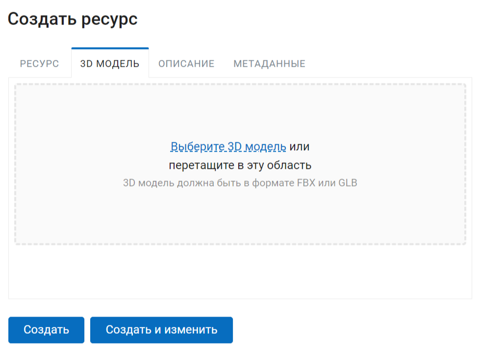
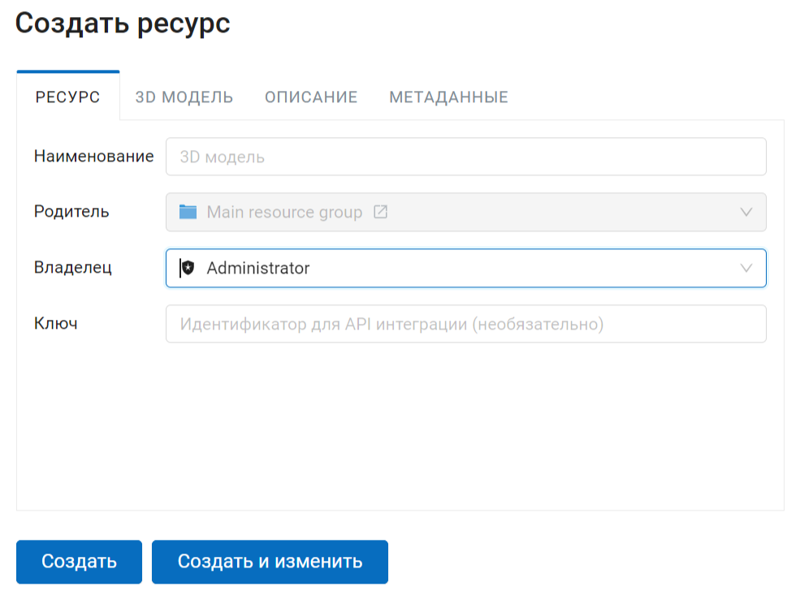
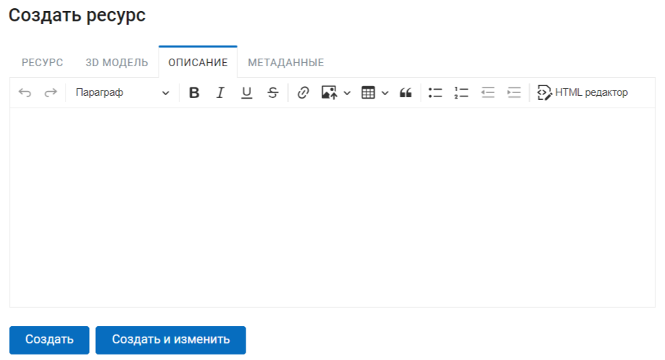
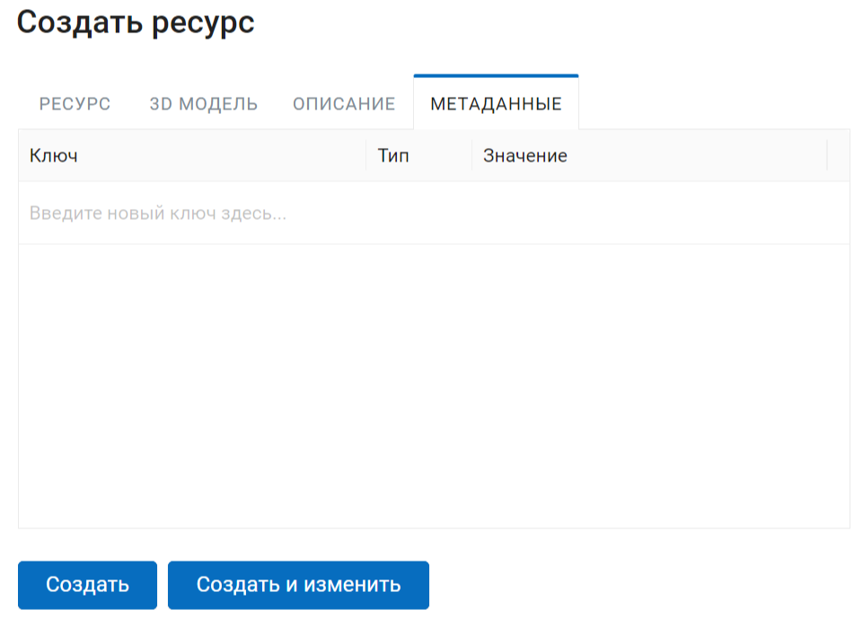
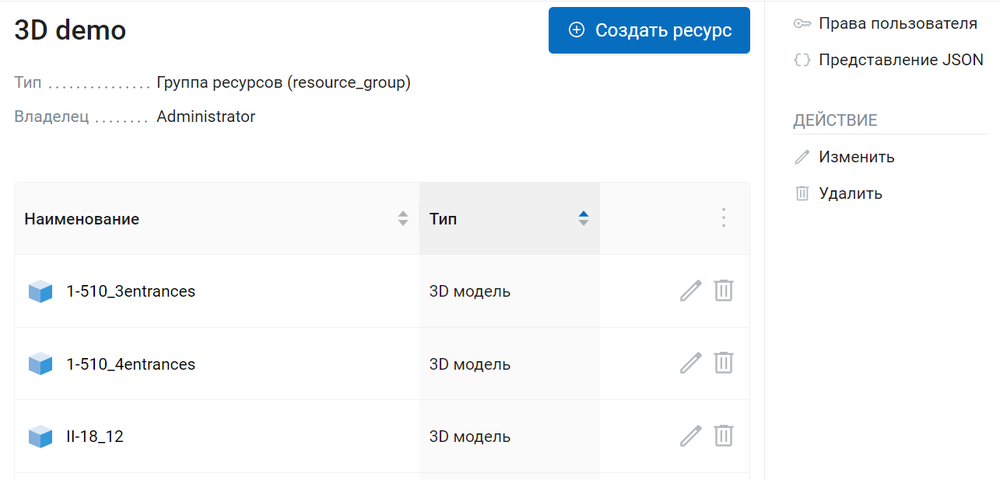
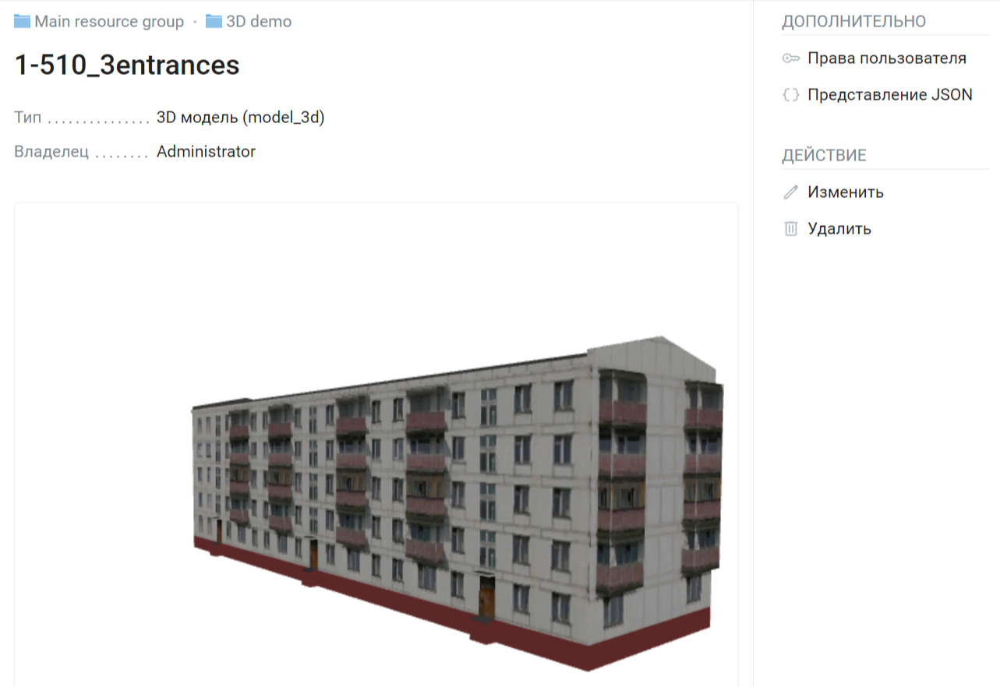

.. sectionauthor:: Роман Гайнуллов <roman.gainullov@nextgis.ru>

.. _ngw_3d_models:

Загрузка и хранение трёхмерных моделей
======================================

3D модель - это цифровое представление трехмерного объекта.

.. _ngw_3D_model_formats:

Какие форматы поддерживаются
-----------------------------

Поддерживается загрузка 3D моделей в форматах FBX и GLB.

.. _ngw_3D_model_how_upload:

Как выполнить загрузку модели
---------------------------------

Для загрузки 3D модели необходимо создать ресурс “3D модель”. Для того, чтобы создать ресурс, перейдите в группу, куда хотите его добавить, и нажмите на кнопку Создать ресурс. Затем во всплывающем окне выберите нужный тип ресурса. (:numref:`ngw3D_select_3D_model`).

   Выбор ресурса "3D модель"

В открывшемся окне на вкладке «3D модель» необходимо загрузить файл в формате FBX и GLB.

   Загрузка файла 3D модели

На вкладке "Ресурс" введите название, которое будет отображаться в административном интерфейсе.

   Наименование ресурса “3D модель”

На вкладке "Описание" существует возможность добавить текстовое описание ресурса в произвольной форме (:numref:`ngw3D_desc_3D_model`).

   Вкладка "Описание" ресурса “3D модель”

Также пользователь имеет возможность добавить к ресурсу 3D модели метаданные в формате ключ-значение (:numref:`ngw3D_metadata_3D_model`).

   Вкладка метаданных ресурса

После нажатия пользователем кнопки “Сохранить” ресурс 3D Модель будет создан в указанной директории NextGIS Web (:numref:`ngw3D_finished_3D_model`).

   3D модель в директории NextGIS Web

На странице ресурса доступно превью модели. Ее можно вращать, зажимая левую кнопку мыши.

   Предварительный просмотр 3D модели на странице ресурса.
