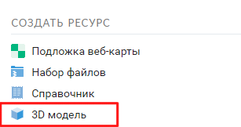
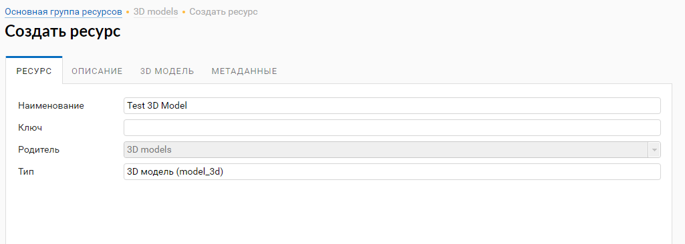
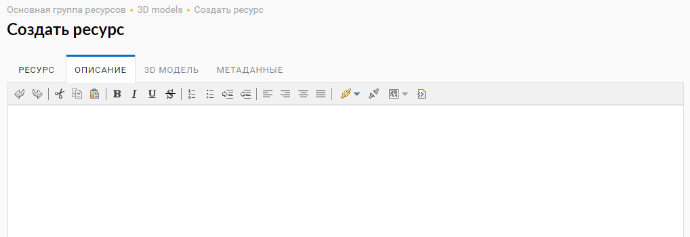
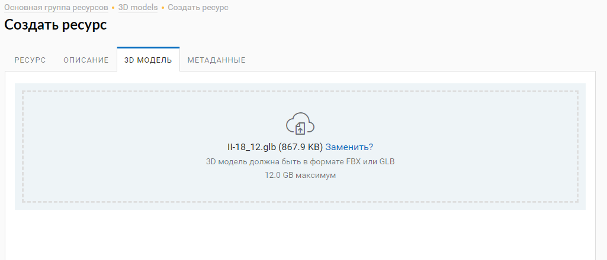
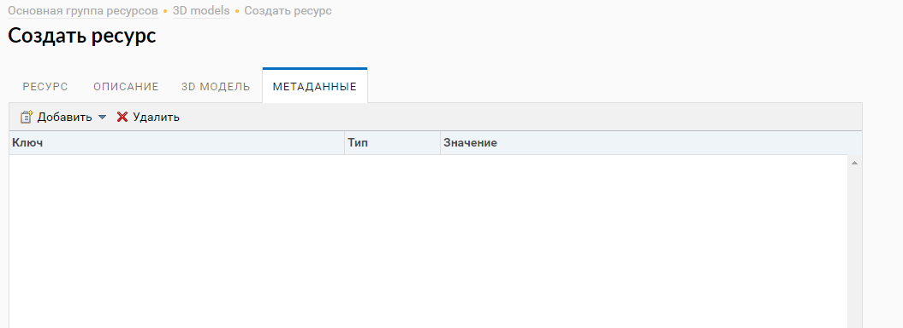
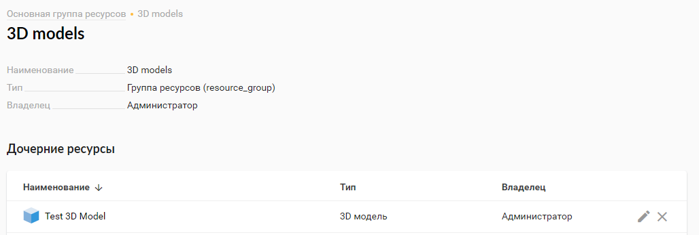

.. sectionauthor:: Роман Гайнуллов <roman.gainullov@nextgis.ru>

.. _ngw_3d_models:

Загрузка и хранение трёхмерных моделей
======================================

.. _ngw_3D_model:

**Что такое 3D модель**.
3D модель - это цифровое представление трехмерного объекта.

.. _ngw_3D_model_formats:

**Какие форматы поддерживаются**.
Поддерживается загрузка 3D моделей в форматах FBX и GLB.

.. _ngw_3D_model_how_upload:

**Как выполнить загрузку модели (описание всех вкладок)**.
Для загрузки 3D модели необходимо создать ресурс “3D модель”. Он находится в правой панели NextGIS Web в списке доступных ресурсов (:numref:`ngw3D_select_3D_model`).

   Выбор ресурса "3D модель"

Процесс создания ресурса трехмерной модели выполняется пошагово и в интерфейсе разделяется на 4 вкладки. 
На первой необходимо задать наименование ресурса 3D модели (:numref:`ngw3D_name_3D_model`). Это поле является обязательным.

   Наименование ресурса “3D модель”

На второй вкладке существует возможность добавить текстовое описание ресурса в произвольной форме (:numref:`ngw3D_desc_3D_model`).

   Вкладка "описание" ресурса “3D модель”

На третьей вкладке необходимо загрузить файл трёхмерной модели в формате rbx или glb со своего компьютера (:numref:`ngw3D_file_3D_model`).

   Загрузка файла 3D модели

На четвертой вкладке пользователь имеет возможность добавить метаданные к ресурсу 3D модели (:numref:`ngw3D_metadata_3D_model`).

   Вкладка метаданных ресурса

После нажатия пользователем кнопки “Сохранить” ресурс 3D Модель будет создан в указанной директории NextGIS Web (:numref:`ngw3D_finished_3D_model`).

   3D модель в директории NextGIS Web
