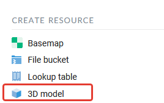
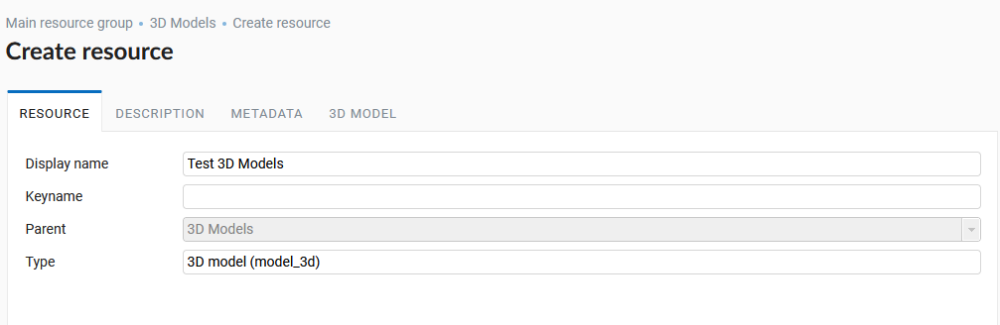
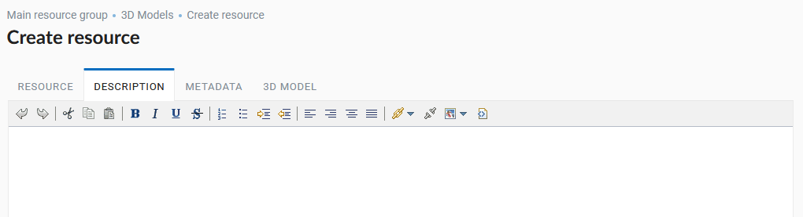
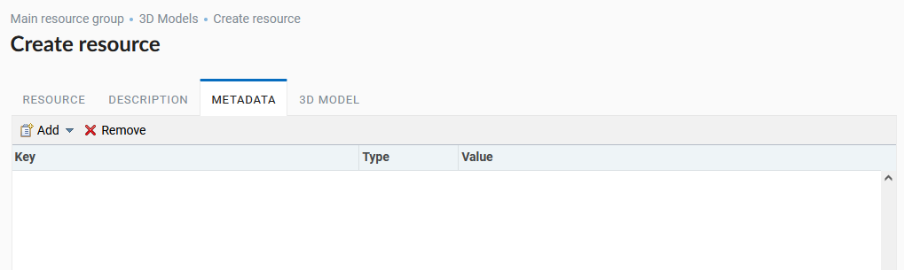
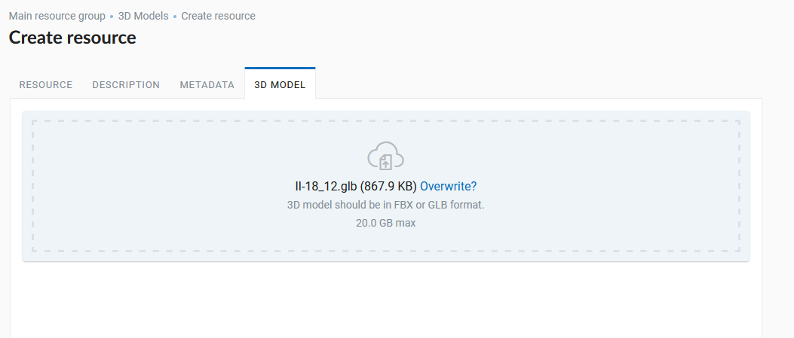
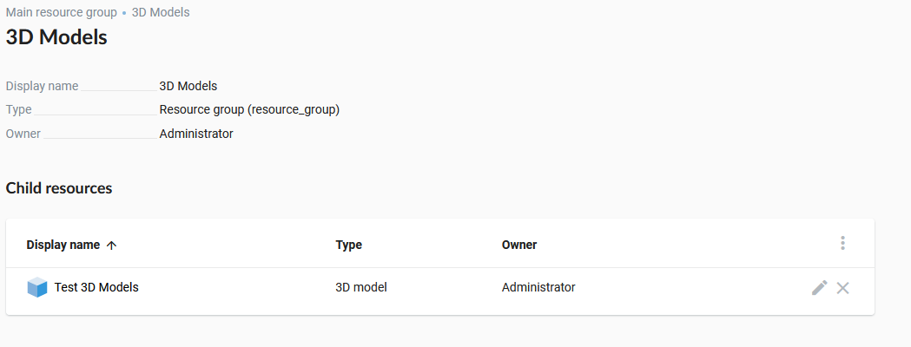

.. sectionauthor:: Roman Gainullov <roman.gainullov@nextgis.com>

.. _ngw_3d_models:

Uploading 3D Models
===================

.. _ngw_3D_model:

**What is a 3D model**.
3D model - is a digital representation of a three-dimensional object.

.. _ngw_3D_model_formats:

**What formats are supported**.
You can upload 3D models in formats rbx and glb.

.. _ngw_3D_model_how_upload:

**How to upload the model (description of all tabs)**.
To upload a 3D model, you need to create a “3D model” resource. It is located in the right pane of NextGIS Web in the list of available resources (:numref:`ngw3D_select_3D_model`).

   Resource selection "3D model"

The process of creating a 3D model resource is performed step by step and is divided into 4 tabs in the interface.
On the first one you need to set the name of the 3D model resource (:numref:`ngw3D_name_3D_model`). This field is required.

   Resource name "3D model"

On the second tab it is possible to add a text description of the resource in any form (:numref:`ngw3D_desc_3D_model`).

   Resource description tab "3D model"

On the third tab the user can add metadata to the 3D model resource (:numref:`ngw3D_file_3D_model`).

   Metadata resource tab

On the fourth tab you need to upload a 3D model file in rbx or glb format from your computer (:numref:`ngw3D_metadata_3D_model`).

   Uploading the 3D model file

After clicking the “Create” button the 3D Model resource will be created in the specified NextGIS Web directory (:numref:`ngw3D_finished_3D_model`).

   3D model in NextGIS Web directory
