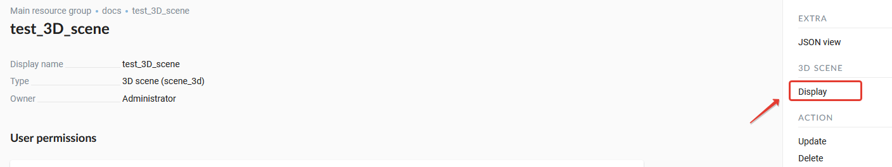
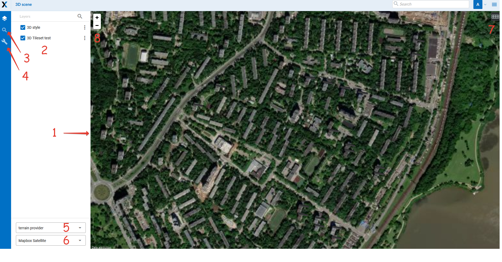

.. sectionauthor:: Roman Gainullov <roman.gainullov@nextgis.com>

.. _ngw_3d_visualization:

Rendering 3D scenes
===================

NextGIS Web includes a special client application for rendering 3D scenes.
You can open the web client using the icon |open_3d_scene_icon| or click the *Display* button inside the resource (:numref:`ngw3D_open_3d_scene_vizual`).

.. |open_3d_scene_icon| image:: _static/open_3d_scene_icon_EN.png

   Display 3D scene

   Appearance of the 3D scene web client. The numbers indicate: 1 - 3D scene; 2 - layer tree; 3 - search string; 4 - settings of rendering quality;
   5 - drop-down list of terrain resources; 6 - drop-down list of basemaps; 7 - mode switch (3D / 2D); 8 - scale map control buttons
   
   
The web client includes three main components: a 3D scene (:numref:`ngw3D_open_3d_scene_vizual`, item 1), panels (:numref:`ngw3D_open_3d_scene_vizual`, items 3, 4), 
and 3D scene tools (:numref:`ngw3D_open_3d_scene_vizual`, items 7, 8).

The map scale can be changed using the scale control buttons (:numref:`ngw3D_open_3d_scene_vizual`, item 8).

The left side of the workspace functionality panel arranged:

* Layer tree
* Search
* NGW resource tree

In the search bar (:numref:`ngw3D_open_3d_scene_vizual`, item 3), as you type, a search will be performed by two sources:

* By attributive information of layers added to the map
* According to the address base of OpenStreetMap

Results appear as you type. Objects found by attribute values from added layers are shown first.
Next are the addresses containing the search string. When you select a search result from the list, the map navigates to it.

The settings bar is responsible for specifying the rendering quality of data on the scene.

When you select a layer in the layer tree, you can call the layer menu (:numref:`ngw3D_open_3d_scene_vizual`, item 2),
which contains the Zoom to function, which centers the layer on the 3D scene.

To change basemap and connect a terrain resource, use the drop-down lists (:numref:`ngw3D_open_3d_scene_vizual`, items 5, 6).

The 3D scene mode switch is used to change the way of displaying data - 3D on the Globe or 2D on a plane.
