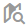
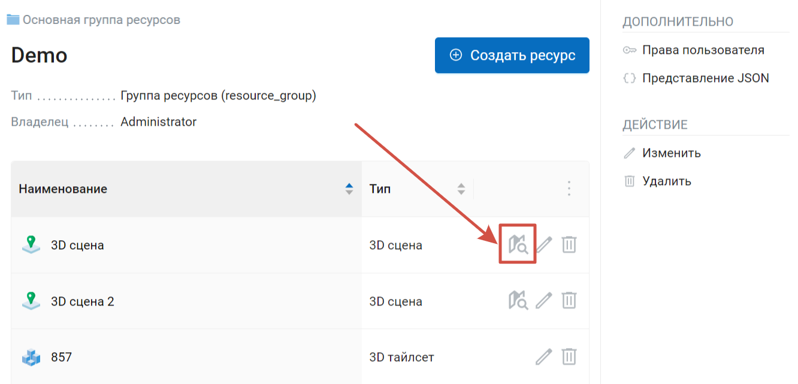
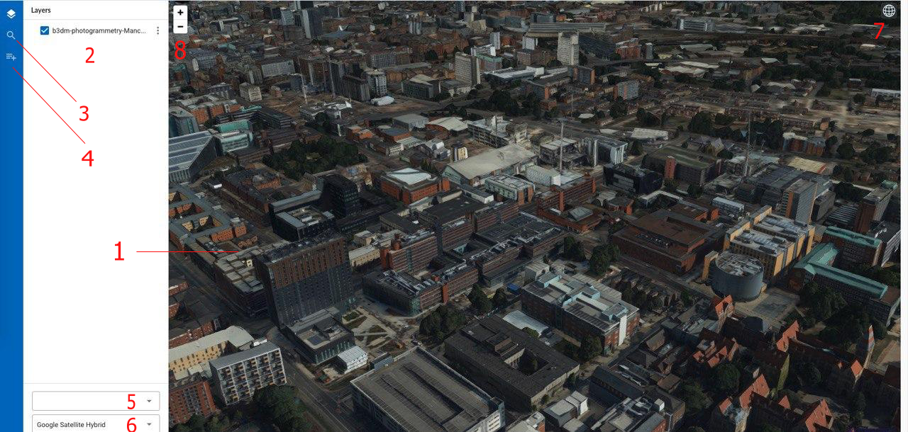

.. sectionauthor:: Роман Гайнуллов <roman.gainullov@nextgis.ru>

.. _ngw_3d_visualization:

Визуализация 3D сцен
====================

В составе NextGIS Web предусмотрено специальное клиентское приложение для визуализации 3D сцен. 
Открыть веб-клиент можно с помощью иконки |open_3d_scene_icon| или внутри ресурса нажать кнопку Открыть.

   Открыть 3D сцену

Посмотрите, как выглядит открытая 3D сцена, в нашем видео:

.. raw:: html

   <iframe width="560" height="315" src="https://rutube.ru/play/embed/411e9116c5a9957f03739fd6521efd5c/" frameBorder="0" allow="clipboard-write; autoplay" webkitAllowFullScreen mozallowfullscreen allowFullScreen></iframe>

Видео на `youtube <https://youtu.be/vuRxhAOsI2M>`_, `rutube <https://rutube.ru/video/411e9116c5a9957f03739fd6521efd5c/>`_.

Веб-клиент включает в себя три основных компонента: 

* 3D сцену (:numref:`ngw3D_open_3d_scene_vizual`, п.1), 
* панели (:numref:`ngw3D_open_3d_scene_vizual`, п.3, 4), 
* инструменты 3D сцены (:numref:`ngw3D_open_3d_scene_vizual`, п.7, 8).

   Внешний вид веб-клиента 3D сцены. Цифрами обозначено: 1 – 3D сцена; 2 - дерево слоев; 3 - строка поиска; 4 - дерево ресурсов НГВ; 
   5 - выпадающий список ресурсов рельефа; 6 - выпадающий список подложек; 7 - переключатель режима (3D/2D); 8 – кнопки управления масштабом карты

Масштаб карты можно изменять с помощью кнопок управления масштабом (:numref:`ngw3D_open_3d_scene_vizual`, п.8), прокручиванием колесика мыши или зажимая правую кнопку и двигая мышь.

Менять угол обзора можно зажимая колесико и двигая мышь или зажимая Shift или Ctrl на клавиатуре.

В левой части рабочей области располагаются функциональные панели:

* Дерево слоев
* Поиск
* Дерево ресурсов НГВ

В панели поиска (:numref:`ngw3D_open_3d_scene_vizual`, п.3) по мере ввода будет производиться поиск по двум источникам:

* По атрибутивной информации добавленных на карту слоёв.
* По адресной базе OpenStreetMap.

Результаты появляются по мере ввода. Объекты, найденные по атрибутивным значениям из добавленных слоев, показываются первыми. 
Следом идут адреса, содержащие строку поиска. При выборе результата поиска из списка карта осуществляет переход к нему.

При выборе слоя в дереве слоев можно вызвать меню слоя (:numref:`ngw3D_open_3d_scene_vizual`, п.2), в котором находится функция Zoom to, центрирующая слой на 3D сцене.

Для смены картографических подложек и подключения ресурса рельефа служат выпадающие списки (:numref:`ngw3D_open_3d_scene_vizual`, п.5, 6).

Переключатель режима 3D сцены служит для смены способа отображения данных - 3D на Глобусе или 2D на плоскости. 
