.. sectionauthor:: Roman Gainullov <roman.gainullov@nextgis.com>

.. _ngw_3d_scenes:

Creation of 3D scenes
=====================

Three-dimensional objects in NextGIS Web can be placed on a 3D scene - an analogue of a web map for three-dimensional objects.
To create it, go to the required NextGIS Web directory and select the creation of a *3D scene* resource (:numref:`ngw3D_select_3D_scene`).

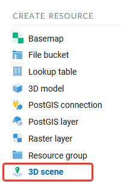

   Creating a 3D scene resource
   
   
The Resource tab indicates the name of the future 3D scene (:numref:`ngw3D_name_3D_scene`).

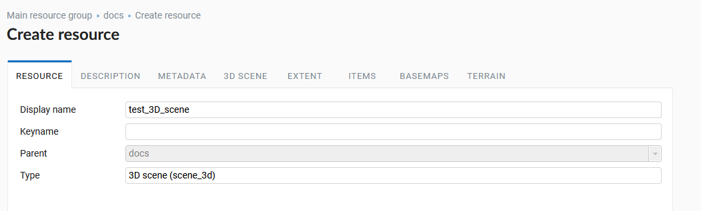

   Resource name 3D scene

The '3D scene' tab allows you to select the type of data display on the 3D scene - a globe or a plane (:numref:`ngw3D_settings_3D_scene`). 
It is also possible to connect Yandex Panoramas and Google Street View data by specifying the appropriate API keys.
Also you can specify a quality value that affects the performance of a 3D scene.

.. figure:: _static/ngw3D_settings_3D_scene_en.png
   :name: ngw3D_settings_3D_scene
   :align: center
   :width: 20cm

   Method of displaying data on a 3D scene

The 'Extent' window sets the area of coverage of the 3D scene in degrees (:numref:`ngw3D_extent_3D_scene`).

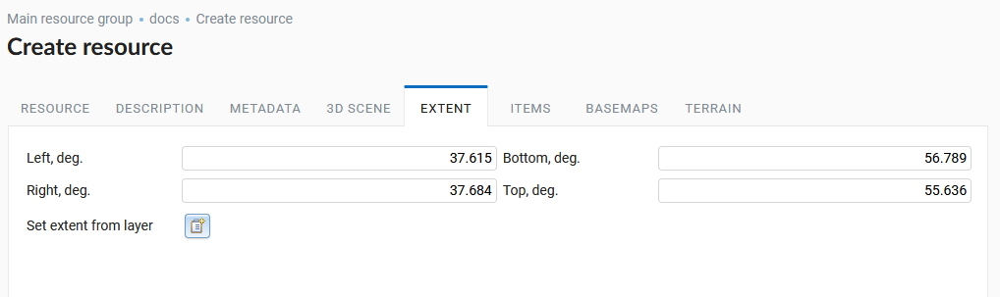

   3D scene extent

There is also an option - to set the extent by the layer loaded in Web GIS (:numref:`ngw3D_extent_by_layer_3D_scene`).
Clicking on the folder icon with a plus opens a window where you can select the layer on which you want to specify the extent of the 3D scene.

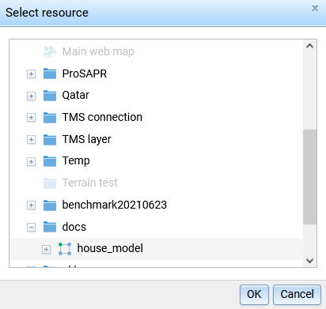

   Window for Selecting layer of 3D Scene’s extent

The 'Items' tab allows you to add and remove items of various NextGIS Web resources on/from a 3D scene - for example, 3D styles and 3D tilesets (Fig. 38),
as well as form them into various groups.

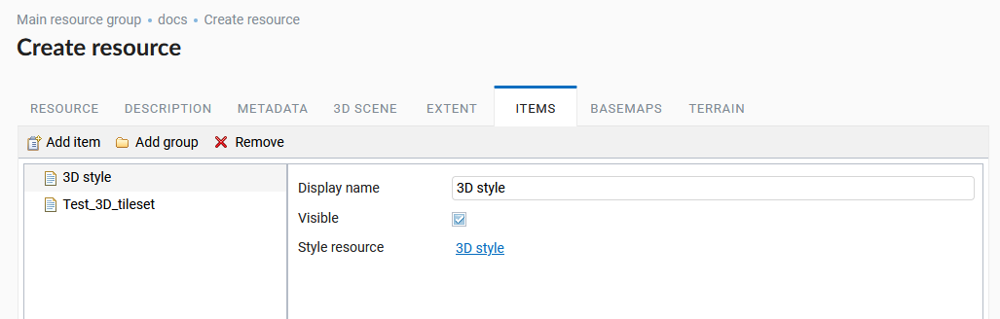

   3D scene items window

The addition takes place after you click ‘Add Item’, resulting in an open choice NextGIS Web resource box (:numref:`ngw3D_select_elements_3D_scene`).

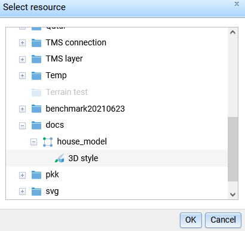

   Selecting a 3D style resource to add to a 3D scene

The *Visible* option means that when a 3D scene is opened this element will be displayed by default.

Various basemaps can be added to the 3D scene.
The addition takes place using the ‘Add’ button (:numref:`ngw3D_add_basemap_3D_scene`) and specifies basemap resource NextGIS Web (:numref:`ngw3D_select_basemap_3D_scene`). 

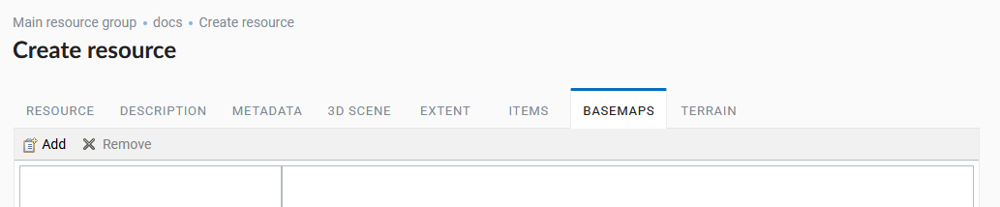

   Basemaps tab 3D scene

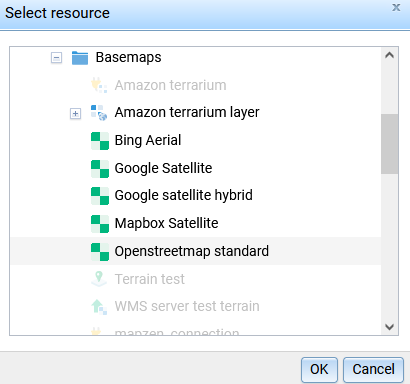

   Selection a 3D scene basemap
   
To upload a basemap onto a 3D scene, you must first create it in NextGIS Web. For this there is a resource Basemap (:numref:`ngw3D_create_basemap_3D_scene`).

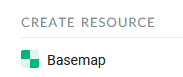

   Basemap resource in NextGIS Web

You can specify the URL or find the one you need in the search In the Settings, if there is one in `QuickMapServices <https://qms.nextgis.com/>`_ (:numref:`ngw3D_settings_basemap_3D_scene`) directory.

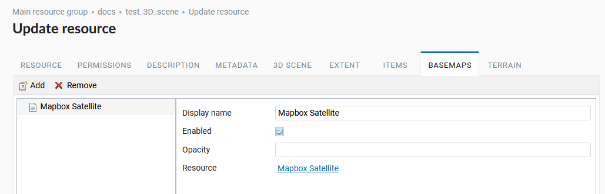

   Basemap settings
         
The Terrain resource of the previously created TMS layer is added to the 3D scene on the Terrain tab (:numref:`ngw3D_terrain_3D_scen_en`).
Adding occurs through the standard addition of a resource in the corresponding window (:numref:`ngw3D_select_terrain_3D_scen`).

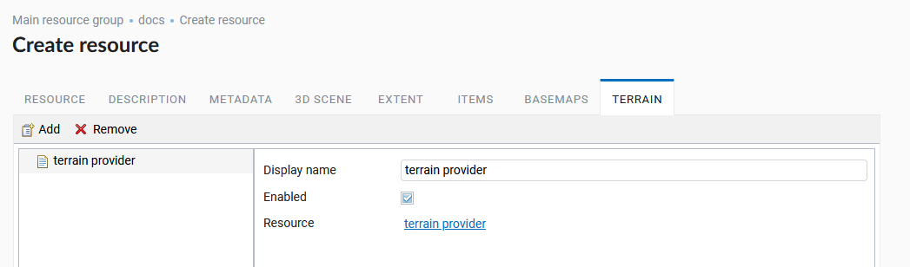

   Terrain Resource settings of 3D scene

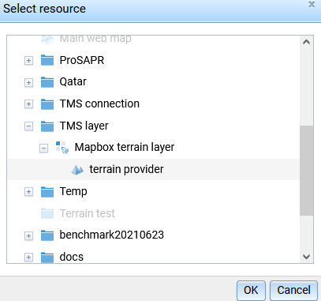

   Selecting the Terrain resource for a 3D scene
   
Permissions, description and metadata are optional.

