.. sectionauthor:: Роман Гайнуллов <roman.gainullov@nextgis.ru>

.. _ngw_3d_scenes:

Создание 3D сцен
================

Трехмерные объекты в NextGIS Web могут быть помещены на 3D сцену - аналог веб-карты для трёхмерных объектов. 
Для её создания необходимо перейти в нужную вам директорию NextGIS Web и выбрать создание ресурса 3D сцена (:numref:`ngw3D_select_3D_scene`).

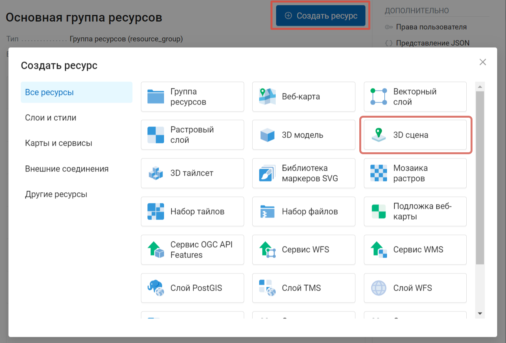

   Создание ресурса "3D сцена"

Вкладка **3D сцена** позволяет выбрать вид отображения данных на 3D сцене - глобус или плоскость (:numref:`ngw3D_settings_3D_scene`) и выбрать качество (это влияет на производительность 3D-сцены).

Также существует возможность подключить данные Яндекс.Панорамы и Google Street View, задав соответствующие API ключи.

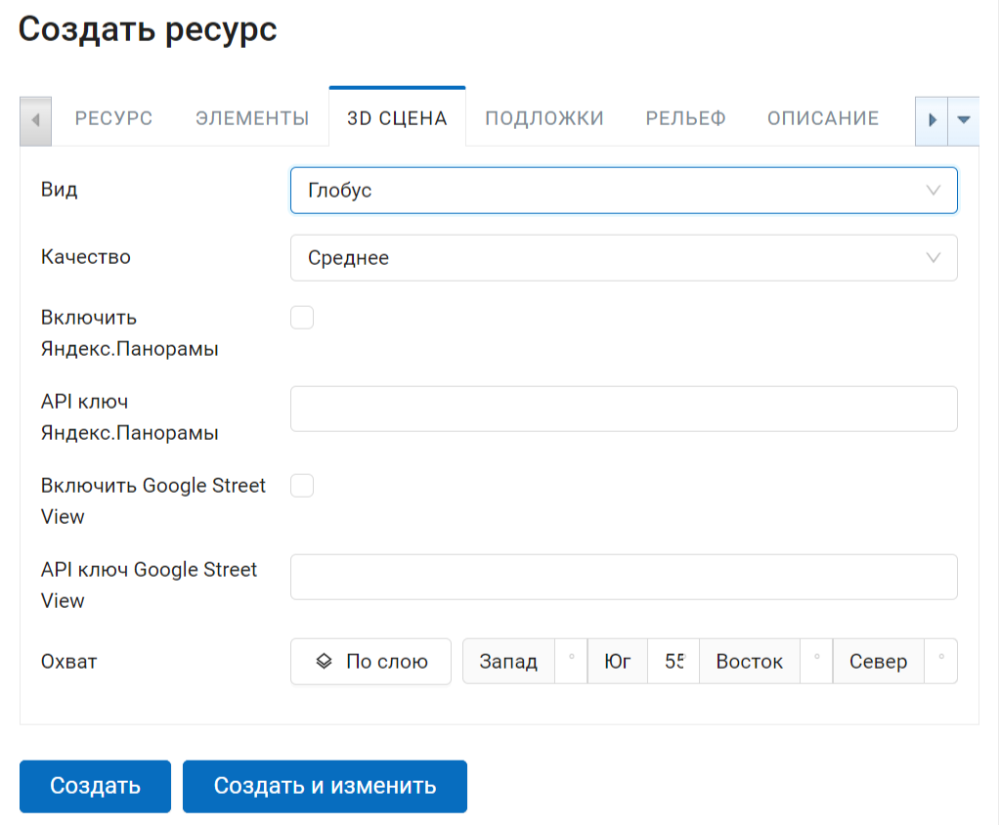

   Способ отображения данных на 3D сцене

В этой же вкладке задается область охвата 3D сцены в градусах (:numref:`ngw3D_extent_3D_scene`). Также есть опция задать охват по загруженному в веб ГИС слою (:numref:`ngw3D_extent_by_layer_3D_scene`) 
По нажатию на иконку папки с плюсом открывается окно, в котором можно выбрать тот слой, по которому вы хотите задать экстент 3D сцены.

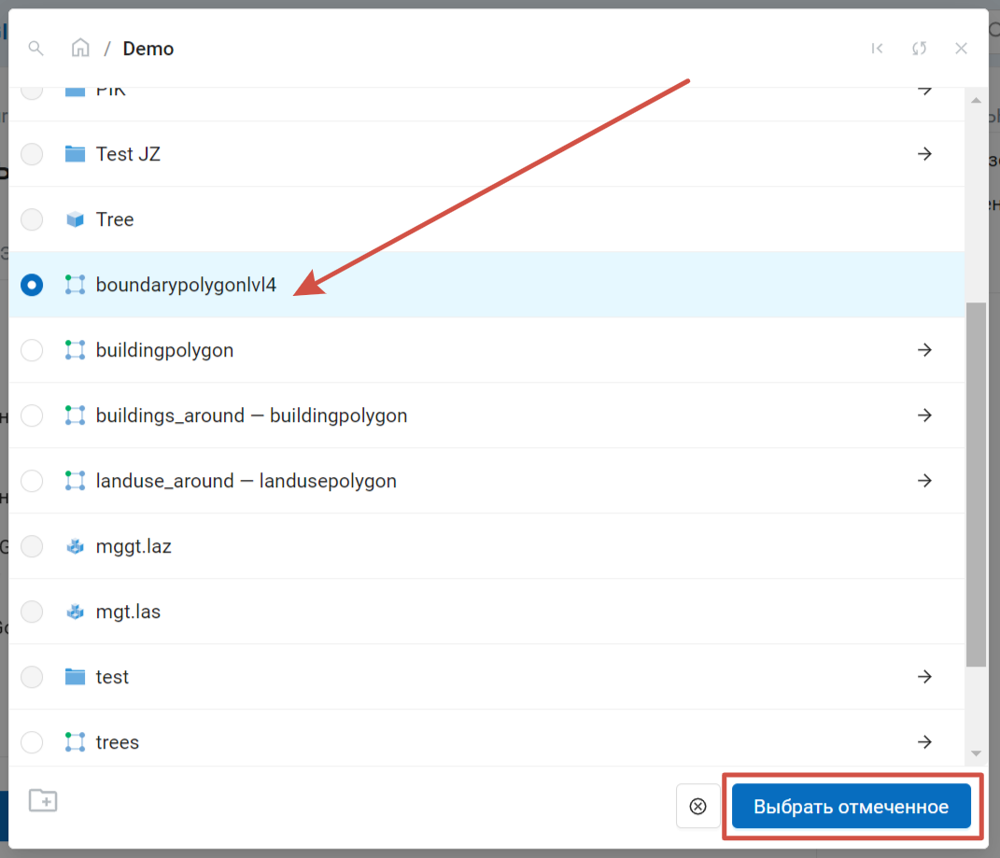

   Окно Выбора Ресурса охвата 3D сцены

На вкладке **Ресурс** указывается наименование будущей 3D сцены (:numref:`ngw3D_name_3D_scene`).

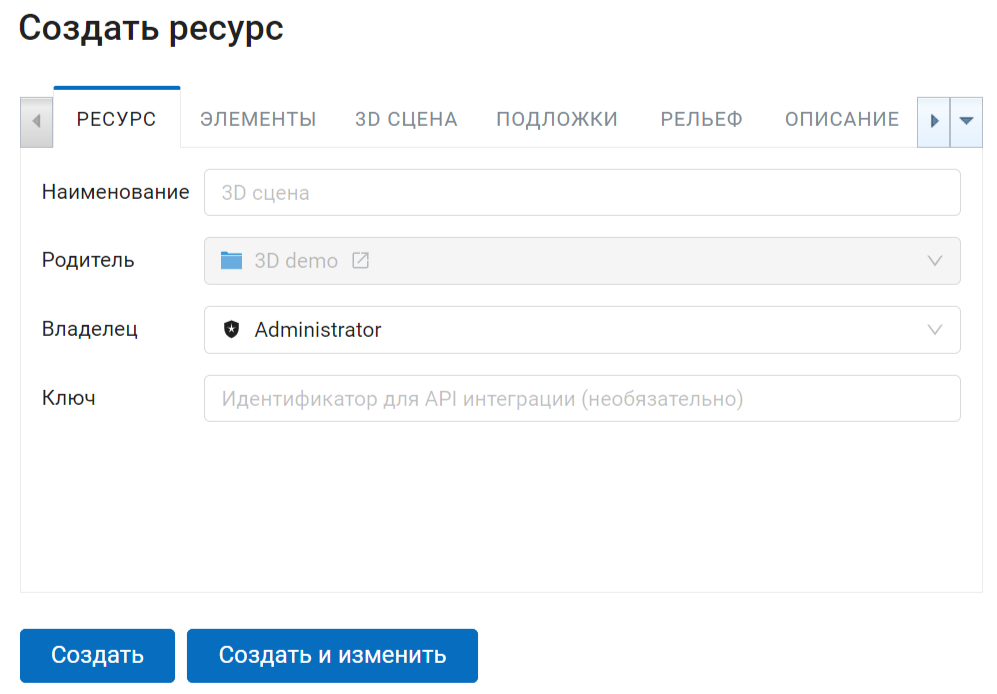

   Наименование ресурса "3D сцена"

Вкладка **Элементы** позволяет добавлять и удалять на 3D сцену элементы различных ресурсов NextGIS Web - например 3D стили и 3D тайлсеты (:numref:`ngw3D_elements_3D_scene`), а также объединять их в различные группы. Для этого предусмотрены соответствующие кнопки «Добавить слой», «Добавить группу» и «Удалить» (крестик в конце строки).

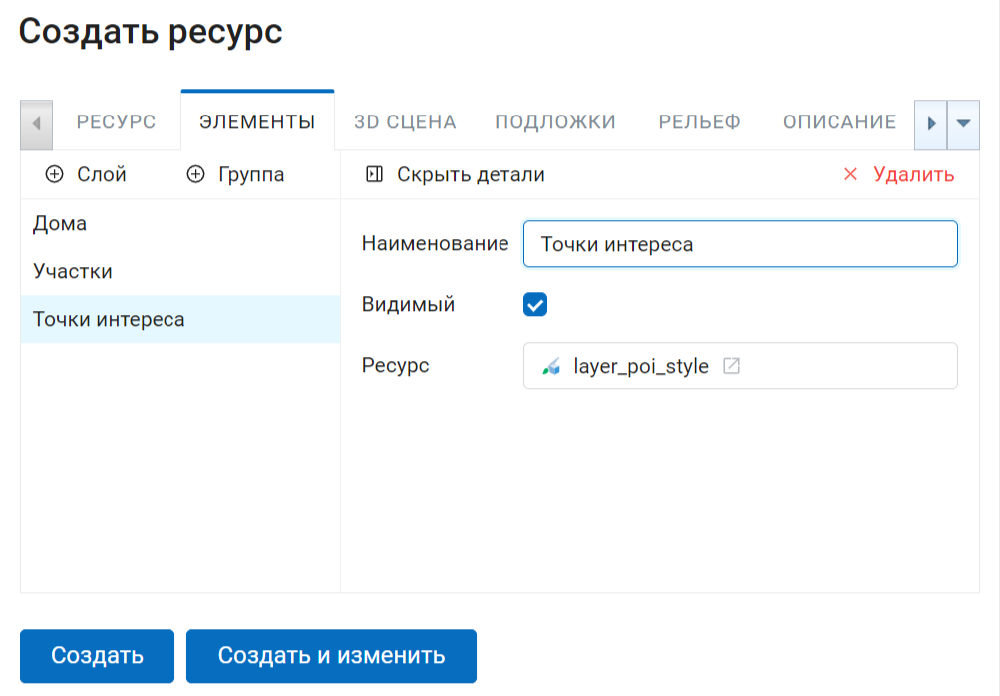

   Окно элементов 3D сцены

Для того, чтобы отобразить данные слоя на карте, необходимо создать для него хотя бы один стиль. О создании 3D стилей для слоев можно прочитать `здесь <https://docs.nextgis.ru/docs_ngweb_3D/source/3D_style.html>`_.

Добавление происходит после нажатия кнопки **+ Слой**, в результате чего открывается окно Выбора ресурса NextGIS Web (:numref:`ngw3D_select_elements_3D_scene`).

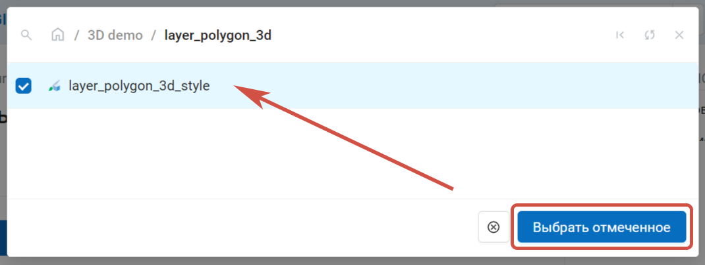

   Выбор ресурса 3D стиль для добавления на 3D сцену

Опция **Видимый** говорит о том, что при открытии 3D сцены этот элемент будет по умолчанию отображаться.

На 3D сцену можно добавлять различные **Подложки** в соответствующей вкладке. 
Добавление происходит с помощью кнопки **Добавить** (:numref:`ngw3D_add_basemap_3D_scene`) и указания ресурса подложки в NextGIS Web (:numref:`ngw3D_select_basemap_3D_scene`). 

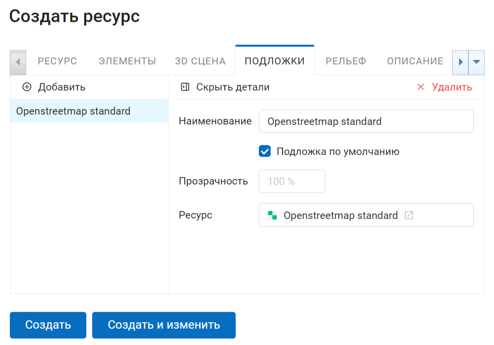

   Вкладка "Подложки" 3D сцены

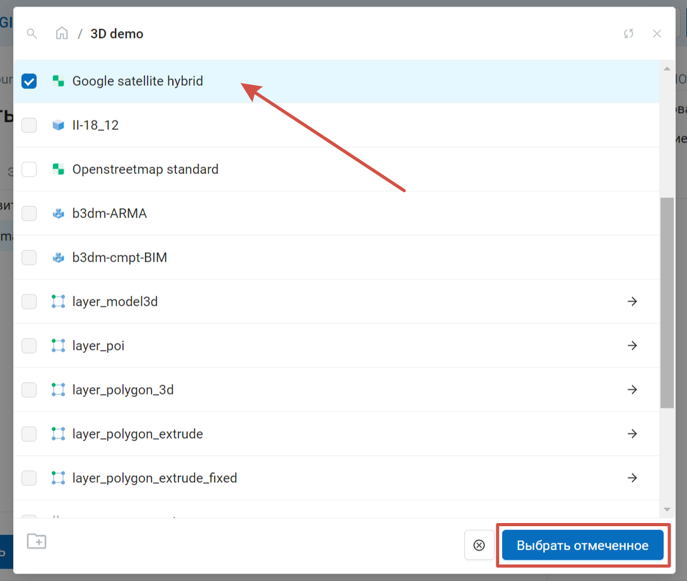

   Выбор подложки 3D сцены
   

Чтобы загрузить подложку на 3D сцену, её нужно сначала создать в NextGIS Web. Для этого существует ресурс Подложка веб-карты (:numref:`ngw3D_create_basemap_3D_scene`).

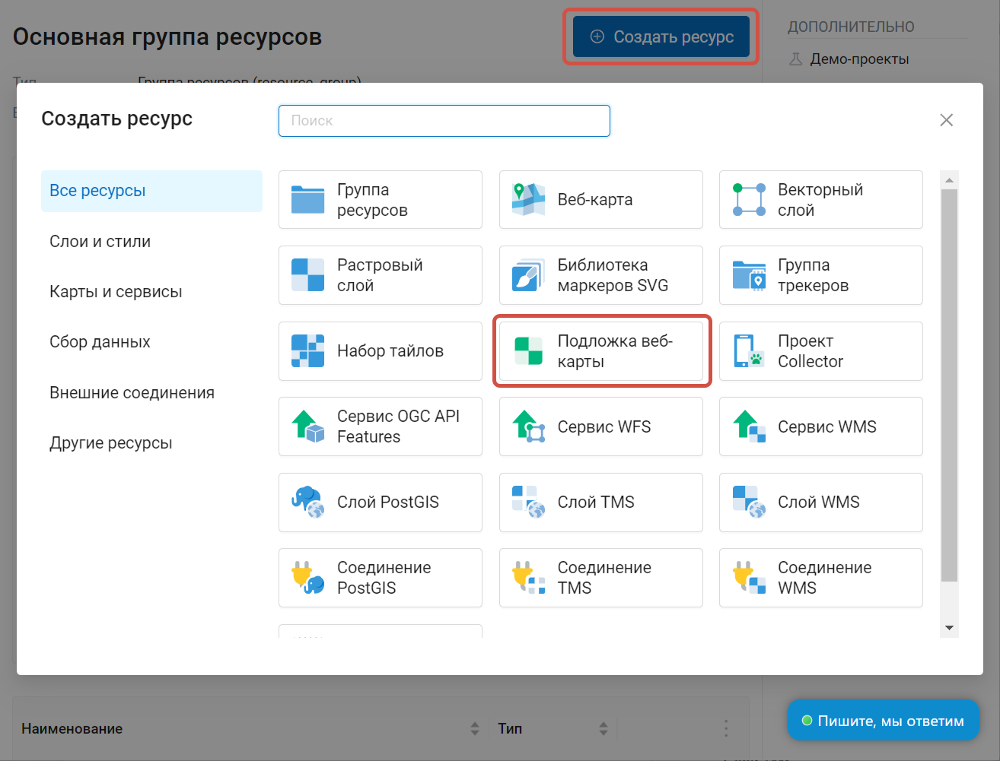

   Выбор типа создаваемого ресурса "Подложка веб-карты"

В настройках можно указать URL или найти нужную в поиске, если такая есть в каталоге `QuickMapServices <https://qms.nextgis.com/>`_ (:numref:`ngw3D_settings_basemap_3D_scene`). `Подробнее о подложках <https://docs.nextgis.ru/docs_ngweb/source/layers.html#ngw-create-basemap>`_.

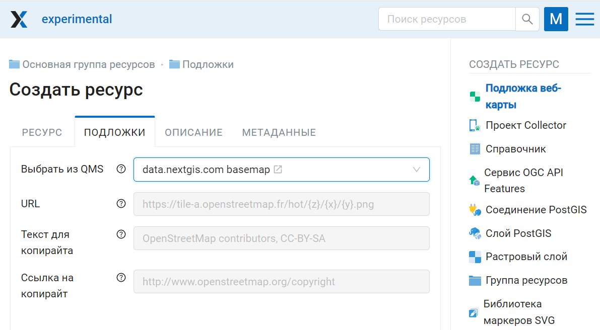

   Настройки подложки
         
На вкладке "Рельеф" на 3D сцену добавляется ресурс рельефа созданного ранее TMS слоя. 
Добавление происходит через стандартное добавление ресурса в соответствующем окне (:numref:`ngw3D_select_terrain_3D_scene`).

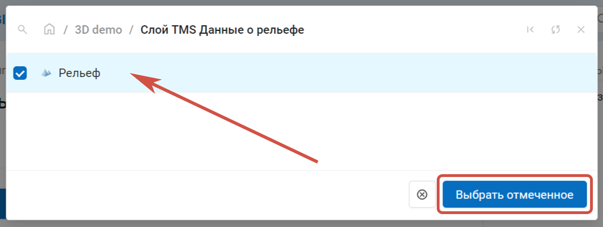

   Выбор ресурса Рельеф для 3D сцены
   
Права доступа, описание и метаданные являются опциональными настройками.

